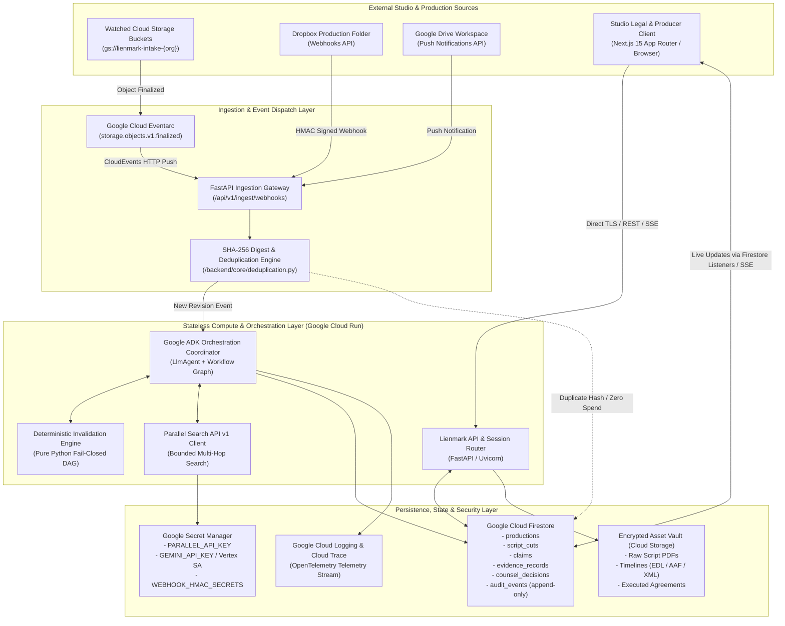
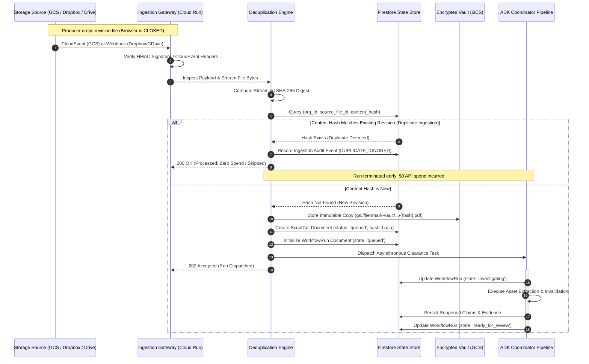

# Lienmark Architecture: System Topology & Background Ingestion

**Document:** `docs/architecture/01_system_topology_and_ingestion.md`  
**Status:** Canonical Engineering Specification  
**Version:** 2.0.0 (Post-Recovery Consolidation)  
**Target Environment:** Google Cloud Run, Eventarc, Cloud Storage, Cloud Firestore, Secret Manager, Next.js 15 App Router

---

## 1. High-Level System Topology

Lienmark is an enterprise-grade clearance verification and errors & omissions (E&O) change control platform designed for film, television, and game production studios. It continuously detects creative and legal modifications between production milestones (screenplays, cuts, edit decision lists, licensed agreements) and executes targeted, budget-governed verification workflows.

The system decouples user interaction from background discovery and verification, ensuring that document ingestion, delta analysis, and external research execute autonomously in the cloud without requiring an active browser session.



---

## 2. Core Infrastructure Components

### 2.1 Frontend Layer: Next.js 15 App Router
- **Framework & Deployment:** Next.js 15 App Router, React Server Components (RSC), TypeScript strict mode, hosted on Google Cloud Run as a containerized edge service or Vercel Enterprise with Cloud Run backend peering.
- **Visual Design System:** Dark mode palette (`#0B0F17` canvas, `#161F30` elevated cards, `#1E293B` borders, `#38BDF8` primary cyan accent, `#F43F5E` critical warning). Enforces high-density data tables, split-pane legal comparison views, and accessible WCAG AAA contrast for clearance counsel.
- **Six Unified Command Center Destinations:**
  1. **Inbox:** Triage queue of newly detected script revisions, unresolved external alerts, and high-urgency claim modifications.
  2. **Productions:** Master roster of productions, version histories, script branches, and baseline coverage statuses.
  3. **Investigations:** Live telemetry for active agent clearance runs, query traces, Parallel API call costs, and execution DAGs.
  4. **Evidence:** Attributable repository of external public registry findings (ASCAP, USPTO, Copyright Office) and private executed contracts.
  5. **Decisions:** Human-in-the-loop counsel review interface, multi-factor attestation modals, and rejection directive routing.
  6. **Connections & Policy:** Configuration for Cloud Storage buckets, Dropbox/Google Drive connectors, spend governors, and E&O underwriting profiles.
- **Real-Time Synchronization:** Directly subscribes to Firestore collection snapshots via the Firebase Web SDK for zero-latency UI updates when runs complete in the background, supplemented by FastAPI Server-Sent Events (SSE) for granular step execution traces.

### 2.2 API & Ingestion Gateway: FastAPI on Cloud Run
- **Runtime:** Python 3.11+ ASGI application running on Google Cloud Run (Fully Managed Serverless Container).
- **Concurrency & Scaling:** Minimum 1 instance for warm execution (eliminating cold starts for critical webhooks); scales horizontally up to 50 concurrent container instances under peak production loads.
- **Authentication & Authorization:**
  - Inbound client traffic authenticated via Google Identity Platform / Firebase Auth (OIDC JWT Bearer tokens).
  - Webhook endpoints authenticated via constant-time HMAC-SHA256 signature verification using pre-shared secrets stored in Secret Manager.
  - Inter-service communication between Cloud Run and GCP services authenticated via Google Application Default Credentials (ADC) and IAM service accounts with least-privilege role bindings.
- **Rate Limiting & Protection:** `asyncio.Semaphore(10)` per worker process for outbound provider calls; IP-based and token bucket rate limiters on public ingestion routes to prevent denial-of-service and replay attacks.

### 2.3 Cloud Storage Architecture with Eventarc
- **Storage Buckets:**
  - `gs://lienmark-intake-{org_id}-{env}`: Watched incoming drop bucket for screenplays, cuts, and revisions.
  - `gs://lienmark-vault-{org_id}-{env}`: Permanent immutable storage for hashed source documents, encrypted with Customer-Managed Encryption Keys (CMEK) via Cloud KMS.
  - `gs://lienmark-contracts-{org_id}-{env}`: Restricted access bucket for private distribution, synchronization, and talent agreements.
- **Retention & Compliance:** 90-day automated lifecycle deletion policies on intake staging buckets; legal-hold retention rules on the permanent vault.
- **Eventarc Trigger Pipeline:** Native Google Cloud Eventarc triggers configured on `google.cloud.storage.object.v1.finalized`. When an asset lands in the intake bucket, Eventarc formats a CloudEvent 1.0 envelope and securely invokes the Cloud Run ingestion endpoint `/api/v1/ingest/gcs-event` over authenticated private Google networking.

### 2.4 Persistence & Session Store: Cloud Firestore
- **Database Engine:** Google Cloud Firestore in Datastore/Native Mode.
- **Security & Authorization Model (Resolving Legacy Vulnerability):**
  > [!IMPORTANT]
  > As documented in Section 8 of the Recovery Map, Firestore Security Rules only constrain client-side Firebase SDKs and are completely bypassed by backend server SDKs using service account Application Default Credentials (ADC).
  > 
  > Lienmark strictly implements **Defense-in-Depth Storage Governance**:
  > 1. **Client-Side:** Firestore Rules allow read-only queries scoped to the user's validated `request.auth.token.org_id`. Direct client `create`, `update`, and `delete` operations are globally forbidden (`allow write: if false;`).
  > 2. **Backend-Side:** All database mutations are mediated exclusively through the FastAPI backend. The backend uses dedicated, identity-scoped IAM service accounts (`sa-lienmark-backend@{project}.iam.gserviceaccount.com`).
  > 3. **Immutable Collections:** The `audit_events` and `ledger_entries` collections are append-only. The backend application layer strictly enforces create-only operations, cryptographically chaining every new record to its predecessor's SHA-256 digest.

### 2.5 Secret Management: Google Secret Manager
- All sensitive provider credentials (`PARALLEL_API_KEY`, `GEMINI_API_KEY`, Dropbox App Secret, Google Drive Webhook Client Secret, HMAC signing keys) are provisioned in Secret Manager with version pinning.
- Secrets are injected into Cloud Run environment variables at container initialization or resolved dynamically via the Secret Manager client API, preventing credential leakage in code or container images.

---

## 3. Background Ingestion Architecture

A core design requirement of Lienmark is that **ingestion and investigation must occur asynchronously without requiring a user to keep a browser tab open**. When a post-production coordinator drops "Shadows_Over_Broadway_v8.pdf" into a cloud folder at 2:00 AM, the system must autonomously identify the production, perform delta extraction, invalidate affected claims, launch targeted external search queries, and prepare the counsel review queue before the legal team arrives in the morning.



### 3.1 Connector Specifications

Lienmark supports three primary autonomous ingestion vectors:

#### A. Watched Google Cloud Storage Buckets (Eventarc)
- **Mechanism:** Asynchronous Google Cloud Storage Object Finalized events routed through Eventarc.
- **CloudEvent Header Validation:**
  - `ce-type`: `google.cloud.storage.object.v1.finalized`
  - `ce-source`: `//storage.googleapis.com/projects/_/buckets/lienmark-intake-{org_id}`
  - `ce-subject`: `objects/{production_id}/{filename}`
- **Security:** Ingestion endpoint protected by Google Cloud IAM service account authentication (`roles/run.invoker` granted exclusively to the Eventarc trigger identity).

#### B. Dropbox Webhook Connector
- **Mechanism:** Dropbox Webhooks API combined with cursor-based polling.
- **Verification Challenge:** Implements the required Dropbox verification handshake:
  ```python
  @router.get("/api/v1/ingest/dropbox")
  async def verify_dropbox_challenge(challenge: str = Query(...)):
      # Echo back challenge parameter as text/plain
      return Response(content=challenge, media_type="text/plain")
  ```
- **Notification & Cursor Polling:**
  1. Dropbox sends an HTTP POST notification indicating that an account/folder experienced file updates.
  2. Gateway verifies the `X-Dropbox-Signature` header via HMAC-SHA256 using the studio's configured app secret.
  3. Gateway enqueues an asynchronous cursor fetch task using Dropbox `/2/files/list_folder/continue` passing the stored `cursor` from Firestore `connector_states`.
  4. New or updated entries with `.pdf`, `.edl`, `.xml`, or `.aaf` extensions are downloaded directly to memory/stream for hashing.

#### C. Google Drive Push Notifications Connector
- **Mechanism:** Google Drive API v3 Push Notifications (Webhooks via Google Cloud Pub/Sub or HTTPS watch channel).
- **Handshake & Validation:** Validates `X-Goog-Channel-Token` matching the secret token generated during channel creation and checks `X-Goog-Resource-State: change`.
- **Cursor Synchronization:** Retrieves updated files using `drive.changes.list(pageToken=saved_token)`, extracting the document metadata and content stream.

---

### 3.2 Content Hashing & Cryptographic Deduplication

To eliminate redundant LLM inference and search spend ($0 Spend Guard), all ingested files undergo strict streaming SHA-256 content hashing prior to triggering any downstream agents.

```python
import hashlib
from typing import BinaryIO, Tuple

def compute_stream_digest(file_stream: BinaryIO, chunk_size: int = 65536) -> str:
    """
    Computes a canonical SHA-256 hexadecimal digest of an incoming file stream.
    Memory-efficient: buffers in 64KB chunks to handle multi-gigabyte cut files.
    """
    hasher = hashlib.sha256()
    while chunk := file_stream.read(chunk_size):
        hasher.update(chunk)
    file_stream.seek(0)
    return hasher.hexdigest()
```

#### Deduplication Rules Matrix
| Case | File Name | Provider File ID | SHA-256 Content Digest | Action | Billable Spend |
| :--- | :--- | :--- | :--- | :--- | :--- |
| **1. Identical File Drop** | Identical | Identical | Identical | Log `DUPLICATE_DELIVERY`; ignore run. | **$0.00** |
| **2. File Rename / Move** | Changed | Changed | Identical | Update metadata pointer; suppress agent run. | **$0.00** |
| **3. Webhook Replay** | Identical | Identical | Identical | Reject via idempotency token check. | **$0.00** |
| **4. Genuine Revision** | Changed | Changed | Changed | Register new `ScriptCut`; trigger ADK pipeline. | Standard Budget |
| **5. Content Rollback** | Changed | Changed | Matches Older Ver | Reuse existing historic claims; link version. | **$0.00** |

---

### 3.3 Asynchronous Execution & Cold-Browser Verification Proof

To empirically verify that clearance processing operates independently of the web browser, Lienmark uses a decoupled state machine persisted in Firestore.

#### Persisted Workflow Run States
```
[ queued ] 
    │
    ▼
[ investigating ] ───(Missing Private Document / Unclear Lead)───► [ waiting_for_information ]
    │                                                                           │
    │                                                            (Human Answers / Document Arrives)
    │                                                                           │
    │                                                                           ▼
    ├──────────────────(Spend Governor Limit Reached)───────────► [ waiting_for_budget ]
    │                                                                           │
    │                                                               (Budget Raised by Admin)
    │                                                                           │
    ▼                                                                           ▼
[ ready_for_review ] ◄──────────────────────────────────────────────────────────┘
    │
    ├─► [ completed ]   (Attorney Approves / Re-attests)
    ├─► [ failed ]      (Unrecoverable System / Schema Error)
    ├─► [ cancelled ]   (Superceded by newer version or cancelled by Admin)
    └─► [ superseded ]  (Newer draft uploaded before review completed)
```

#### Cold-Browser Verification Protocol
1. **Initiation:** The external test script or storage connector drops a revised screenplay (`Shadows_Broadway_Draft8.pdf`) into `gs://lienmark-intake-studio-alpha/prod_001/`.
2. **Event Verification:** Eventarc captures the GCS finalized event and posts to Cloud Run. The API returns HTTP 202 with `run_id: run_8f102c9a`.
3. **Browser Absence:** Zero active WebSocket connections or HTTP long-polling requests exist for the production tenant.
4. **State Assertion:** A detached verification worker polls the Firestore document `workflow_runs/run_8f102c9a` directly via the Admin SDK:
   - Within 1.5s: `state == "investigating"`, `extracted_claims_count == 12`
   - Within 4.0s: `stale_claims_count == 2`, `carried_forward_count == 10`
   - Within 8.0s: `parallel_queries_executed == 2`, `state == "ready_for_review"`
5. **Durable Output:** When the legal counsel opens the Next.js frontend hours later, the clearance brief, evidence citations, and pre-formatted Form E&O-2026 Underwriter Schedule load instantly from the durable projection documents.

---

## 4. Failure Modes & Resilience Engineering

| Failure Mode | Subsystem | Detection Mechanism | Automated Recovery / Fallback Behavior |
| :--- | :--- | :--- | :--- |
| **Malformed / Corrupted File** | Ingestion Gateway | PDF header magic bytes (`%PDF-`) verification failure | Reject payload immediately with HTTP 422; write `MALFORMED_INPUT` audit event; send alert toast to Studio Admin; do not allocate compute. |
| **GCS Eventarc Duplicate Delivery** | Ingestion Gateway | CloudEvent ID + Event Timestamp replay check | Ingestion handler checks Redis / Firestore idempotency cache. If CloudEvent ID processed in last 24h, acknowledge with HTTP 200 and discard. |
| **Cloud Run Cold Start Latency** | Compute Layer | Cloud Monitoring container startup metrics | Maintain `min-instances: 1` on production ingress services; execute lightweight healthcheck ping every 4 minutes via Cloud Scheduler. |
| **Secret Manager Unreachable** | API Gateway | Secret fetch timeout (>2000ms) | Fail-closed: log critical security alarm; do not start pipeline with unverified or empty API keys; reject inbound runs with HTTP 503. |
| **Firestore Outage / Partition** | Persistence Layer | Exponential backoff retry failure across 3 attempts | Buffer run event in Cloud Pub/Sub dead-letter queue; set connector state to `paused_backlog`; retry upon Firestore reconnection. |
