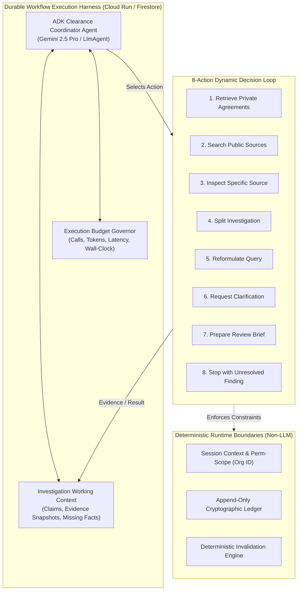
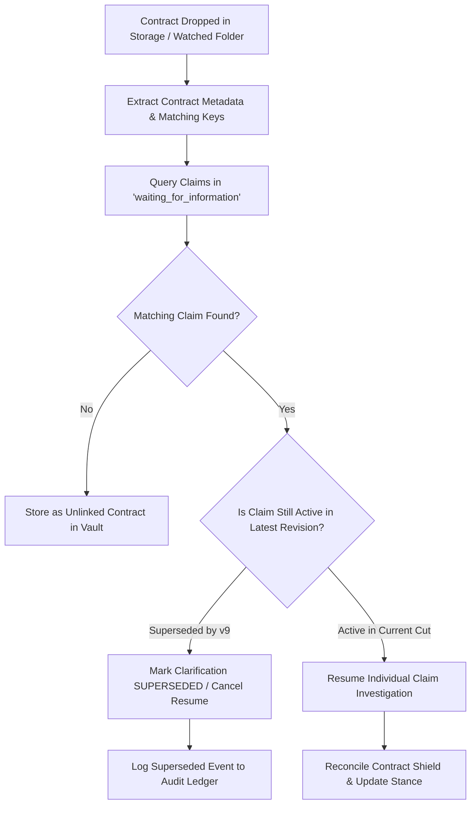
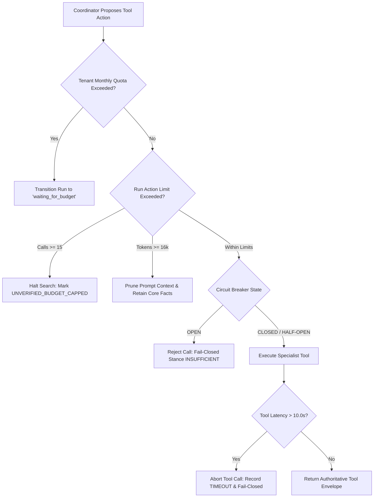

# Lienmark Architecture: Agent Orchestration & ADK Pipeline

**Document Reference:** `docs/architecture/02_agent_orchestration_and_adk_pipeline.md`  
**Classification:** Canonical Engineering Specification & System Architecture  
**Status:** Approved Architectural Standard (v2.1.0)  
**Framework:** Google Agent Development Kit (`google.adk`), Vertex AI Agent Engine, Gemini 2.5 Pro & Flash, Parallel Search API v1  
**Related Documents:**
- [`01_system_topology_and_ingestion.md`](01_system_topology_and_ingestion.md)
- [`03_dependency_graph_and_invalidation_engine.md`](03_dependency_graph_and_invalidation_engine.md)
- [`04_data_schemas_and_entity_contracts.md`](04_data_schemas_and_entity_contracts.md)
- [`../investigation/02_adaptive_research_and_clarification_loops.md`](../investigation/02_adaptive_research_and_clarification_loops.md)
- [`../investigation/01_public_evidence_vs_private_permission.md`](../investigation/01_public_evidence_vs_private_permission.md)

---

## Executive Summary

Clearance verification in commercial entertainment is an adversarial, high-stakes legal exercise. Script revisions introduce, modify, and retire third-party creative elements—ranging from background music cues and wall posters to branded props and character likenesses. 

This specification establishes Lienmark's canonical **ADK Orchestration Pipeline**. It eliminates legacy architectural anti-patterns—such as disconnected agent facades, hardcoded asset drifts, and mock workflow nodes—and codifies a resilient **Single Logical Coordinator per Investigation** executing within a durable workflow runtime.

---

## 1. Architectural Evolution: Addressing Real Implementation Gaps

### 1.1 Remediation of Implementation Anti-Patterns

A rigorous audit of the legacy prototype implementation (`backend/orchestration/adk_pipeline.py` and `backend/services/revalidation_planner.py`) identified three critical structural defects:

```
┌────────────────────────────────────────────────────────────────────────────────────────┐
│                        LEGACY IMPLEMENTATION GAP IDENTIFICATION                        │
├────────────────────────────────────────────────────────────────────────────────────────┤
│ 1. THE DISCONNECTED AGENT FACADE ANTI-PATTERN (adk_pipeline.py:222-262)               │
│    • An LlmAgent was instantiated with tools, but completely disconnected from the     │
│      returned Workflow graph.                                                          │
│    • Workflow nodes returned hardcoded static dicts:                                   │
│      def ingest_and_eval_node(ctx): return {"phase": "...", "status": "COMPLETED"}    │
│    • The agent was a cosmetic wrapper; actual execution was a rigid, mock pipeline.    │
├────────────────────────────────────────────────────────────────────────────────────────┤
│ 2. HARDCODED ASSET DRIFT & FIXTURE-ASSIGNED STANCES (adk_pipeline.py:105,              │
│    revalidation_planner.py:227-232)                                                    │
│    • adk_pipeline.py hardcoded drift checks:                                           │
│      is_known_drift = key in ("poster_noir_detective_magazine", "music_cue_...")       │
│    • revalidation_planner.py pre-assigned legal stances via string heuristics:         │
│      if "poster_noir" in key.lower(): expected_stance = SUPPORTING                     │
│      elif "midnight" in key.lower(): expected_stance = CONTRADICTORY                  │
│    • This violated the core premise of autonomous clearance: evidence was pre-baked    │
│      rather than derived dynamically from live public registries and private vaults.   │
├────────────────────────────────────────────────────────────────────────────────────────┤
│ 3. RUN-LEVEL WORKFLOW STALLING (HISTORICAL SPECIFICATION GAP)                          │
│    • Suspending an entire workflow run when a single claim required human clarification│
│      blocked independent claims from resolving, wasting throughput and stalling teams. │
└────────────────────────────────────────────────────────────────────────────────────────┘
```

### 1.2 The Canonical Target Architecture: True Dynamic Agency

To resolve these defects, Lienmark replaces disconnected agent facades and hardcoded fixtures with **True Dynamic Agency**:
1. **One Logical Coordinator per Investigation:** An authoritative Google ADK `LlmAgent` powered by Gemini 2.5 Pro acts as the cognitive engine for each active investigation.
2. **Durable Workflow Container:** The coordinator operates within a stateful, event-driven workflow execution harness managed by Google ADK and backed by Cloud Firestore.
3. **Dynamic Multi-Hop Traversal:** The coordinator evaluates claims dynamically. No asset names are hardcoded; no legal stances are fixture-assigned. The coordinator continuously inspects returned evidence and selects subsequent actions based on empirical facts.



---

## 2. The Coordinator Decision Loop & 8-Action Decision Matrix

### 2.1 The Core Governing Inquiry

At every cycle of the investigation, the ADK Coordinator evaluates its state by answering one fundamental question:

$$\boxed{\text{“Given this claim, the evidence collected, the missing facts, and the remaining budget, what useful action should happen next?”}}$$

This decision loop rejects pre-scripted directed acyclic graphs (DAGs) for evidence gathering. Instead, **the evidence returned by one action directly conditions and shapes the next action**.

### 2.2 The 8-Action Decision Matrix

The coordinator selects exclusively from the following canonical 8-action matrix:

| Action Code | Action Name | Primary Trigger Condition | Expected Input & Execution | State Impact & Next Step |
| :--- | :--- | :--- | :--- | :--- |
| `ACT_01` | **Retrieve Private Agreements** | Baseline license unverified, or public search revealed adverse claimant that studio might hold rights to. | Queries studio contract vault (`gs://lienmark-contracts-{org}/`) for executed licenses, releases, or assignments scoped to `project_id`. | Extracts relevant contractual clauses. If complete coverage is found, informs brief preparation; if terms are missing, informs clarification. |
| `ACT_02` | **Search Public Sources** | New creative use detected, or modified context requires verifying underlying work in public copyright/trademark registries. | Dispatches targeted search to Parallel Search API v1 targeting authoritative registries (ASCAP, BMI, USPTO, Copyright Office). | Returns `PublicEvidenceSnapshot` with citations, excerpts, and SHA-256 payload hash. Updates claim evidence context. |
| `ACT_03` | **Inspect Specific Source** | Search result contains an ambiguous excerpt, catalog reference number, or adverse assignment link requiring deep inspection. | Directs targeted HTTP fetch or document parser to retrieve full catalog entry, assignment schedule, or registry detail. | Extracts granular metadata (e.g., renewal filing dates, class codes, specific territorial exceptions) to disambiguate findings. |
| `ACT_04` | **Split Investigation** | Asset embodies composite rights with distinct ownership chains (e.g., musical composition vs. master sound recording). | Decomposes parent claim into two or more independent child sub-claims (e.g., `claim_comp` and `claim_master`). | Spawns child investigation paths that run concurrently under the parent claim's budget quota. |
| `ACT_05` | **Reformulate Query** | Prior search returned zero hits, over 40 colliding entities, or generic lyric/fan scraper pages. | Analyzes failure mode (collision, domain error, over-specificity) and reformulates query syntax with extracted years, authors, or catalog IDs. | Re-executes Parallel Search with optimized syntax. Increments reformulation counter against governor limit. |
| `ACT_06` | **Request Clarification** | Critical fact is private and absent from both public registries and internal vaults (e.g., prop rental invoice, actor consent). | Formats structured `ClarificationRequest` assigned to specific human role (Line Producer, Music Supervisor, Clearance Counsel). | Suspends **only the affected claim** into `waiting_for_information`. Emits notification to dashboard. Sibling claims continue. |
| `ACT_07` | **Prepare Review Brief** | Sufficient public and private evidence assembled to synthesize comprehensive legal analysis for counsel. | Invokes Formatter Tool to construct 4D explanation (Creative Shift, Public Evidence, Private Contracts, Statutory Basis). | Transitions claim to `ready_for_review` and compiles Form E&O-2026 Underwriter Exception schedule proposal. |
| `ACT_08` | **Stop with Unresolved Finding** | Budget governor exhausted, 3-hop retry cap reached, or irreconcilable conflict prevents affirmative clearance. | Formulates detailed failure summary documenting tried queries, partial evidence, and missing elements. | Marks claim as `UNRESOLVED_EXCEPTION` (fail-closed). Routes directly to counsel manual exception ledger. |

### 2.3 Evidence-Chaining Invariant

A fundamental rule of Lienmark orchestration is that **evidence is causal, cumulative, and adaptive**:

```mermaid
sequenceDiagram
    autonumber
    participant Coord as ADK Coordinator (Gemini 2.5 Pro)
    participant Search as Parallel Search API v1
    participant Vault as Private Contract Vault
    participant Context as Working Context

    Note over Coord,Context: Initial State: Cue "Midnight Serenade" in Cut v8
    Coord->>Search: ACT_02: Search Public Sources ("Midnight Serenade" ASCAP/BMI)
    Search-->>Coord: Result: Composition registered to Kobalt; Master assigned to Vanguard Media 2026
    Coord->>Context: Record evidence: Dual-ownership detected (Composition != Master)
    
    Note over Coord: Causal Decision: Cannot resolve as single work
    Coord->>Coord: ACT_04: Split Investigation (Comp-01 vs Master-01)
    
    par Path A: Composition Sub-Goal
        Coord->>Search: ACT_02: Check Composition Sync Status (Kobalt Admin)
        Search-->>Coord: Composition Public Registration Verified
    and Path B: Master Recording Sub-Goal
        Coord->>Vault: ACT_01: Retrieve Private Agreements (Vanguard Media License)
        Vault-->>Coord: Return 0 matching contracts for "Vanguard Media"
    end
    
    Note over Coord: Causal Decision: Master license absent from studio vault
    Coord->>Coord: ACT_06: Request Clarification (To Music Supervisor: "Provide Vanguard License")
    Coord->>Context: Suspend Master-01 -> waiting_for_information
```

---

## 3. Concurrency & Granular Claim Suspension Architecture

### 3.1 Non-Blocking Claim Isolation

In media production, a single script cut may contain 50+ claims. Suspending the entire workflow run because one sync license is missing would paralyze production clearance.

```
┌────────────────────────────────────────────────────────────────────────────────────────┐
│                        GRANULAR CLAIM-LEVEL CONCURRENCY                                │
├────────────────────────────────────────────────────────────────────────────────────────┤
│ WORKFLOW RUN: run_v8_reval_99812                                                       │
│ Status: RUNNING (Shared Budget: 15 API Calls, 20 LLM Inferences)                       │
│                                                                                        │
│ ├── Claim 1: "detective_magazine_prop" ──► [ACT_02] ──► [ACT_07] ──► READY_FOR_REVIEW │
│ │                                                                                      │
│ ├── Claim 2: "midnight_serenade_master" ─► [ACT_06] ──► WAITING_FOR_INFORMATION (SUSPENDED)
│ │   └── Dispatched to Music Supervisor (Awaiting Vanguard License PDF)                 │
│ │                                                                                      │
│ ├── Claim 3: "neon_sign_acme" ───────────► [ACT_01] ──► [ACT_07] ──► READY_FOR_REVIEW │
│ │                                                                                      │
│ └── Claim 4: "vintage_radio_broadcast" ──► [ACT_02] ──► [ACT_05] ──► INVESTIGATING    │
└────────────────────────────────────────────────────────────────────────────────────────┘
```

#### Architectural Invariants:
1. **Claim-Level State Machine:** Each claim maintains an independent state machine (`evaluating`, `investigating`, `waiting_for_information`, `ready_for_review`, `unresolved_exception`).
2. **Global Run Continuity:** The parent `WorkflowRun` remains in status `IN_PROGRESS` as long as any claim is actively progressing. If all active claims are either completed or suspended, the run enters `PAUSED_PENDING_INPUT`.
3. **Shared Budget Quota:** All claims within a run draw from a shared, thread-safe budget pool managed by `ExecutionBudgetGovernor`. No rogue claim can exhaust resources allocated to its peers.

### 3.2 Superseded Revision Verification on Resumption

A common failure mode in film production is the **Out-of-Order Document Arrival Race**:
1. Claim 2 in Cut v8 enters `waiting_for_information` requesting an agreement for Scene 42.
2. The director cuts Scene 42 entirely in Cut v9.
3. Two days later, the music coordinator uploads the requested agreement for Cut v8.

If the system resumed without validation, it would waste compute clearing an obsolete scene.



**Resumption Guard Invariant:** When an external event (human answer or document ingestion) satisfies a clarification, the runtime executes a mandatory **Revision Freshness Check**:
$$\text{If } V_{\text{claim}} < V_{\text{latest}} \text{ and } \text{LineageKey} \notin V_{\text{latest}} \implies \text{ABORT\_RESUMPTION}(\text{Status: SUPERSEDED})$$

### 3.3 Separation of Worker Execution Time vs. Investigation Elapsed Time

Lienmark enforces a strict separation between synchronous compute time and asynchronous legal time:

```
┌────────────────────────────────────────────────────────────────────────────────────────┐
│                        COMPUTE TIME VS. ELAPSED TIME SEPARATION                        │
├────────────────────────────────────────────────────────────────────────────────────────┤
│ WORKER EXECUTION TIME (Synchronous Compute)                                            │
│ • Unit: Seconds (5.0s – 30.0s per tool call)                                           │
│ • Compute: Ephemeral Cloud Run container / Vertex AI Agent Engine thread               │
│ • State: Leases held during live network roundtrips and LLM token generation           │
│ • Timeouts: Strict 10s HTTP timeout; 45s total worker lease timeout                    │
├────────────────────────────────────────────────────────────────────────────────────────┤
│ INVESTIGATION ELAPSED TIME (Asynchronous Legal Lifecycle)                              │
│ • Unit: Hours, Days, Weeks                                                             │
│ • Compute: ZERO compute resources consumed while suspended                             │
│ • State: Hydrated in Google Cloud Firestore; rehydrated on Pub/Sub trigger             │
│ • Lifecycle: Clarification open 72h before automated escalation; 14-day archival SLA   │
└────────────────────────────────────────────────────────────────────────────────────────┘
```

---

## 4. Strict Boundaries: What Remains Outside the Coordinator

The ADK Coordinator is an expert clearance researcher and synthesizer—it is **not** the enterprise security kernel, the financial ledger, or the licensed legal attorney.

```
┌────────────────────────────────────────────────────────────────────────────────────────┐
│                        SYSTEM GOVERNANCE BOUNDARY ARCHITECTURE                         │
├────────────────────────────────────────────────────────────────────────────────────────┤
│                                APPLICATION RUNTIME                                     │
│  (Identity Context, Permission Scoping, Budget Reservation, Dependency Invalidation)   │
│                                           │                                            │
│                     ┌─────────────────────┴─────────────────────┐                      │
│                     ▼                                           ▼                      │
│        ┌───────────────────────────┐               ┌───────────────────────────┐       │
│        │      ADK COORDINATOR      │               │   DETERMINISTIC ENGINES   │       │
│        │  (Reasoning & Synthesis)  │               │   (Invariants & Commits)  │       │
│        ├───────────────────────────┤               ├───────────────────────────┤       │
│        │ • Evaluates Evidence      │               │ • Invalidation Engine     │       │
│        │ • Selects Next Action     │               │ • Evidence Reconciler     │       │
│        │ • Formulates Queries      │               │ • Ledger Commit Service   │       │
│        │ • Proposes Briefings      │               │ • Cryptographic Hash Chain│       │
│        └───────────────────────────┘               └───────────────────────────┘       │
│                     ▲                                           ▲                      │
│                     └─────────────────────┬─────────────────────┘                      │
│                                           │                                            │
│                                 BOUNDED TOOLS & VAULT                                  │
│                        (Scoped Passages, Provenance, Telemetry)                        │
└────────────────────────────────────────────────────────────────────────────────────────┘
```

### 4.1 Application Runtime Invariants

The application runtime deterministically enforces the following non-bypassable boundaries:

1. **Authentication & Identity Derivation:**
   - Tool execution scope derives strictly from the verified, authenticated server session context (OAuth2/OIDC JWT).
   - **Zero Model-Selected Tenant IDs:** The LLM cannot supply or override an `organization_id`, `studio_id`, or `project_id`. All data queries are pinned to the session principal.
2. **Budget Pre-Reservation:**
   - Before any specialist tool executes, the runtime reserves quota (1 API call, estimated tokens). If quota is unavailable, the tool invocation is rejected before network dispatch.
3. **Deterministic Graph & Ledger Commits:**
   - The coordinator cannot write directly to the append-only audit ledger or mutate the dependency graph.
   - All state transitions pass through the deterministic `InvalidationEngine` and `EvidenceReconciler`, which mathematically evaluate lineage hashes and validity invariants.

### 4.2 Non-Delegable Legal Authorities

| Capability | Coordinator / Tool Authority | Application Runtime / Counsel Authority | Enforcement Mechanism |
| :--- | :--- | :--- | :--- |
| **Contract Retrieval** | Returns exact textual passages, license scopes, and expiration dates. | Determines legal sufficiency and clears the claim. | Contract tool output cannot set `DecisionState.APPROVED`. Only counsel or reconciler contract shield can alter clearance stance. |
| **Brief Synthesis** | Generates proposed 4D risk summaries, statutory citations, and draft schedules. | Formally executes underwriting sign-off or legal clearance. | Synthesis outputs are tagged `DRAFT_PROPOSAL`. They require an explicit cryptographic signature from Clearance Counsel to bind insurance policies. |
| **Search Invalidation** | Emits `INSUFFICIENT` or `CONTRADICTORY` stance based on registry findings. | Calculates dependency cascade across scripts and deliverables. | `InvalidationEngine` calculates downstream graph invalidation using pure Python DAG algorithms. |

### 4.3 Mandatory Tool Result Schema

Every tool registered with the coordinator returns a standardized payload enforcing **provenance, uncertainty, and execution status**:

```python
class ToolExecutionStatus(str, Enum):
    SUCCESS = "success"
    TRANSIENT_ERROR = "transient_error"
    CIRCUIT_BROKEN = "circuit_broken"
    RATE_LIMITED = "rate_limited"
    TIMEOUT = "timeout"

class AuthoritativeToolEnvelope(BaseModel):
    tool_name: str
    execution_id: str = Field(default_factory=lambda: f"exec_{uuid.uuid4().hex[:8]}")
    timestamp_utc: str
    status: ToolExecutionStatus
    latency_ms: float
    
    # Provenance & Verification
    raw_payload_hash: str  # SHA-256 digest of external provider raw response
    source_uri: Optional[str] = None
    provider_call_id: Optional[str] = None
    
    # Cognitive Metrics
    uncertainty_score: float = Field(
        ..., ge=0.0, le=1.0, 
        description="0.0 = absolute mathematical/textual certainty; 1.0 = total ambiguity"
    )
    unresolved_questions: List[str] = Field(default_factory=list)
    
    # Output Payload
    payload: Dict[str, Any]
```

---

## 5. End-to-End Orchestration Sequence

The following sequence details how the ADK Coordinator navigates dynamic revalidation across the 8-action matrix, respecting runtime boundaries and granular claim suspension:

```mermaid
sequenceDiagram
    autonumber
    participant Runtime as Application Runtime (Server Session)
    participant Coord as ADK Coordinator (Gemini 2.5 Pro)
    participant Search as Parallel Search Tool
    participant Vault as Contract Vault Tool
    participant Reconciler as Evidence Reconciler (Pure Python)
    participant Ledger as Append-Only Ledger Store

    Runtime->>Coord: Initialize Investigation Run (Target Cut v8, Scoped Tenant: org_warner)
    Note over Coord: Claim 1: "Detective Magazine" | Claim 2: "Midnight Serenade"
    
    rect rgb(240, 248, 255)
        Note over Coord,Search: Parallel Claim 1 Execution (Asset: "Detective Magazine")
        Coord->>Search: ACT_02: Search Public Sources ("Detective Magazine" 1946 USCO Renewal)
        Search-->>Coord: PublicEvidenceSnapshot (No Renewal Found; Stance: SUPPORTING)
        Coord->>Coord: ACT_07: Prepare Review Brief (Statutory Basis: 17 U.S.C. § 304)
        Coord->>Reconciler: Evaluate Reconciliation
        Reconciler-->>Coord: State: APPROVED_PUBLIC_DOMAIN
    end

    rect rgb(255, 245, 245)
        Note over Coord,Vault: Parallel Claim 2 Execution (Asset: "Midnight Serenade")
        Coord->>Search: ACT_02: Search Public Sources ("Midnight Serenade" Registry)
        Search-->>Coord: PublicEvidenceSnapshot (Vanguard Media Adverse Assignment 2026)
        Coord->>Vault: ACT_01: Retrieve Private Agreements (Vanguard Media License)
        Vault-->>Coord: Passages: 0 Matching Records Found
        Coord->>Runtime: ACT_06: Request Clarification (Assign to Music Supervisor)
        Runtime-->>Coord: Clarification Dispatched (ClrID: clr_9918)
        Note over Runtime: Claim 2 Suspended -> waiting_for_information<br/>(Claim 1 continues without interruption)
    end

    Runtime->>Ledger: Commit Intermediate Progress (Claim 1 Approved, Claim 2 Suspended)
    Note over Runtime: Investigation Elapsed Time: 18 Hours Pass...
    
    rect rgb(245, 255, 245)
        Note over Runtime,Ledger: Watched Folder Ingestion Event
        Runtime->>Runtime: Validate MIME, Hash, and Check Revision Freshness (Still Cut v8)
        Runtime->>Vault: Ingest "vanguard_master_license_executed.pdf"
        Runtime->>Coord: Wake Up Suspended Claim 2 with New Document Artifact
        Coord->>Vault: ACT_01: Inspect Specific Source (Clause Extraction on New PDF)
        Vault-->>Coord: Passages: "Worldwide sync & master granted in perpetuity"
        Coord->>Coord: ACT_07: Prepare Review Brief (Contract Shield Applied)
        Coord->>Reconciler: Reconcile Contract Shield vs Adverse Hit
        Reconciler-->>Coord: State: APPROVED_WITH_CONDITION (License Valid)
    end

    Coord->>Ledger: Commit Final Decision State & Form E&O-2026 Exceptions Schedule
    Ledger-->>Runtime: Pipeline Run COMPLETED
```

---

## 6. Execution Budget Governor & Guardrails

To prevent unbounded financial spend and runaway loops, all operations are governed by deterministic constraints:



### 6.1 Governor Limit Specifications

| Dimension | Default Threshold | Maximum Permitted | Action on Violation |
| :--- | :--- | :--- | :--- |
| **Max Parallel API Calls per Run** | 5 calls | 15 calls | Halt external research; mark unresolved claims as `UNVERIFIED_BUDGET_CAPPED`; transition run to `waiting_for_budget`. |
| **Max Query Reformulations** | 1 per claim | 2 per claim | Terminate search loop; set stance to `INSUFFICIENT` (fail-closed); dispatch clarification. |
| **Max Total Inferences per Run** | 8 inferences | 20 inferences | Halt automated reasoning; package raw evidence for manual counsel review. |
| **Max Context Tokens per Prompt** | 8,192 tokens | 16,384 tokens | Enforce aggressive dialogue and character name pruning; retain only rights-relevant descriptions. |
| **HTTP Request Timeout (Parallel)** | 5.0 seconds | 10.0 seconds | Terminate connection; trip failure counter; emit `transient_error`. |
| **Worker Lease Execution Timeout** | 30.0 seconds | 45.0 seconds | Release worker thread; persist working checkpoint; log error to Cloud Logging. |

---

## 7. Failure Modes & Architectural Recovery Matrix

| Failure Condition | Architectural Root Cause | System Behavior & Mitigation Strategy |
| :--- | :--- | :--- |
| **Disconnected Workflow Node Execution** | Legacy code calling dummy node functions returning static dictionaries. | Complete architectural refactor to dynamic coordinator loop. Workflow nodes dynamically invoke `LlmAgent.step()` passing working memory. |
| **Adverse External Record Discovered** | Public registry indicates third-party copyright ownership or active trademark. | Coordinator triggers `ACT_01` (Private Vault Search). If no direct license exists, triggers `ACT_06` (Clarification) or `ACT_08` (Stop with Exception). |
| **Clarification Abandonment** | Production team fails to respond to missing contract request within 72 hours. | Claim automatically escalates to `UNRESOLVED_EXCEPTION` on Form E&O-2026 Section I. Unaffected claims remain cleared and unblocked. |
| **Concurrent Version Ingestion Race** | Cut v9 ingested while Cut v8 claim is suspended in `waiting_for_information`. | Runtime intercepts storage event, marks v8 claim as `SUPERSEDED`, prunes task queue, and initializes fresh evaluation for v9 delta. |
| **Prompt Injection in Creative Script** | Malicious payload embedded in screenplay dialogue attempting to bypass clearance rules. | Screenplay text is treated strictly as passive data inside Pydantic schemas. Tool parameters are strictly validated by structural regex before dispatch. |

---

## 8. Summary of Architectural Guarantees

1. **Deterministic Legality:** No LLM can grant legal clearance or bind insurance coverage; clearance decisions are strictly proposed by agents and attested by counsel.
2. **Dynamic Agency:** No hardcoded asset names or fixture-assigned stances; every finding is backed by live public registry searches and private contract retrieval.
3. **Granular Concurrency:** Independent claim lifecycles ensure human clarification loops suspend only the affected claim, allowing production to proceed unblocked.
4. **Cryptographic Provenance:** Every tool result records raw payload hashes (SHA-256), uncertainty metrics, and execution status for immutable ledger auditing.
