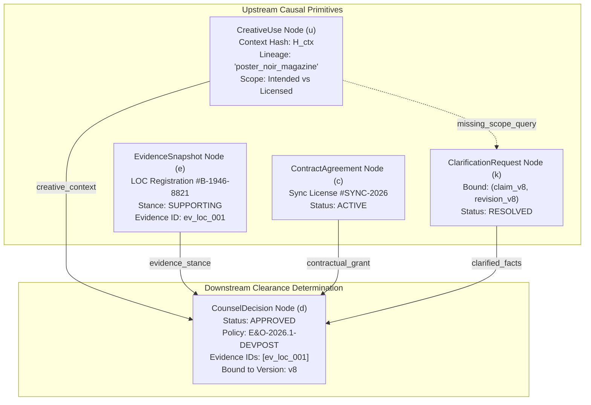
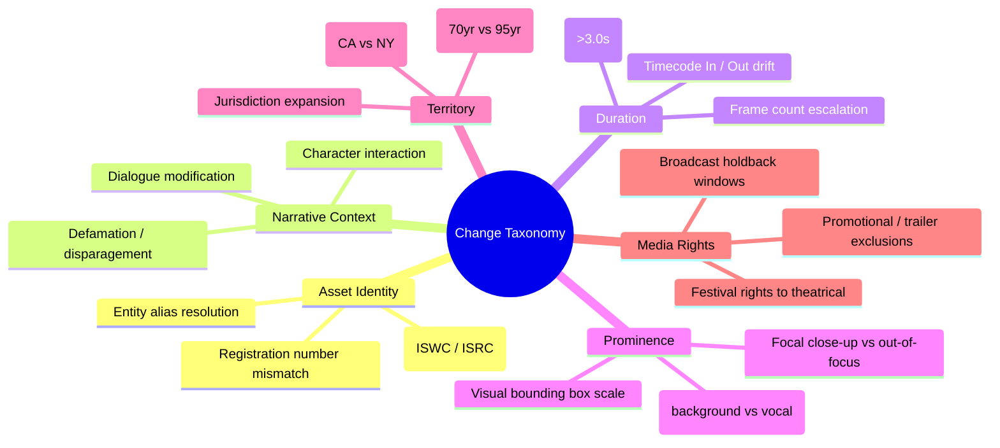
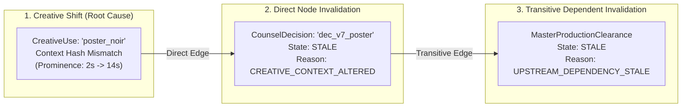
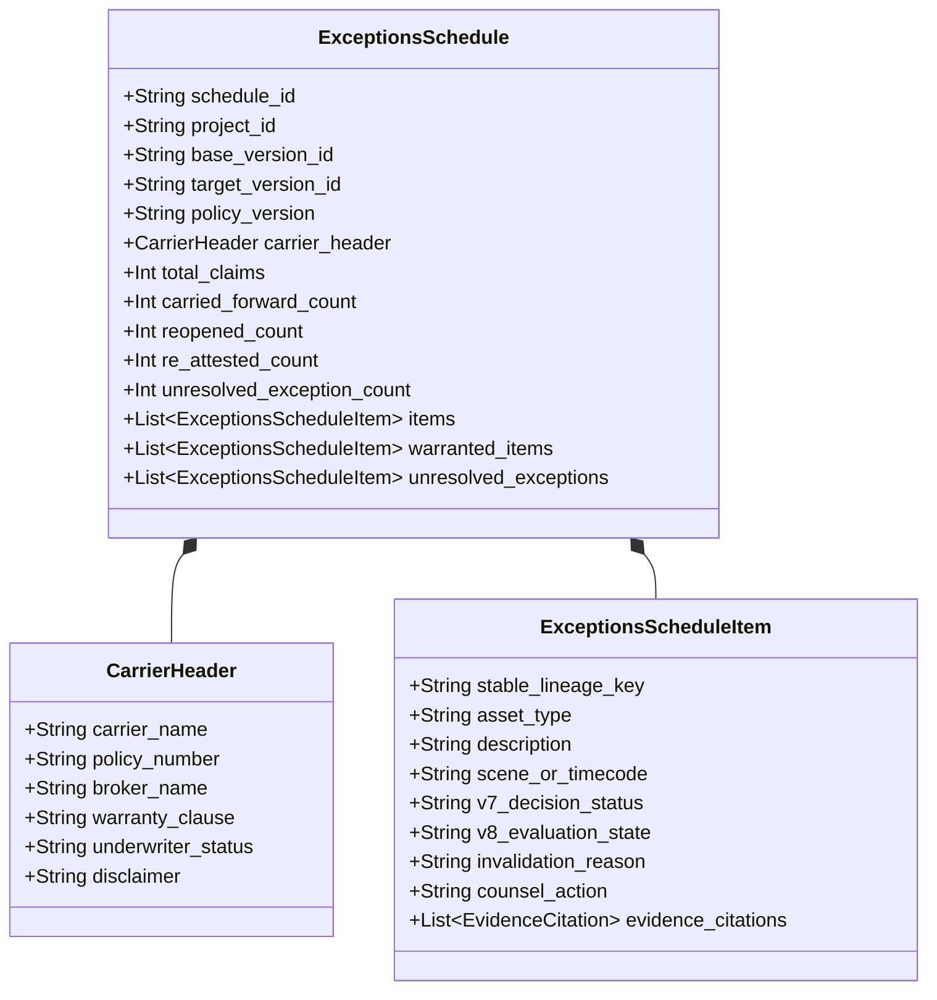

# Lienmark Architecture: Dependency Graph & Invalidation Engine

**Document:** `docs/architecture/03_dependency_graph_and_invalidation_engine.md`  
**Status:** Canonical Engineering Specification  
**Version:** 2.1.0 (Schedule Accounting & Invalidation Integrity Revision)  
**Implementation Reference:** `backend/core/invalidation_engine.py`, `backend/core/dependency_graph.py`  
**Related Documents:**
- [`01_system_topology_and_ingestion.md`](01_system_topology_and_ingestion.md)
- [`02_agent_orchestration_and_adk_pipeline.md`](02_agent_orchestration_and_adk_pipeline.md)
- [`04_data_schemas_and_entity_contracts.md`](04_data_schemas_and_entity_contracts.md)

---

## 1. Architectural Core: Deterministic Fail-Closed Clearance

### 1.1 The Underwriting Reality: Why Prompts Cannot Clear Titles
In entertainment errors and omissions (E&O) insurance underwriting, legal clearance is an insurable warranty. Underwriters do not insure non-deterministic LLM statements such as *"I believe this poster is likely fair use."* Insurance policies depend on:
1. Exact identifying work registration numbers and public catalog verification;
2. Unambiguous license grants, strict covenant compliance, and confirmed scope;
3. Mathematically reproducible dependency tracking across script drafts; and
4. Explicit human attorney attestations for any ambiguous, altered, or high-exposure assets.

For this reason, **Lienmark's clearance invalidation engine is implemented strictly in pure, deterministic Python (`backend/core/invalidation_engine.py`)**. LLMs are utilized upstream solely for semantic extraction and delta classification. The core decision engine that determines whether an existing legal clearance carries forward, becomes stale, or requires re-attestation is completely deterministic, fail-closed, and mathematically verifiable.

---

## 2. Mathematical Formalization of the Clearance DAG

The clearance lineage is modeled as a finite directed acyclic graph (DAG):

$$\mathcal{G} = (\mathcal{V}, \mathcal{E})$$

### 2.1 Vertex Topology ($\mathcal{V}$)
The set of vertices $\mathcal{V}$ is partitioned into typed node classes:

$$\mathcal{V} = \mathcal{V}_{\text{creative}} \cup \mathcal{V}_{\text{evidence}} \cup \mathcal{V}_{\text{contract}} \cup \mathcal{V}_{\text{clarification}} \cup \mathcal{V}_{\text{decision}}$$

1. **Creative Use Nodes ($u \in \mathcal{V}_{\text{creative}}$):** A concrete instance of a rights-bearing asset in a specific cut version $V_n$. Characterized by a cryptographic context fingerprint and explicit scope separation:
   $$H_{\text{ctx}}(u) = \text{SHA-256}(\text{narrative\_context}(u) \mathbin{\Vert} \text{prominence}(u))_{[0:16]}$$
   Every creative node isolates intended production use (`intended_territory`, `intended_media`, `intended_duration`, `distribution_window`) from documented license scope (`licensed_territory`, `licensed_media`, `licensed_term`). Missing scope forces $u$ into `UNKNOWN` status.
2. **External Evidence Snapshot Nodes ($e \in \mathcal{V}_{\text{evidence}}$):** Third-party verified registry entries (ASCAP, USPTO, Copyright Office) retrieved via Parallel Search API at timestamp $t$ with cryptographic raw payload hash $\text{SHA-256}(\text{payload})$. Possesses an evidence stance:
   $$\text{stance}(e) \in \{\text{SUPPORTING}, \text{INFORMATIONAL}, \text{CONTRADICTORY}, \text{INSUFFICIENT}\}$$
3. **Contract Agreement Nodes ($c \in \mathcal{V}_{\text{contract}}$):** Executed studio licenses and talent releases with explicit scope, term, covenants, and active status:
   $$\text{is\_active}(c) \in \{\text{TRUE}, \text{FALSE}\}$$
4. **Clarification Request Nodes ($k \in \mathcal{V}_{\text{clarification}}$):** Mid-run human inquiries bound strictly to a specific claim and script revision $(u_{\text{claim\_id}}, V_{\text{revision\_id}})$. If scope or licensing is missing/unknown, $k$ suspends auto-clearance until counsel or production responds.
5. **Counsel Decision Nodes ($d \in \mathcal{V}_{\text{decision}}$):** Signed legal determinations rendered by clearance counsel, explicitly binding policy version $\text{policy\_version\_id}$, target revision $V_n$, and array of relied evidence snapshot IDs:
   $$\text{evidence\_snapshot\_ids}(d) = [e_1, e_2, \dots], \quad \text{status}(d) \in \{\text{APPROVED}, \text{APPROVED\_WITH\_CONDITION}, \text{REJECTED}, \text{NEEDS\_REVIEW}\}$$

### 2.2 Edge Topology ($\mathcal{E}$)
Directed causal edges represent legal dependence:

$$(x, y) \in \mathcal{E} \iff y \text{ causally depends upon } x$$

Where $x$ is an upstream prerequisite and $y$ is a downstream dependent. A counsel clearance decision $d$ depends upon the creative use $u$, external evidence $e$, and any private contract $c$:

$$(u, d) \in \mathcal{E}, \quad (e, d) \in \mathcal{E}, \quad (c, d) \in \mathcal{E}$$

If scope is missing ($u_{\text{scope\_status}} = \text{UNKNOWN}$), an edge $(u, k) \in \mathcal{E}$ directs the pipeline to an asynchronous human clarification request before decision $d$ can be attested: $(k, d) \in \mathcal{E}$.



---

## 3. Comprehensive Change Taxonomy

When a production transitions from a baseline revision ($V_{base}$, e.g. V7) to a target revision ($V_{target}$, e.g. V8), the engine classifies modifications across six orthogonal domain dimensions:



### 3.1 Taxonomy Dimension Breakdown

| Dimension | Measured Parameter | Threshold for Invalidation | Legal / Statutory Justification |
| :--- | :--- | :--- | :--- |
| **1. Asset** | Work ID (ISWC/ISRC), title, writer, registration # | Any substitution or unverified alias | Title clearance attaches strictly to an identified work; changing an arrangement or master recording invalidates prior sync licenses. |
| **2. Context** | Script dialogue, character interactions, scene framing | Context hash mismatch ($H_{\text{ctx}}$) or disparagement flag | Nominative fair use evaporates if a trademarked product is used in a defamatory, disparaging, or unwholesome context (e.g., product malfunction causing injury). |
| **3. Duration** | SMPTE timecode interval $[t_{in}, t_{out}]$, aggregate seconds | Delta $> 1.0\text{s}$ or aggregate $> 3.0\text{s}$ | The statutory *de minimis* defense (*Sandoval v. New Line Cinema*) requires that copyright visual appearances be fleeting and unnoticeable. |
| **4. Prominence** | Camera framing, focal plane, depth-of-field, audio mix | Shift from background blur to focal center; dialogue references headline | Background elements brought into focal center become featured uses, converting non-infringing ambient decor into copyright reproduction. |
| **5. Territory** | Distribution jurisdiction codes (`["US", "EU", "UK", "JP"]`) | Inclusion of jurisdictions with differing term laws | A work published in 1946 may be in the public domain in the US (expired pre-1978 renewal) but fully protected in the EU under life-plus-70 rules. |
| **6. Media** | Distribution channels (Theatrical, SVOD, Free-to-Air, Promo) | Exploitation beyond licensed grant | Music and footage licenses are strictly scoped; using a festival-cleared track in a theatrical trailer constitutes copyright infringement. |

---

## 4. Invalidation Propagation & Lineage Resolution

### 4.1 Invalidation States & Schedule Visibility Mandate
For every prior clearance decision $d \in \mathcal{V}_{\text{decision}}$ evaluated against target revision $V_{target}$, the engine outputs a `DecisionValidity` record assigning one of eight formal states.

> [!IMPORTANT]
> **Universal Visibility Mandate: No Concealment of Active Exposure**  
> The clearance schedule and export exist to expose legal risk to underwriters, not to conceal in-flight work. While unresolved claims are *excluded from insurance policy coverage*, they must **REMAIN 100% VISIBLE in the Draft Schedule of Exceptions**. Concealing `STALE`, `NEW`, `UNVETTED`, or `CONDITIONAL` claims creates hidden underwriting liabilities and breaches the clearance warranty.

| State | Definition | Engine Action | Carrier Policy Coverage | Draft Schedule & Export Visibility |
| :--- | :--- | :--- | :--- | :--- |
| **`CARRIED_FORWARD`** | Prerequisite creative context and evidence are bit-for-bit identical. | Zero revalidation; prior approval carries forward idempotently. | **Covered.** Warranted without review ($0 legal spend). | **Warranted Coverage Section.** Listed as cleared with zero attorney touch. |
| **`STALE`** | Creative context altered, external evidence shifted, or upstream prerequisite modified. | Invalidate prior clearance; reopen claim; dispatch Investigation Plan / Parallel Search. | **Excluded from Coverage** until counsel re-attests. | **Prominently Visible in Schedule of Exceptions.** Flagged as open invalidation requiring review. |
| **`NEW`** | Asset present in $V_{target}$ but absent in $V_{base}$ (newly introduced creative element). | Route to intake extraction; create initial investigation goals; flag for clearance review. | **Excluded from Coverage** until initially vetted. | **Prominently Visible in Schedule of Exceptions.** Listed as newly introduced unvetted exposure. |
| **`UNVETTED`** | Ingestion complete, but public registry research, private contract discovery, or clarification response is pending. | External Parallel Search or human clarification in progress. | **Excluded from Coverage** (in-flight research). | **Prominently Visible in Schedule of Exceptions.** Listed as in-flight research blocker. |
| **`CONDITIONAL`** | Approved by counsel subject to outstanding contractual conditions or post-production delivery covenants. | Awaiting signed release upload or delivery verification. | **Excluded from Coverage** until conditions verified. | **Prominently Visible in Schedule of Exceptions.** Listed with pending covenant checklist. |
| **`RE_ATTESTED`** | Stale claim reviewed by counsel with fresh evidence/contract and re-approved with signed rationale. | Persist new superseding decision in append-only cryptographic ledger. | **Covered.** Warranted under signed counsel attestation. | **Warranted Coverage Section.** Listed with attorney rationale & citations. |
| **`EXCEPTION`** | Stale/new claim rejected by counsel, unlicensable, disputed, or subject to adverse infringement claim. | Escalate to carrier underwriter; attach citations, statutory exposure analysis, and contract voidance notice. | **Formally Excluded.** Not covered by standard policy binder. | **Scheduled Exception Rider.** Formally scheduled on underwriter policy exclusion exhibit. |
| **`REMOVED`** | Asset present in $V_{base}$ but excised in $V_{target}$ (deleted scene/cut). | Close clearance lineage; mark decision non-applicable for target version. | **Non-Applicable.** Not in target production cut. | **Omitted from Target Census.** Does not appear in target cut; recorded in historical audit ledger only. |

---

### 4.2 Transitive Invalidation Algorithm

When an upstream node shifts, the invalidation engine executes a breadth-first search (BFS) over the transpose dependency graph $\mathcal{G}^T$ (following downstream dependent edges):

```python
def propagate_invalidation(
    graph: ClearanceDependencyGraph,
    changed_nodes: Dict[str, InvalidationCause]
) -> List[InvalidationNotice]:
    """
    Executes fail-closed transitive invalidation propagation across the DAG.
    Guarantees deterministic, input-order invariant propagation.
    """
    notices: List[InvalidationNotice] = []
    visited: Set[str] = set()
    queue = deque(sorted(changed_nodes.keys()))  # Canonical sort order

    while queue:
        current_node_id = queue.popleft()
        cause = changed_nodes.get(current_node_id)

        # Retrieve downstream dependents: { y | (current_node_id, y) in E }
        dependents = graph.get_downstream_dependents(current_node_id)
        for dep in sorted(dependents, key=lambda n: n.canonical_sort_key()):
            if dep.node_id in visited:
                continue

            visited.add(dep.node_id)
            notice = InvalidationNotice(
                affected_node_id=dep.node_id,
                affected_lineage_key=dep.stable_lineage_key,
                affected_node_type=dep.node_type,
                root_cause_node_id=current_node_id,
                root_cause_lineage_key=cause.lineage_key,
                reason_code=cause.reason_code,
                explanation=cause.format_explanation(dep),
                invalidation_path=graph.find_shortest_path(current_node_id, dep.node_id),
            )
            notices.append(notice)
            queue.append(dep.node_id)

    return notices
```



---

## 5. Mathematical Invariants & Verification Guarantees

The Invalidation Engine strictly enforces three core mathematical invariants. Any breach raises a fatal `FailClosedSecurityViolation` and halts pipeline execution.

### Invariant 1: Idempotency Under Self-Evaluation
Evaluating any revision against itself ($V_n$ vs $V_n$) must yield **100% carried-forward approvals, zero stale claims, and zero external API spend**:

$$\text{Evaluate}(V_n, V_n) \implies \begin{cases}
|\mathcal{V}_{\text{stale}}| = 0 \\
|\mathcal{V}_{\text{carried}}| = |\mathcal{V}_{\text{total}}| \\
\text{Spend}_{\text{API}} = \$0.00
\end{cases}$$

### Invariant 2: Input Permutation Invariance
The engine's output is strictly invariant to the input list order of creative uses, prior decisions, and evidence snapshots. All internal maps, sets, and evaluation loops sort entities by their canonical sort key:

$$\text{SortKey}(u) = (\text{stable\_lineage\_key}(u), \text{use\_id}(u))$$

$$\text{Evaluate}(\sigma(\mathcal{U}_{base}), \sigma(\mathcal{U}_{target})) \equiv \text{Evaluate}(\mathcal{U}_{base}, \mathcal{U}_{target}) \quad \forall \sigma \in S_n$$

### Invariant 3: The Schedule Conservation Law & Fundamental Accounting Identity
For any generated Form E&O-2026 Underwriter Schedule, the sum of partitioned claims must exactly equal the total number of evaluated target cut claims:

$$N_{\text{target\_total}} = N_{\text{warranted}} + N_{\text{unresolved\_exceptions}}$$

Where the warranted coverage set $N_{\text{warranted}}$ is partitioned strictly into:
$$N_{\text{warranted}} = N_{\text{carried\_forward}} + N_{\text{re\_attested}}$$

And the unresolved exceptions set $N_{\text{unresolved\_exceptions}}$ accounts for every open, in-flight, or rejected claim:
$$N_{\text{unresolved\_exceptions}} = N_{\text{stale}} + N_{\text{new}} + N_{\text{unvetted}} + N_{\text{conditional}} + N_{\text{rejected\_exception}}$$

#### The Universal Census Theorem:
$$\forall c \in \mathcal{V}_{\text{creative}}(V_{\text{target}}), \quad c \in \text{ScheduleView}(V_{\text{target}})$$

Every active claim in the target cut revision $V_{\text{target}}$ MUST be accounted for and visible in the Draft Schedule and final underwriter export:
1. **Zero Concealment Invariant:** A clearance management platform exists to expose legal liabilities, never to conceal them. Uncleared, stale, unvetted, or new claims must NEVER be hidden or filtered out of the schedule view.
2. **Deterministic Partitioning:** The intersection between warranted coverage and unresolved exceptions is strictly empty, and their union forms the full census of target creative uses:
   $$\mathcal{S}_{\text{warranted}} \cap \mathcal{S}_{\text{unresolved\_exceptions}} = \emptyset, \quad \mathcal{S}_{\text{warranted}} \cup \mathcal{S}_{\text{unresolved\_exceptions}} = \mathcal{V}_{\text{creative}}(V_{\text{target}})$$
3. **Fail-Closed Accounting Identity:** If $N_{\text{carried\_forward}} + N_{\text{re\_attested}} + N_{\text{unresolved\_exceptions}} \neq N_{\text{target\_total}}$, the engine immediately raises `FailClosedSecurityViolation("Schedule conservation law violated: claim census mismatch")` and halts export generation.

---

## 6. Form E&O-2026 Underwriter Schedule Generation

The culmination of the Invalidation Engine is the automated synthesis of the **Form E&O-2026 Schedule of Exceptions**. This document serves as the legal exhibit attached to entertainment errors and omissions insurance policies.

The schedule export is structured into two mutually exclusive and collectively exhaustive (MECE) sections:
1. **Part A: Warranted Coverage Schedule ($N_{\text{warranted}}$):** Lists all unaffected carried-forward claims and counsel-attested items with verified statutory citations, contract hashes, and evidence IDs.
2. **Part B: Schedule of Exceptions & Active Invalidation Items ($N_{\text{unresolved\_exceptions}}$):** Catalogs every single active unresolved claim (`STALE`, `NEW`, `UNVETTED`, `CONDITIONAL`, and `EXCEPTION`) with required remedial action, pending covenants, or insurance exclusion riders.



### 6.1 Concrete Invalidation Walkthrough: The Blockbuster Baseline (12 $\rightarrow$ 10 / 2)

To demonstrate the mathematical precision of the engine and the Universal Census Theorem, consider the canonical transition from **Version 7 (Baseline)** to **Version 8 (Target)** across its two lifecycle phases:

#### Phase 1: Ingestion & Invalidation (Intermediate Draft Schedule State)
1. **Total Claims Evaluated ($N_{\text{target\_total}} = 12$):** 12 rights-bearing creative uses across music, trademarks, artwork, and props.
2. **10 Unaffected Claims Carry Forward ($0 Spend):**
   - Scene 14 Diner Wall Decor, Scene 22 Vehicle Badges, and Scene 35 Instrumental Radio Cues have identical context hashes ($H_{\text{ctx}}^{v7} == H_{\text{ctx}}^{v8}$) and unshifted external evidence.
   - Designated `CARRIED_FORWARD` $\implies N_{\text{carried\_forward}} = 10$.
3. **2 Claims Invalidated into STALE:**
   - **Claim 11 (`poster_noir_detective_magazine`):** Context hash mismatch (prominence escalated from 2s background blur to 14s close-up read aloud). Flagged `CREATIVE_CONTEXT_ALTERED`.
   - **Claim 12 (`music_cue_midnight_serenade`):** Parallel Search detects adverse Vanguard Media 2026 assignment. Flagged `EXTERNAL_EVIDENCE_SHIFT`.
   - Both claims enter `STALE` state $\implies N_{\text{stale}} = 2$.
4. **Draft Schedule Accounting Balance (Before Human Adjudication):**
   $$N_{\text{target\_total}} (12) = N_{\text{warranted}} (10) + N_{\text{unresolved\_exceptions}} (2 \text{ STALE})$$
   *Schedule Visibility:* Both `STALE` claims are **prominently rendered in the Draft Schedule** under Unresolved Exceptions. Underwriters can inspect the active exposure while Parallel queries and attorney reviews proceed.

#### Phase 2: Post-Investigation & Counsel Adjudication (Final Warranted Schedule State)
1. **Claim 11 Resolution (`poster_noir_detective_magazine`):**
   - Parallel Search returns expired Library of Congress catalog renewal (LOC record #B-1946-8821).
   - Lead clearance counsel Sarah Jenkins, Esq. reviews public domain verification and re-attests the claim with signed legal rationale.
   - Moves from `STALE` to `RE_ATTESTED` $\implies N_{\text{re\_attested}} = 1$.
2. **Claim 12 Resolution (`music_cue_midnight_serenade`):**
   - Adverse assignment confirmed; studio contract vault contains no executed sync license from Vanguard Media.
   - Counsel marks the claim as unlicensable without an additional budget rider $\implies$ moves to `EXCEPTION`.
   - Remains in $N_{\text{unresolved\_exceptions}} = 1 \text{ (EXCEPTION)}$.
3. **Final Form E&O-2026 Schedule Conservation Balance:**
   $$N_{\text{target\_total}} = N_{\text{carried\_forward}} + N_{\text{re\_attested}} + N_{\text{unresolved\_exceptions}}$$
   $$12 \text{ Total} = 10 \text{ Carried Forward} + 1 \text{ Re-Attested} + 1 \text{ Unresolved Exception (1 EXCEPTION)}$$
   $$N_{\text{warranted}} = 11, \quad N_{\text{unresolved\_exceptions}} = 1$$

At every stage of the lifecycle, all 12 claims are 100% visible and accounted for. The schedule never conceals in-flight work or open exposure.

