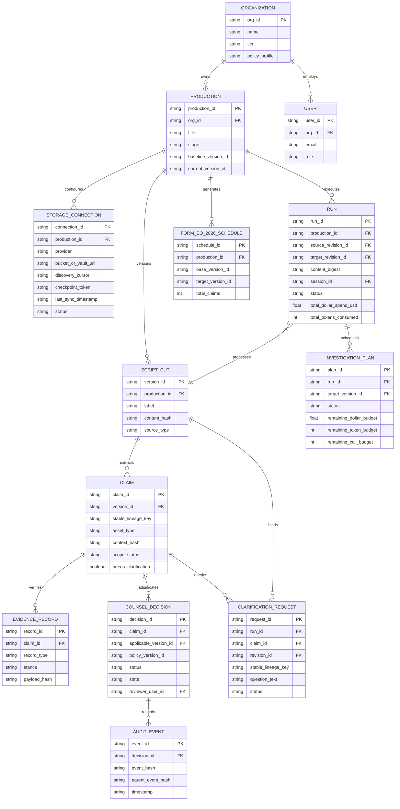
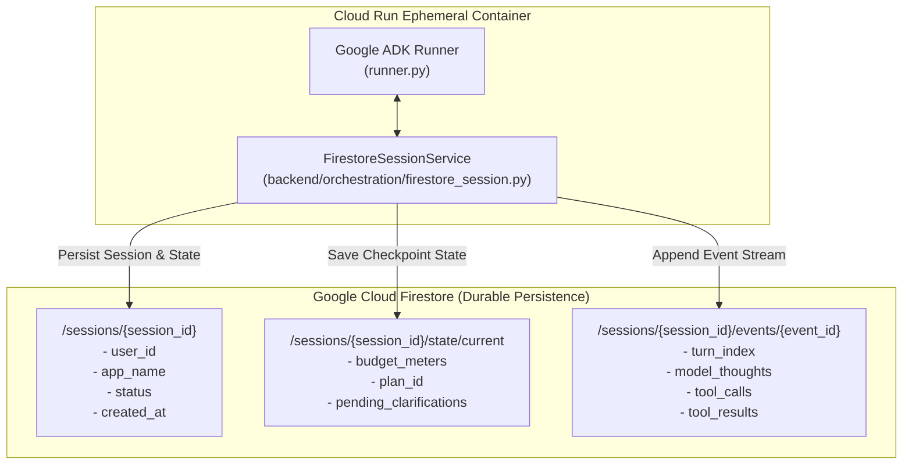
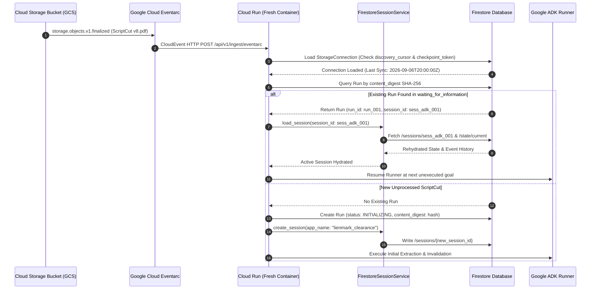

# Lienmark Architecture: Data Schemas & Entity Contracts

**Document:** `docs/architecture/04_data_schemas_and_entity_contracts.md`  
**Status:** Canonical Engineering Specification  
**Version:** 2.1.0 (Scope Separation & Persisted Concepts Revision)  
**Implementation Reference:** `backend/domain/models.py`, `frontend/lib/types.ts`  
**Related Documents:**
- [`01_system_topology_and_ingestion.md`](01_system_topology_and_ingestion.md)
- [`02_agent_orchestration_and_adk_pipeline.md`](02_agent_orchestration_and_adk_pipeline.md)
- [`03_dependency_graph_and_invalidation_engine.md`](03_dependency_graph_and_invalidation_engine.md)

---

## 1. Domain Entity Relationship Topology

The Lienmark clearance platform defines an immutable, strongly-typed domain model across the entire lifecycle of cinematic production clearance: from continuous cloud storage discovery and multi-draft script intake to external evidence retrieval, human legal attestation, append-only auditing, durable session persistence, and underwriter schedule export.



---

## 2. Shared Domain Types & Enumerations

### 2.1 Python (Pydantic v2)
```python
from enum import Enum

class OrganizationTier(str, Enum):
    INDIE = "indie"
    STUDIO = "studio"
    ENTERPRISE = "enterprise"

class UserRole(str, Enum):
    PRODUCER = "producer"
    CLEARANCE_ANALYST = "clearance_analyst"
    ATTORNEY_REVIEWER = "attorney_reviewer"
    STUDIO_ADMIN = "studio_admin"

class StorageProvider(str, Enum):
    GCS = "gcs"
    S3 = "s3"
    DROPBOX = "dropbox"
    BOX = "box"
    FRAME_IO = "frame_io"
    LOCAL_VOLUME = "local_volume"

class ConnectionStatus(str, Enum):
    ACTIVE = "active"
    SYNCING = "syncing"
    PAUSED = "paused"
    ERROR = "error"

class ProductionStage(str, Enum):
    DEVELOPMENT = "development"
    PRE_PRODUCTION = "pre_production"
    PRINCIPAL_PHOTOGRAPHY = "principal_photography"
    POST_PRODUCTION = "post_production"
    PICTURE_LOCK = "picture_lock"
    DISTRIBUTION = "distribution"

class RunStatus(str, Enum):
    QUEUED = "queued"
    INITIALIZING = "initializing"
    EXTRACTING = "extracting"
    EVALUATING = "evaluating"
    WAITING_FOR_INFORMATION = "waiting_for_information"
    WAITING_FOR_BUDGET = "waiting_for_budget"
    READY_FOR_REVIEW = "ready_for_review"
    COMPLETED = "completed"
    FAILED = "failed"
    CANCELLED = "cancelled"

class AssetType(str, Enum):
    MUSIC = "music"
    TRADEMARK = "trademark"
    ARTWORK = "artwork"
    LIKENESS = "likeness"
    FOOTAGE = "footage"
    REAL_PERSON = "real_person"
    PROP = "prop"
    GENAI_FLAG = "genai_flag"
    OTHER = "other"

class ChangeKind(str, Enum):
    ADDED = "added"
    MATERIALLY_MODIFIED = "materially_modified"
    REMOVED = "removed"
    UNCHANGED = "unchanged"
    UNCERTAIN = "uncertain"

class DecisionState(str, Enum):
    CARRIED_FORWARD = "carried_forward"
    STALE = "stale"
    RE_ATTESTED = "re_attested"
    EXCEPTION = "exception"
    REMOVED = "removed"
    NEW = "new"

class DecisionStatus(str, Enum):
    APPROVED = "approved"
    APPROVED_WITH_CONDITION = "approved_with_condition"
    REJECTED = "rejected"
    NEEDS_REVIEW = "needs_review"

class ScopeStatus(str, Enum):
    UNKNOWN = "unknown"
    PARTIALLY_SPECIFIED = "partially_specified"
    FULLY_SPECIFIED = "fully_specified"
    UNLICENSED_EXPOSURE = "unlicensed_exposure"

class EvidenceStance(str, Enum):
    SUPPORTING = "supporting"
    INFORMATIONAL = "informational"
    CONTRADICTORY = "contradictory"
    INSUFFICIENT = "insufficient"

class EvidenceType(str, Enum):
    PUBLIC = "public"
    PRIVATE = "private"

class ClarificationStatus(str, Enum):
    PENDING = "pending"
    ANSWERED = "answered"
    EXPIRED = "expired"
    CANCELLED = "cancelled"

class ReviewAction(str, Enum):
    RE_ATTEST = "re_attest"
    REJECT = "reject"
    EXCEPTION = "exception"
```

### 2.2 TypeScript Interface Mapping
```typescript
export type OrganizationTier = 'indie' | 'studio' | 'enterprise';

export type UserRole = 
  | 'producer' 
  | 'clearance_analyst' 
  | 'attorney_reviewer' 
  | 'studio_admin';

export type StorageProvider = 
  | 'gcs' 
  | 's3' 
  | 'dropbox' 
  | 'box' 
  | 'frame_io' 
  | 'local_volume';

export type ConnectionStatus = 'active' | 'syncing' | 'paused' | 'error';

export type ProductionStage = 
  | 'development' 
  | 'pre_production' 
  | 'principal_photography' 
  | 'post_production' 
  | 'picture_lock' 
  | 'distribution';

export type RunStatus = 
  | 'queued' 
  | 'initializing' 
  | 'extracting' 
  | 'evaluating' 
  | 'waiting_for_information' 
  | 'waiting_for_budget' 
  | 'ready_for_review' 
  | 'completed' 
  | 'failed' 
  | 'cancelled';

export type AssetType = 
  | 'music' 
  | 'trademark' 
  | 'artwork' 
  | 'likeness' 
  | 'footage' 
  | 'real_person' 
  | 'prop' 
  | 'genai_flag' 
  | 'other';

export type ChangeKind = 
  | 'added' 
  | 'materially_modified' 
  | 'removed' 
  | 'unchanged' 
  | 'uncertain';

export type DecisionState = 
  | 'carried_forward' 
  | 'stale' 
  | 're_attested' 
  | 'exception' 
  | 'removed' 
  | 'new';

export type DecisionStatus = 
  | 'approved' 
  | 'approved_with_condition' 
  | 'rejected' 
  | 'needs_review';

export type ScopeStatus = 
  | 'unknown' 
  | 'partially_specified' 
  | 'fully_specified' 
  | 'unlicensed_exposure';

export type EvidenceStance = 
  | 'supporting' 
  | 'informational' 
  | 'contradictory' 
  | 'insufficient';

export type EvidenceType = 'public' | 'private';

export type ClarificationStatus = 
  | 'pending' 
  | 'answered' 
  | 'expired' 
  | 'cancelled';

export type ReviewAction = 're_attest' | 'reject' | 'exception';
```

---

## 3. Entity Contracts: Dual-Stack Schemas

### 3.1 Organization
Represents a multi-tenant enterprise boundary (studio, network, or production company). All collections are partitioned and access-controlled by `org_id`.

#### Pydantic v2 Schema
```python
from pydantic import BaseModel, Field
from typing import List, Dict, Any, Optional
from datetime import datetime, timezone

class Organization(BaseModel):
    org_id: str = Field(..., description="Unique organization identifier, e.g. org_studio_alpha")
    name: str = Field(..., min_length=2, description="Legal entity name of the studio")
    tier: OrganizationTier = Field(default=OrganizationTier.STUDIO)
    policy_profile: str = Field(default="standard_studio_eo_v1")
    watched_bucket_uri: str = Field(..., description="Primary GCS intake bucket URI")
    max_concurrent_runs: int = Field(default=10, ge=1, le=50)
    monthly_parallel_spend_cap_usd: float = Field(default=5000.0, ge=0.0)
    created_at: str = Field(default_factory=lambda: datetime.now(timezone.utc).isoformat())
    metadata: Dict[str, Any] = Field(default_factory=dict)
```

#### TypeScript Interface
```typescript
export interface Organization {
  org_id: string;
  name: string;
  tier: OrganizationTier;
  policy_profile: string;
  watched_bucket_uri: string;
  max_concurrent_runs: number;
  monthly_parallel_spend_cap_usd: number;
  created_at: string;
  metadata: Record<string, unknown>;
}
```

---

### 3.2 User
Represents an authenticated stakeholder within an organization with role-based permissions.

#### Pydantic v2 Schema
```python
class User(BaseModel):
    user_id: str = Field(..., description="Unique user identifier, e.g. usr_sarah_jenkins")
    org_id: str = Field(..., description="Organization boundary reference")
    email: str = Field(..., description="Corporate email address")
    display_name: str = Field(..., min_length=1)
    role: UserRole = Field(default=UserRole.CLEARANCE_ANALYST)
    is_attorney: bool = Field(default=False, description="Whether user holds legal clearance signing authority")
    bar_registration_number: Optional[str] = Field(None, description="State bar # for attorney sign-offs")
    created_at: str = Field(default_factory=lambda: datetime.now(timezone.utc).isoformat())
    last_login_at: Optional[str] = None
```

#### TypeScript Interface
```typescript
export interface User {
  user_id: string;
  org_id: string;
  email: string;
  display_name: string;
  role: UserRole;
  is_attorney: boolean;
  bar_registration_number?: string | null;
  created_at: string;
  last_login_at?: string | null;
}
```

---

### 3.3 StorageConnection
Represents an autonomous cloud storage watcher connection (Google Cloud Storage, AWS S3, Frame.io, Dropbox) that discovers new script drafts, edit decision lists, and executed licenses. Maintains high-watermark pagination tokens and scanning cursors to guarantee restart-resilient background ingestion.

#### Pydantic v2 Schema
```python
class StorageConnection(BaseModel):
    connection_id: str = Field(..., description="Unique connection ID, e.g. conn_gcs_broadway_01")
    org_id: str = Field(..., description="Owning organization boundary")
    production_id: str = Field(..., description="Bound production container ID")
    provider: StorageProvider = Field(default=StorageProvider.GCS)
    bucket_or_vault_uri: str = Field(..., description="Bucket or folder URI, e.g. gs://lienmark-vault-prod/cuts/")
    watch_prefix: str = Field(default="", description="Optional directory prefix to filter ingested documents")
    discovery_cursor: Optional[str] = Field(None, description="Opaque directory scanning cursor for pagination across large object listings")
    checkpoint_token: Optional[str] = Field(None, description="High-watermark pagination/delta token from object storage API")
    last_sync_timestamp: Optional[str] = Field(None, description="ISO 8601 UTC timestamp of last completed poll or webhook sync")
    sync_interval_seconds: int = Field(default=60, ge=10, le=3600)
    status: ConnectionStatus = Field(default=ConnectionStatus.ACTIVE)
    secret_manager_credential_ref: Optional[str] = Field(None, description="Google Secret Manager URI to service account or OAuth credentials")
    created_at: str = Field(default_factory=lambda: datetime.now(timezone.utc).isoformat())
    updated_at: str = Field(default_factory=lambda: datetime.now(timezone.utc).isoformat())
    metadata: Dict[str, Any] = Field(default_factory=dict)
```

#### TypeScript Interface
```typescript
export interface StorageConnection {
  connection_id: string;
  org_id: string;
  production_id: string;
  provider: StorageProvider;
  bucket_or_vault_uri: string;
  watch_prefix: string;
  discovery_cursor?: string | null;
  checkpoint_token?: string | null;
  last_sync_timestamp?: string | null;
  sync_interval_seconds: number;
  status: ConnectionStatus;
  secret_manager_credential_ref?: string | null;
  created_at: string;
  updated_at: string;
  metadata: Record<string, unknown>;
}
```

---

### 3.4 Production
Represents an individual film, television series, or video project undergoing clearance.

#### Pydantic v2 Schema
```python
class Production(BaseModel):
    production_id: str = Field(..., description="Unique production identifier, e.g. prod_broadway_01")
    org_id: str = Field(..., description="Owning organization ID")
    title: str = Field(..., min_length=1, description="Production working title")
    stage: ProductionStage = Field(default=ProductionStage.POST_PRODUCTION)
    underwriting_carrier: str = Field(default="Standard Entertainment & Media Syndicate")
    policy_number: str = Field(default="E&O-2026.1-DEVPOST")
    baseline_version_id: Optional[str] = Field(None, description="Approved baseline version (e.g. v7)")
    current_version_id: str = Field(..., description="Latest active revision (e.g. v8)")
    total_claims_count: int = Field(default=0, ge=0)
    open_exceptions_count: int = Field(default=0, ge=0)
    created_at: str = Field(default_factory=lambda: datetime.now(timezone.utc).isoformat())
    updated_at: str = Field(default_factory=lambda: datetime.now(timezone.utc).isoformat())
```

#### TypeScript Interface
```typescript
export interface Production {
  production_id: string;
  org_id: string;
  title: string;
  stage: ProductionStage;
  underwriting_carrier: string;
  policy_number: string;
  baseline_version_id?: string | null;
  current_version_id: string;
  total_claims_count: number;
  open_exceptions_count: number;
  created_at: string;
  updated_at: string;
}
```

---

### 3.5 ScriptCut (ProductionVersion)
Represents an immutable draft of a screenplay, edit decision list (EDL), or locked cut.

#### Pydantic v2 Schema
```python
class ScriptCut(BaseModel):
    version_id: str = Field(..., description="Version identifier, e.g. v7, v8")
    production_id: str = Field(..., description="Production parent container ID")
    label: str = Field(..., description="Revision label, e.g. 'Production Cut v8 - Picture Lock'")
    revision_color: Optional[str] = Field(None, description="Industry draft color: Blue, Pink, Yellow, etc.")
    content_hash: str = Field(..., min_length=64, max_length=64, description="SHA-256 hash of document")
    source_document_ref: str = Field(..., description="GCS vault URI, e.g. gs://lienmark-vault/.../v8.pdf")
    parent_version_id: Optional[str] = Field(None, description="Immediate predecessor version")
    source_type: str = Field(default="screenplay", description="screenplay, edl, xml, aaf, video_cut")
    timecode_fps: Optional[str] = Field(None, description="e.g. 23.976_ndf, 24.0, 29.97_df")
    created_at: str = Field(default_factory=lambda: datetime.now(timezone.utc).isoformat())
```

#### TypeScript Interface
```typescript
export interface ScriptCut {
  version_id: string;
  production_id: string;
  label: string;
  revision_color?: string | null;
  content_hash: string;
  source_document_ref: string;
  parent_version_id?: string | null;
  source_type: 'screenplay' | 'edl' | 'xml' | 'aaf' | 'video_cut';
  timecode_fps?: string | null;
  created_at: string;
}
```

---

### 3.6 Run (WorkflowRun)
Represents an authoritative Google ADK clearance change control execution run. Binds a source baseline revision to a target cut revision, computes a SHA-256 payload content digest, tracks execution meters, and preserves session state in durable Firestore storage.

#### Pydantic v2 Schema
```python
class Run(BaseModel):
    run_id: str = Field(..., description="Unique workflow run ID, e.g. run_2026_09_v8_001")
    production_id: str = Field(..., description="Bound production ID")
    org_id: str = Field(..., description="Owning organization boundary")
    source_revision_id: str = Field(..., description="Baseline script revision ID, e.g. v7")
    target_revision_id: str = Field(..., description="Target script revision ID, e.g. v8")
    content_digest: str = Field(..., min_length=64, max_length=64, description="SHA-256 digest of ingested document payload")
    session_id: str = Field(..., description="Bound Google ADK Session ID backed by durable FirestoreSessionService")
    status: RunStatus = Field(default=RunStatus.INITIALIZING)
    trigger_source: str = Field(default="storage_event", description="storage_event, webhook, api_dispatch, manual")
    plan_id: Optional[str] = Field(None, description="Bound InvestigationPlan ID")
    claims_evaluated_count: int = Field(default=0, ge=0)
    carried_forward_count: int = Field(default=0, ge=0)
    stale_count: int = Field(default=0, ge=0)
    unresolved_exceptions_count: int = Field(default=0, ge=0)
    total_dollar_spend_usd: float = Field(default=0.0, ge=0.0)
    total_tokens_consumed: int = Field(default=0, ge=0)
    parallel_api_calls_count: int = Field(default=0, ge=0)
    llm_inferences_count: int = Field(default=0, ge=0)
    error_message: Optional[str] = None
    created_at: str = Field(default_factory=lambda: datetime.now(timezone.utc).isoformat())
    updated_at: str = Field(default_factory=lambda: datetime.now(timezone.utc).isoformat())
    completed_at: Optional[str] = None
```

#### TypeScript Interface
```typescript
export interface Run {
  run_id: string;
  production_id: string;
  org_id: string;
  source_revision_id: string;
  target_revision_id: string;
  content_digest: string;
  session_id: string;
  status: RunStatus;
  trigger_source: 'storage_event' | 'webhook' | 'api_dispatch' | 'manual' | string;
  plan_id?: string | null;
  claims_evaluated_count: number;
  carried_forward_count: number;
  stale_count: number;
  unresolved_exceptions_count: number;
  total_dollar_spend_usd: number;
  total_tokens_consumed: number;
  parallel_api_calls_count: number;
  llm_inferences_count: number;
  error_message?: string | null;
  created_at: string;
  updated_at: string;
  completed_at?: string | null;
}
```

---

### 3.7 InvestigationPlan
Represents the dynamic multi-hop clearance research plan formulated by the Google ADK Clearance Coordinator. Records clearance goals, executed steps, tool results, cryptographic payload hashes, and non-bypassable remaining dollar, token, and API call budgets.

#### Pydantic v2 Schema
```python
class InvestigationGoal(BaseModel):
    goal_id: str = Field(..., description="Unique goal ID, e.g. goal_poster_loc_pd")
    stable_lineage_key: str = Field(..., description="Target claim lineage key")
    objective: str = Field(..., description="Targeted legal research goal e.g. 'Verify 1946 LOC renewal expiration'")
    priority: str = Field(default="high", description="critical, high, medium, low")
    status: str = Field(default="pending", description="pending, in_progress, completed, failed, budget_halted")

class ExecutedStep(BaseModel):
    step_id: str = Field(..., description="Unique step execution ID")
    step_name: str = Field(..., description="Canonical step name e.g. parallel_search_evidence")
    tool_name: str = Field(..., description="ADK tool invoked")
    input_summary: str = Field(..., description="Sanitized non-identifying query or parameter summary")
    status: str = Field(default="success", description="success, failed, timed_out, circuit_opened")
    duration_ms: float = Field(default=0.0)
    timestamp: str = Field(default_factory=lambda: datetime.now(timezone.utc).isoformat())

class ToolExecutionResult(BaseModel):
    result_id: str = Field(..., description="Unique result ID")
    step_id: str = Field(..., description="Corresponding step_id")
    tool_name: str = Field(...)
    raw_payload_hash: str = Field(..., min_length=64, max_length=64, description="SHA-256 hash of tool response")
    execution_status: str = Field(default="completed")
    latency_ms: float = Field(default=0.0)
    dollar_cost: float = Field(default=0.0)
    tokens_consumed: int = Field(default=0)
    result_summary: str = Field(..., description="Condensed result summary e.g. 'LOC Catalog record B-1946-8821: Expired'")
    stance: Optional[EvidenceStance] = None

class InvestigationPlan(BaseModel):
    plan_id: str = Field(..., description="Unique investigation plan ID, e.g. plan_v8_drift_eval")
    run_id: str = Field(..., description="Owning Run ID")
    target_version_id: str = Field(..., description="Target script revision ID, e.g. v8")
    status: str = Field(default="planning", description="planning, executing, paused_clarification, completed, budget_exhausted")
    goals: List[InvestigationGoal] = Field(default_factory=list)
    executed_steps: List[ExecutedStep] = Field(default_factory=list)
    tool_results: List[ToolExecutionResult] = Field(default_factory=list)
    
    # Non-Bypassable Budget Allocations & Remaining Allowances
    allocated_dollar_budget: float = Field(default=50.0, ge=0.0)
    remaining_dollar_budget: float = Field(default=50.0, ge=0.0)
    allocated_token_budget: int = Field(default=100000, ge=0)
    remaining_token_budget: int = Field(default=100000, ge=0)
    allocated_call_budget: int = Field(default=15, ge=0)
    remaining_call_budget: int = Field(default=15, ge=0)
    
    created_at: str = Field(default_factory=lambda: datetime.now(timezone.utc).isoformat())
    updated_at: str = Field(default_factory=lambda: datetime.now(timezone.utc).isoformat())
```

#### TypeScript Interface
```typescript
export interface InvestigationGoal {
  goal_id: string;
  stable_lineage_key: string;
  objective: string;
  priority: 'critical' | 'high' | 'medium' | 'low' | string;
  status: 'pending' | 'in_progress' | 'completed' | 'failed' | 'budget_halted' | string;
}

export interface ExecutedStep {
  step_id: string;
  step_name: string;
  tool_name: string;
  input_summary: string;
  status: 'success' | 'failed' | 'timed_out' | 'circuit_opened' | string;
  duration_ms: number;
  timestamp: string;
}

export interface ToolExecutionResult {
  result_id: string;
  step_id: string;
  tool_name: string;
  raw_payload_hash: string;
  execution_status: string;
  latency_ms: number;
  dollar_cost: number;
  tokens_consumed: number;
  result_summary: string;
  stance?: EvidenceStance | null;
}

export interface InvestigationPlan {
  plan_id: string;
  run_id: string;
  target_version_id: string;
  status: 'planning' | 'executing' | 'paused_clarification' | 'completed' | 'budget_exhausted' | string;
  goals: InvestigationGoal[];
  executed_steps: ExecutedStep[];
  tool_results: ToolExecutionResult[];
  allocated_dollar_budget: number;
  remaining_dollar_budget: number;
  allocated_token_budget: number;
  remaining_token_budget: number;
  allocated_call_budget: number;
  remaining_call_budget: number;
  created_at: string;
  updated_at: string;
}
```

---

### 3.8 Claim (CreativeUse) with Scope Separation

> [!IMPORTANT]
> **Elimination of Permissive Defaults & Scope Separation Standard**  
> In prior software systems, creative claims defaulted to `territory: ["US", "EU"]` and `media_scope: "worldwide_all_media_perpetual"`. In errors and omissions insurance underwriting, this assumption is catastrophic negligence. A film licensed for festival exhibition that streams on SVOD triggers statutory copyright infringement.
> 
> Lienmark strictly separates **intended production use** (what the production plans to exploit) from **documented licensed scope** (what executed contracts legally grant). Any missing scope attribute MUST remain `None` / `UNKNOWN` and fail-closed to trigger a `ClarificationRequest`.

#### Pydantic v2 Schema
```python
from pydantic import model_validator

class Claim(BaseModel):
    claim_id: str = Field(..., description="Unique claim instance ID, e.g. clm_v8_poster_noir")
    version_id: str = Field(..., description="Belonging ScriptCut version ID, e.g. v8")
    production_id: str = Field(..., description="Parent production ID, e.g. prod_broadway_01")
    stable_lineage_key: str = Field(..., description="Persistent lineage key connecting asset across versions")
    asset_type: AssetType = Field(...)
    description: str = Field(..., description="Minimal non-identifying description")
    scene_or_timecode: str = Field(..., description="Script page or timecode locator (Scene 42, 00:44:12)")
    duration_or_prominence: str = Field(..., description="Prominence metric e.g. '14s focal close-up'")
    narrative_context: str = Field(..., description="Immediate context / dialogue excerpt")
    context_hash: str = Field(..., description="SHA-256(context::prominence)[0:16]")
    
    # -------------------------------------------------------------------------
    # 1. INTENDED PRODUCTION EXPLOITATION USE (Production Intent)
    # Must NEVER default to permissive values. None/Empty indicates UNKNOWN.
    # -------------------------------------------------------------------------
    intended_territory: Optional[List[str]] = Field(
        None, 
        description="Territories planned for distribution (e.g. ['US', 'CA', 'GB']). None indicates UNKNOWN."
    )
    intended_media: Optional[List[str]] = Field(
        None, 
        description="Media channels planned (e.g. ['theatrical', 'svod']). None indicates UNKNOWN."
    )
    intended_duration: Optional[float] = Field(
        None, 
        description="Planned exposure duration in seconds. None indicates UNKNOWN."
    )
    distribution_window: Optional[str] = Field(
        None, 
        description="Planned distribution window (e.g. 'theatrical_exclusive_45d'). None indicates UNKNOWN."
    )

    # -------------------------------------------------------------------------
    # 2. DOCUMENTED LICENSED SCOPE (Executed Legal Grants on File)
    # Must NEVER default to worldwide perpetual grants. None indicates UNKNOWN / Not on file.
    # -------------------------------------------------------------------------
    licensed_territory: Optional[List[str]] = Field(
        None, 
        description="Territories legally granted per executed agreement. None indicates UNKNOWN / not on file."
    )
    licensed_media: Optional[List[str]] = Field(
        None, 
        description="Media scope granted (e.g. ['theatrical']). None indicates UNKNOWN / not on file."
    )
    licensed_term: Optional[str] = Field(
        None, 
        description="Duration of license grant (e.g. '5_years', 'perpetuity'). None indicates UNKNOWN / not on file."
    )
    licensor_grant_confirmed: bool = Field(
        default=False, 
        description="True ONLY if supported by an executed, active PrivateContractRecord"
    )

    # Scope Evaluation & Clarification Dispatch Trigger
    scope_status: ScopeStatus = Field(
        default=ScopeStatus.UNKNOWN, 
        description="Evaluated scope status: UNKNOWN, PARTIALLY_SPECIFIED, FULLY_SPECIFIED, or UNLICENSED_EXPOSURE"
    )
    needs_clarification: bool = Field(
        default=True, 
        description="True whenever intended or licensed scope is missing (UNKNOWN/None) or inconsistent"
    )
    pro_work_ids: Optional[Dict[str, str]] = Field(None, description="ISWC, ISRC, ASCAP, USPTO IDs")
    created_at: str = Field(default_factory=lambda: datetime.now(timezone.utc).isoformat())

    @model_validator(mode="after")
    def evaluate_scope_fail_closed(self) -> "Claim":
        """
        Fail-closed validation: Missing intended or licensed scope MUST remain
        UNKNOWN / None and force needs_clarification=True. Permissive defaults
        are strictly prohibited.
        """
        missing_intended = not self.intended_territory or not self.intended_media
        missing_licensed = not self.licensed_territory or not self.licensed_media or not self.licensed_term

        if missing_intended or (missing_licensed and not self.licensor_grant_confirmed):
            self.scope_status = ScopeStatus.UNKNOWN
            self.needs_clarification = True
        elif self.licensor_grant_confirmed and not missing_intended and not missing_licensed:
            unlicensed_territories = set(self.intended_territory) - set(self.licensed_territory)
            unlicensed_media = set(self.intended_media) - set(self.licensed_media)
            if unlicensed_territories or unlicensed_media:
                self.scope_status = ScopeStatus.UNLICENSED_EXPOSURE
                self.needs_clarification = True
            else:
                self.scope_status = ScopeStatus.FULLY_SPECIFIED
                self.needs_clarification = False
        return self
```

#### TypeScript Interface
```typescript
export interface Claim {
  claim_id: string;
  version_id: string;
  production_id: string;
  stable_lineage_key: string;
  asset_type: AssetType;
  description: string;
  scene_or_timecode: string;
  duration_or_prominence: string;
  narrative_context: string;
  context_hash: string;
  
  // 1. Intended Production Exploitation Use
  intended_territory?: string[] | null;
  intended_media?: string[] | null;
  intended_duration?: number | null;
  distribution_window?: string | null;

  // 2. Documented Licensed Scope
  licensed_territory?: string[] | null;
  licensed_media?: string[] | null;
  licensed_term?: string | null;
  licensor_grant_confirmed: boolean;

  // Scope Evaluation & Clarification Trigger
  scope_status: ScopeStatus;
  needs_clarification: boolean;
  pro_work_ids?: Record<string, string> | null;
  created_at: string;
}
```

---

### 3.9 EvidenceRecord (Public vs Private)
A polymorphic entity representing attributable verification. Uses tagged discriminator `record_type`.

#### Pydantic v2 Schema
```python
from typing import Union, Literal

class BaseEvidenceRecord(BaseModel):
    record_id: str = Field(..., description="Unique evidence ID")
    claim_id: str = Field(..., description="Associated claim ID")
    stable_lineage_key: str = Field(..., description="Asset stable lineage key")
    record_type: EvidenceType
    retrieved_at: str = Field(default_factory=lambda: datetime.now(timezone.utc).isoformat())
    payload_hash: str = Field(..., min_length=64, max_length=64, description="SHA-256 digest")

class PublicEvidenceRecord(BaseEvidenceRecord):
    record_type: Literal[EvidenceType.PUBLIC] = EvidenceType.PUBLIC
    provider: str = Field(default="Parallel")
    provider_call_id: str = Field(..., description="Parallel search_id or session_id")
    query: str = Field(..., description="Actual query string sent to Parallel")
    source_title: str = Field(..., description="Title of registry entry or article")
    source_url: str = Field(..., description="Attributable external URL")
    excerpt: str = Field(..., description="Verbatim extracted text excerpt")
    publisher: Optional[str] = Field(None, description="e.g. Library of Congress, ASCAP")
    stance: EvidenceStance = Field(default=EvidenceStance.SUPPORTING)
    http_status: int = Field(default=200)
    retrieval_latency_ms: float = Field(default=0.0)

class PrivateContractRecord(BaseEvidenceRecord):
    record_type: Literal[EvidenceType.PRIVATE] = EvidenceType.PRIVATE
    agreement_id: str = Field(..., description="License contract identifier")
    licensor: str = Field(..., description="Grantor party")
    licensee: str = Field(..., description="Grantee party")
    scope: str = Field(..., description="Exact permitted media and territory grant from agreement")
    term: str = Field(..., description="Contract duration or expiration")
    is_active: bool = Field(default=True)
    covenant_clauses: List[str] = Field(default_factory=list)
    storage_vault_uri: str = Field(..., description="GCS path to executed PDF agreement")

EvidenceRecord = Union[PublicEvidenceRecord, PrivateContractRecord]
```

#### TypeScript Interface
```typescript
export interface BaseEvidenceRecord {
  record_id: string;
  claim_id: string;
  stable_lineage_key: string;
  record_type: EvidenceType;
  retrieved_at: string;
  payload_hash: string;
}

export interface PublicEvidenceRecord extends BaseEvidenceRecord {
  record_type: 'public';
  provider: string;
  provider_call_id: string;
  query: string;
  source_title: string;
  source_url: string;
  excerpt: string;
  publisher?: string | null;
  stance: EvidenceStance;
  http_status: number;
  retrieval_latency_ms: number;
}

export interface PrivateContractRecord extends BaseEvidenceRecord {
  record_type: 'private';
  agreement_id: string;
  licensor: string;
  licensee: string;
  scope: string;
  term: string;
  is_active: boolean;
  covenant_clauses: string[];
  storage_vault_uri: string;
}

export type EvidenceRecord = PublicEvidenceRecord | PrivateContractRecord;
```

---

### 3.10 ClarificationRequest (Bound to Claim and Revision)
Represents an asynchronous request for human information, missing licenses, or scope confirmation dispatched mid-run. Strictly bound to **both `claim_id` AND `revision_id`** to prevent cross-draft ambiguity.

#### Pydantic v2 Schema
```python
class ClarificationRequest(BaseModel):
    request_id: str = Field(..., description="Unique request ID, e.g. clrf_8a92")
    run_id: str = Field(..., description="Active ADK workflow run ID")
    claim_id: str = Field(..., description="Target claim instance identifier, e.g. clm_v8_poster_noir")
    revision_id: str = Field(..., description="ScriptCut / ProductionVersion ID this request is strictly bound to (e.g. 'v8')")
    stable_lineage_key: str = Field(..., description="Persistent lineage key across drafts")
    scope_field_missing: Optional[str] = Field(
        None, 
        description="Missing scope attribute triggering this clarification, e.g. 'intended_territory', 'licensed_media'"
    )
    question_text: str = Field(..., description="Targeted legal clarification question")
    suggested_options: Optional[List[str]] = None
    required_document_type: Optional[str] = Field(None, description="e.g. 'Executed Master Use License'")
    assigned_role: UserRole = Field(default=UserRole.PRODUCER)
    assigned_user_id: Optional[str] = None
    status: ClarificationStatus = Field(default=ClarificationStatus.PENDING)
    response_text: Optional[str] = None
    attached_document_ref: Optional[str] = None
    created_at: str = Field(default_factory=lambda: datetime.now(timezone.utc).isoformat())
    resolved_at: Optional[str] = None
```

#### TypeScript Interface
```typescript
export interface ClarificationRequest {
  request_id: string;
  run_id: string;
  claim_id: string;
  revision_id: string;
  stable_lineage_key: string;
  scope_field_missing?: string | null;
  question_text: string;
  suggested_options?: string[] | null;
  required_document_type?: string | null;
  assigned_role: UserRole;
  assigned_user_id?: string | null;
  status: ClarificationStatus;
  response_text?: string | null;
  attached_document_ref?: string | null;
  created_at: string;
  resolved_at?: string | null;
}
```

---

### 3.11 CounselDecision (Explicit Policy Version & Evidence Array)
Represents an authoritative legal attestation or override rendered by clearance counsel. Strictly stores the explicit **`policy_version_id`** applied and the **`evidence_snapshot_ids`** relied upon.

#### Pydantic v2 Schema
```python
class CounselDecision(BaseModel):
    decision_id: str = Field(..., description="Unique decision ID, e.g. dec_v8_poster_noir")
    claim_id: str = Field(..., description="Target claim instance ID")
    stable_lineage_key: str = Field(..., description="Lineage key bound across versions")
    applicable_version_id: str = Field(..., description="Version for which decision applies (e.g. v8)")
    policy_version_id: str = Field(..., description="Explicit identifier of underwriting policy ruleset applied, e.g. 'E&O-2026.1-DEVPOST'")
    evidence_snapshot_ids: List[str] = Field(
        default_factory=list, 
        description="Array of PublicEvidenceSnapshot and PrivateContractRecord IDs relied upon"
    )
    status: DecisionStatus = Field(..., description="approved, approved_with_condition, rejected, needs_review")
    state: DecisionState = Field(default=DecisionState.NEW, description="carried_forward, stale, re_attested, exception, new")
    rationale: str = Field(..., description="Counsel legal justification")
    reviewer_user_id: str = Field(..., description="User ID of reviewing attorney")
    reviewer_display_name: str = Field(..., description="Full legal name of clearance counsel")
    supersedes_decision_id: Optional[str] = Field(None, description="ID of prior decision being superseded")
    dependency_ids: List[str] = Field(default_factory=list, description="IDs of uses, evidence, or contracts relied upon")
    statutory_citation_ref: Optional[str] = Field(None, description="e.g. 17 U.S.C. § 107, 17 U.S.C. § 205(e)")
    human_confirmed: bool = Field(default=True, description="True for attorney sign-off; False for AI recommendation")
    reviewed_at: str = Field(default_factory=lambda: datetime.now(timezone.utc).isoformat())
```

#### TypeScript Interface
```typescript
export interface CounselDecision {
  decision_id: string;
  claim_id: string;
  stable_lineage_key: string;
  applicable_version_id: string;
  policy_version_id: string;
  evidence_snapshot_ids: string[];
  status: DecisionStatus;
  state: DecisionState;
  rationale: string;
  reviewer_user_id: string;
  reviewer_display_name: string;
  supersedes_decision_id?: string | null;
  dependency_ids: string[];
  statutory_citation_ref?: string | null;
  human_confirmed: boolean;
  reviewed_at: string;
}
```

---

### 3.12 AuditEvent
Represents a tamper-evident, append-only ledger entry. Chained cryptographically via `event_hash` and `parent_event_hash`.

#### Pydantic v2 Schema
```python
import hashlib
import json
from pydantic import model_validator

class AuditEvent(BaseModel):
    event_id: str = Field(..., description="Unique event ID, e.g. evt_9f2018a")
    production_id: str = Field(...)
    stable_lineage_key: str = Field(...)
    action: ReviewAction = Field(...)
    prior_decision_id: Optional[str] = None
    new_decision_id: str = Field(...)
    prior_state: DecisionState = Field(default=DecisionState.STALE)
    new_state: DecisionState = Field(...)
    prior_status: DecisionStatus = Field(default=DecisionStatus.APPROVED)
    new_status: DecisionStatus = Field(...)
    reviewer_user_id: str = Field(...)
    reviewer_name: str = Field(...)
    counsel_rationale: str = Field(...)
    changed_dependencies: List[str] = Field(default_factory=list)
    evidence_citations: List[Dict[str, str]] = Field(default_factory=list)
    parent_event_hash: str = Field(default="0" * 64, description="SHA-256 of preceding audit event")
    event_hash: str = Field(default="", description="Canonical SHA-256 digest of this event")
    timestamp: str = Field(default_factory=lambda: datetime.now(timezone.utc).isoformat())

    @model_validator(mode="after")
    def compute_hash_chain(self) -> "AuditEvent":
        if not self.event_hash or len(self.event_hash) != 64:
            payload = {
                "event_id": self.event_id,
                "production_id": self.production_id,
                "stable_lineage_key": self.stable_lineage_key,
                "action": self.action.value,
                "new_decision_id": self.new_decision_id,
                "new_state": self.new_state.value,
                "new_status": self.new_status.value,
                "reviewer_user_id": self.reviewer_user_id,
                "counsel_rationale": self.counsel_rationale,
                "parent_event_hash": self.parent_event_hash,
                "timestamp": self.timestamp,
            }
            serialized = json.dumps(payload, sort_keys=True, separators=(",", ":"))
            self.event_hash = hashlib.sha256(serialized.encode("utf-8")).hexdigest()
        return self
```

#### TypeScript Interface
```typescript
export interface AuditEvent {
  event_id: string;
  production_id: string;
  stable_lineage_key: string;
  action: ReviewAction;
  prior_decision_id?: string | null;
  new_decision_id: string;
  prior_state: DecisionState;
  new_state: DecisionState;
  prior_status: DecisionStatus;
  new_status: DecisionStatus;
  reviewer_user_id: string;
  reviewer_name: string;
  counsel_rationale: string;
  changed_dependencies: string[];
  evidence_citations: Array<{
    source_title: string;
    source_url: string;
    payload_hash: string;
  }>;
  parent_event_hash: string;
  event_hash: string;
  timestamp: string;
}
```

---

### 3.13 FormEO2026Schedule
Represents the formal Errors & Omissions Underwriter Exceptions Schedule and Warranted Coverage exhibit. Guarantees complete visibility of all active unresolved claims (`STALE`, `NEW`, `UNVETTED`, `CONDITIONAL`, `EXCEPTION`).

#### Pydantic v2 Schema
```python
class ExceptionsScheduleItem(BaseModel):
    stable_lineage_key: str
    asset_type: AssetType
    description: str
    scene_or_timecode: str
    v7_decision_status: str
    v8_evaluation_state: str  # carried_forward, re_attested, stale, new, exception
    invalidation_reason: Optional[str] = None
    counsel_action: str
    evidence_citations: List[Dict[str, str]] = Field(default_factory=list)

class CarrierHeader(BaseModel):
    carrier_name: str = Field(default="Standard Entertainment & Media Syndicate")
    policy_number: str = Field(default="E&O-2026.1-DEVPOST")
    broker_name: str = Field(default="Gallagher / Front Row Insurance Brokers")
    warranty_clause: str = Field(
        default="Warranted clearance schedule of exceptions; uncleared and unlisted rights are excluded from coverage."
    )
    underwriter_status: str = Field(default="PENDING_REVIEW")
    disclaimer: str = Field(
        default="NON-BINDING RISK ASSESSMENT: This schedule does not constitute an insurance binder or policy. Clearance exceptions and warranties are subject to carrier underwriting review."
    )

class FormEO2026Schedule(BaseModel):
    schedule_id: str = Field(..., description="Unique schedule ID, e.g. sch_broadway_v8")
    production_id: str = Field(...)
    project_name: str = Field(...)
    base_version_id: str = Field(..., description="e.g. v7")
    target_version_id: str = Field(..., description="e.g. v8")
    generated_at: str = Field(default_factory=lambda: datetime.now(timezone.utc).isoformat())
    policy_version: str = Field(default="E&O-2026.1-DEVPOST")
    carrier_header: CarrierHeader = Field(default_factory=CarrierHeader)
    total_claims: int = Field(..., ge=0)
    carried_forward_count: int = Field(..., ge=0)
    reopened_count: int = Field(..., ge=0)
    re_attested_count: int = Field(..., ge=0)
    unresolved_exception_count: int = Field(..., ge=0)
    items: List[ExceptionsScheduleItem] = Field(default_factory=list, description="All active target claims census")
    warranted_items: List[ExceptionsScheduleItem] = Field(default_factory=list, description="Cleared and attested items")
    unresolved_exceptions: List[ExceptionsScheduleItem] = Field(default_factory=list, description="All active exceptions: STALE, NEW, UNVETTED, CONDITIONAL, EXCEPTION")
```

#### TypeScript Interface
```typescript
export interface ExceptionsScheduleItem {
  stable_lineage_key: string;
  asset_type: AssetType;
  description: string;
  scene_or_timecode: string;
  v7_decision_status: string;
  v8_evaluation_state: string;
  invalidation_reason?: string | null;
  counsel_action: string;
  evidence_citations: Array<{
    source_title: string;
    source_url: string;
    excerpt: string;
    provider: string;
    provider_call_id: string;
    payload_hash: string;
  }>;
}

export interface FormEO2026Schedule {
  schedule_id: string;
  production_id: string;
  project_name: string;
  base_version_id: string;
  target_version_id: string;
  generated_at: string;
  policy_version: string;
  carrier_header: CarrierHeader;
  total_claims: number;
  carried_forward_count: number;
  reopened_count: number;
  re_attested_count: number;
  unresolved_exception_count: number;
  items: ExceptionsScheduleItem[];
  warranted_items: ExceptionsScheduleItem[];
  unresolved_exceptions: ExceptionsScheduleItem[];
}
```

---

## 4. Durable Session & State Storage Architecture

### 4.1 The Volatility Hazard: Why `InMemorySessionService` Cannot Support Restart Recovery
Google ADK ships with a default `InMemorySessionService` that manages sessions in a Python local dictionary:
```python
# The dangerous default: Volatile memory dict
self._sessions: Dict[str, Session] = {}
```

In cinematic production clearance, relying on `InMemorySessionService` is fatal:
1. **Container Ephemerality (Cloud Run):** Cloud Run containers are serverless and ephemeral. They shut down during auto-scaling to zero, blue/green traffic shifts, runtime memory exhaustion, or routine host node maintenance.
2. **Asynchronous Human-in-the-Loop Pauses:** When an ADK pipeline dispatches a `ClarificationRequest` (e.g. inquiring whether a poster license covers SVOD, or requesting an executed master sync license from a music supervisor), the process pauses for hours, days, or weeks awaiting human input.
3. **Catastrophic State Loss:** When the container recycles during this pause, `InMemorySessionService` loses all session state, conversation history, and execution context. When the user responds or a new document is uploaded to GCS, the incoming event triggers a `SessionNotFoundError`. The system is forced to re-execute the entire workflow from scratch, exhausting LLM token quotas and external search budgets.

### 4.2 Durable Firestore Session Architecture (`FirestoreSessionService`)
Lienmark implements an authoritative `FirestoreSessionService` conforming strictly to Google ADK's `SessionService` abstract interface, storing session data in Google Cloud Firestore (Datastore Native Mode):



#### Firestore Collection Schema Mapping
| Collection Path | Entity / Scope | Description |
| :--- | :--- | :--- |
| `/sessions/{session_id}` | `ADK Session Metadata` | Master session record holding application name, user ID, active run ID, and lifecycle state (`active`, `suspended`, `completed`). |
| `/sessions/{session_id}/state/current` | `ADK Session State` | Key-value working memory holding current `InvestigationPlan` pointer, remaining budget meters, and pending clarification identifiers. |
| `/sessions/{session_id}/events/{event_id}` | `ADK Event Stream` | Append-only sequence of conversation turns, model reasoning outputs, tool invocation payloads, and tool receipts. |
| `/organizations/{org_id}/productions/{prod_id}/runs/{run_id}` | `Business Run Record` | Primary business domain document linking `source_revision_id`, `target_revision_id`, and `content_digest`. |
| `/organizations/{org_id}/productions/{prod_id}/storage_connections/{conn_id}` | `Storage Watcher` | Cloud storage watcher configuration holding `discovery_cursor`, `checkpoint_token`, and `last_sync_timestamp`. |

### 4.3 Business Workflow Persistence & Resume-on-Document-Arrival
When a container restarts or a new cut arrives in cloud storage, the system resumes deterministically without re-evaluating unchanged claims:



---

## 5. Architectural Integrity & Verification Invariants

1. **Zero Permissive Scope Invariant:** If `intended_territory`, `intended_media`, `licensed_territory`, `licensed_media`, or `licensed_term` is unspecified, the engine forces `scope_status = ScopeStatus.UNKNOWN` and `needs_clarification = True`. No asset may default to worldwide perpetual coverage.
2. **Restart Recovery Invariant:** Every workflow step must persist its state checkpoint to Firestore before returning control to the caller. A container killed via `SIGKILL` at any point during a run must resume from its last completed step without duplicating external search API spend.
3. **Schedule Visibility Invariant:** Every claim in the target cut revision MUST appear in the Form E&O-2026 Schedule. No `STALE`, `NEW`, `UNVETTED`, or `CONDITIONAL` claim may be concealed or omitted from the schedule of exceptions.
