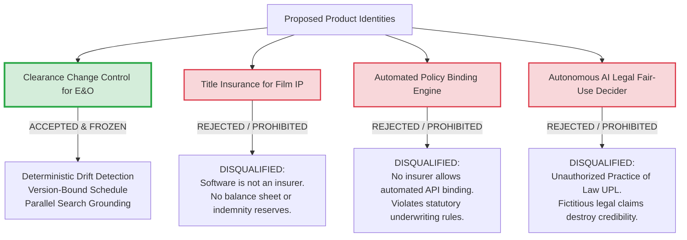
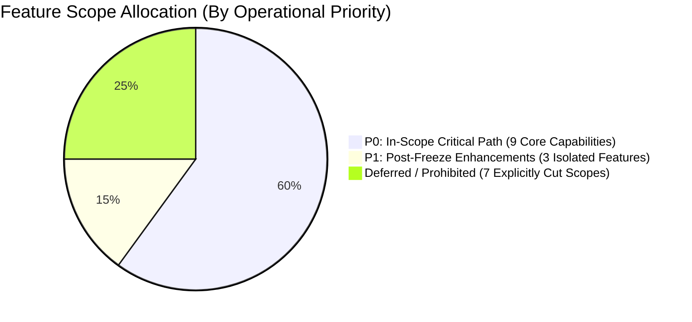
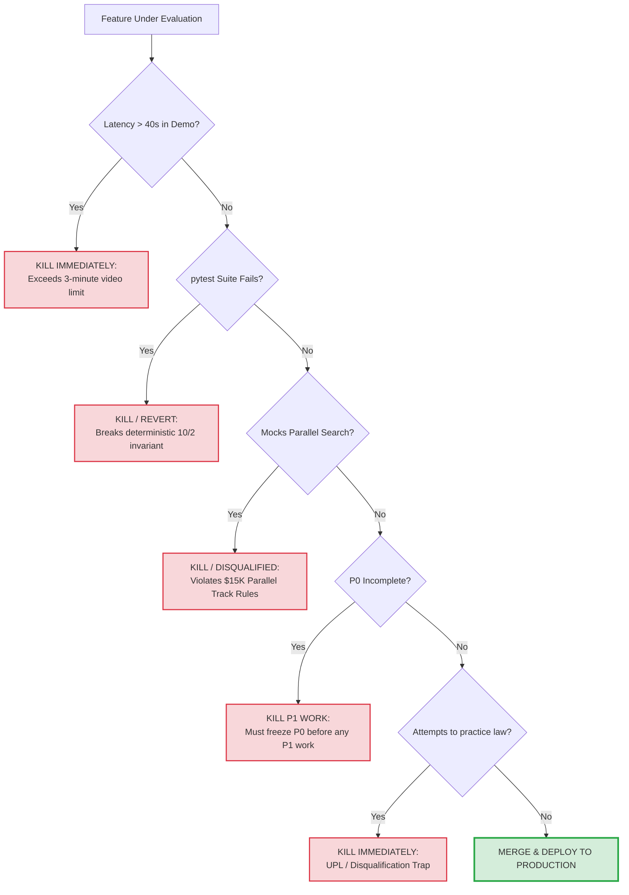

# Scope Demolition, Capability Boundary & Acceptance Contract Freeze

> **Hackathon**: Agentic Cinema: The Blockbuster Hackathon  
> **Evaluation Milestone**: Sprint 0B (Tasks 1, 2, 3, 5) & Stage 1 Pass/Fail Boundary Control  
> **Track Focus**: Parallel Track ($15,000 Prize Pool) & Core Agentic Implementation  
> **Document Status**: Complete & Authoritative (Sprint 0B Executed)  
> **Audited Date**: September 5, 2026 (Base review: September 1, 2026)  
> **Project**: [Lienmark — Clearance Change Control for E&O](https://github.com/lx-singw/lienmark)  
> **Author & Lead Architect**: Linda Singwane (`lx-singw`)  
> **Target Audience**: Devpost Screeners, Google Cloud Technical Judges, Parallel Track Judges, Entertainment Production Legal Counsel  
> **Operational Verdict**: **P0 SCOPE LOCKED / ZERO SCOPE CREEP / DETERMINISTIC ACCEPTANCE CONTRACT SEALED**

---

## 1. Executive Summary & The Imperative of Scope Demolition

In high-stakes hackathons, the most common mode of failure is not technical incompetence; it is **uncontrolled scope explosion**. Ambitious teams routinely conceptualize bloated "everything platforms"—promising automated insurance underwriting, video computer vision frame scanners, multi-agent peer chatter swarms, blockchain timestamping, and autonomous AI legal opinions. Such architectures inevitably collapse before the deadline: their code remains an unrunnable scaffold, their live APIs fail during demonstrations, and their legal claims collapse under professional scrutiny.

Sprint 0B of Lienmark executes a rigorous, disciplined **Scope Demolition**. Its purpose is to strip away all vanity features, hypothetical integrations, and decorative complexity, replacing them with **one mathematically testable, judge-verifiable vertical slice** built from the magic 40-second demonstration backward.

```
+----------------------------------------------------------------------------------------------------+
|                               THE SPRINT 0B IMMUTABLE FREEZE TRIAD                                  |
+----------------------------------------------------------------------------------------------------+
|                                                                                                    |
|   1. PRODUCT CATEGORY FREEZE:                                                                      |
|      "Clearance Change Control for E&O"                                                            |
|      (NOT title insurance, NOT automated policy binding, NOT autonomous legal advice)             |
|                                                                                                    |
|   2. PRIMARY USER FREEZE:                                                                          |
|      "Production / Clearance Counsel"                                                              |
|      (NOT the downstream underwriter, NOT the film viewer, NOT the director)                       |
|                                                                                                    |
|   3. CORE OUTPUT FREEZE:                                                                           |
|      "Version-Bound Form E&O-2026 Exceptions Schedule"                                             |
|      (NOT an invented "AI certificate", NOT a decorative crypto token, NOT a generic PDF)         |
|                                                                                                    |
+----------------------------------------------------------------------------------------------------+
```

This document establishes the binding architectural contract governing all subsequent engineering sprints (Sprints 1 through 8). Any pull request, dependency, or feature proposal that violates these boundaries is subject to immediate rejection under the **Ironclad Kill Criteria** defined in [§6.2](#62-the-five-ironclad-kill-criteria).

---

## 2. Task 1: Product Category Freeze — "Clearance Change Control for E&O"

### 2.1 Authoritative Category Definition

> **Lienmark is Clearance Change Control for E&O.**  
> More precisely: **Lienmark is the change-triggered, version-bound evidence and sign-off layer that detects clearance drift across script revisions, cuts, and refreshed public evidence.**

In cinematic production, rights clearance is never a static, one-time event. A clearance memo written against Script Draft 3 becomes invalid when the director re-cuts Scene 42 in Cut 8, bringing a background poster into focal dialogue, or when an external music rights catalog changes ownership mid-production. This operational gap between what was legally approved and what the production currently relies upon is termed **clearance drift**.

Lienmark solves clearance drift by transforming legal clearance into a deterministic, version-bound dependency graph. When a script or edit changes from Version 7 to Version 8:
1. It deterministically **carries unaffected approvals forward**, sparing production thousands of dollars in redundant legal re-review;
2. It **selectively reopens only drifted decisions** with explicit causal explanations;
3. It launches live queries to the **Parallel Search API** exclusively for the affected claims;
4. It presents actionable, structured briefings to entertainment counsel via **Gemini 2.5 Flash**; and
5. It compiles the reconciled audit trail into a standardized **Form E&O-2026 Exceptions Schedule**.

### 2.2 What Lienmark IS (The High-Value Workflow Wedge)

| Capability Dimension | Production Reality & Value Proposition |
|---|---|
| **Deterministic Invalidation Engine** | A pure-Python, fail-closed dependency evaluator (`backend/core/invalidation_engine.py`) that matches context hashes and evidence stamps, guaranteeing zero false carry-forwards. |
| **Targeted Evidence Grounding** | A runtime integration with the Parallel Search API (`backend/services/parallel_service.py`) that queries live public records only when a dependency changes, capturing URLs, timestamps, and stances. |
| **Counsel Decision Support** | An AI-accelerated briefing workflow (`backend/services/gemini_service.py`) that isolates material changes in under 15 seconds, keeping the attorney strictly in control. |
| **Standardized Insurer Deliverable** | A version-bound, SSR-rendered Exceptions Schedule (`frontend/app/report/[production_id]/page.tsx`) formatted to match standard Hollywood E&O underwriting warranty packets. |

### 2.3 What Lienmark Is Explicitly NOT (The Disqualification & Liability Traps)

To prevent misrepresentation during Devpost judging and avoid professional legal liabilities, Lienmark strictly repudiates three tempting but fatal mischaracterizations:



#### 1. NOT "Title Insurance for Entertainment IP"
- **The Fallacy**: Analogizing software to real-estate title insurance (e.g., First American).
- **The Reality**: Title insurance companies are state-regulated financial institutions with statutory capital reserves that issue legally binding indemnity contracts. They guarantee property title against prior liens and defend insureds in court with their own capital.
- **The Freezing Decision**: Lienmark does not underwrite financial risk, does not hold insurance reserves, does not issue policies of indemnity, and does not replace an insurance underwriter. Framing Lienmark as "title insurance" is factually false, legally misleading, and immediately invites skepticism from entertainment insurance specialists.

#### 2. NOT "Automated Policy Binding"
- **The Fallacy**: Claiming that Lienmark automatically issues or binds an E&O insurance policy via APIs (e.g., "Direct binding with Chubb or Hiscox").
- **The Reality**: No entertainment insurance carrier in the world permits programmatic, unsupervised policy binding for theatrical motion pictures. E&O insurance requires licensed surplus lines brokers, rigorous underwriting reviews, audited warranty applications, and manual carrier sign-off.
- **The Freezing Decision**: Lienmark integrates upstream of the underwriter. It prepares the verified, auditable warrantable schedule that counsel submits to the broker/carrier. It never pretends to bind coverage.

#### 3. NOT "Autonomous AI Legal Fair-Use Scoring"
- **The Fallacy**: Building an agent that issues binding legal opinions (e.g., "Our AI declares this use is 94% Fair Use under 17 U.S.C. § 107").
- **The Reality**: Determining copyright fair use is an intensely qualitative, four-factor statutory balancing test conducted by licensed attorneys subject to state bar fiduciary standards. An algorithm stating a definitive fair use verdict constitutes the **Unauthorized Practice of Law (UPL)** and creates catastrophic liability if the production is subsequently sued.
- **The Freezing Decision**: Lienmark never gives legal conclusions. It extracts empirical facts (e.g., "Duration increased from 2s to 14s; camera moved from soft focus to focal close-up; characters speak the title aloud") and surfaces attributable evidence from Parallel Search. The human attorney retains 100% legal decision-making authority.

---

## 3. Task 2: Primary User Freeze — "Production / Clearance Counsel"

### 3.1 Persona Definition & Operational Focus

The primary user of Lienmark is the **Production Attorney, Outside Clearance Counsel, or Clearance Coordinator**.

```
+----------------------------------------------------------------------------------------------------+
|                               PRIMARY USER COCKPIT PERSONA SPECIFICATION                           |
+----------------------------------------------------------------------------------------------------+
|   Title:             Sarah Jenkins, Esq.                                                           |
|   Role:              Lead Production & Clearance Counsel                                           |
|   Firm / Entity:     Silverman & Associates Entertainment Law / Broadway Picture Group             |
|   Key Motivation:    Protect the production from copyright infringement injunctions while          |
|                      preventing $40,000+ in unnecessary line-by-line legal re-review on every cut. |
|   Primary Pain:      Picture cuts arrive at 2:00 AM with 30 subtle asset changes; the underwriter |
|                      demands a locked exceptions warranty within 48 hours for distribution escrow. |
|   Lienmark Action:   Uses the Review Cockpit to audit 2 flagged items, verify Parallel citations,  |
|                      re-attest cleared assets, and export Form E&O-2026.                           |
+----------------------------------------------------------------------------------------------------+
```

### 3.2 Complete Counsel Workflow (The Closed-Loop Experience)

1. **Version Ingestion**: Counsel opens the Lienmark Review Cockpit for production `"proj_blockbuster_cinema"`. The baseline script (Version 7) contains 12 prior counsel-approved clearance decisions.
2. **Automated Delta & Invalidation Traversal**: The system ingests Version 8. In 2.4 seconds, Lienmark:
   - Computes context hashes across all 12 creative uses;
   - Carries forward **10 unchanged claims** with immutable provenance hashes;
   - Flags **2 drifted claims** requiring human intervention:
     - *Item 11 (Creative Drift)*: Scene 42 detective magazine poster escalated from incidental background (2s blur) to a featured focal prop (14s close-up with spoken dialogue).
     - *Item 12 (External Rights Drift)*: Scene 18 background jazz cue creatively unchanged, but live Parallel Search detects an August 2026 worldwide rights assignment to Vanguard Media Holdings.
3. **Evidence Inspection**: Counsel clicks on Item 11. The Parallel Search evidence panel presents live, attributable citations from the U.S. Copyright Office Historical Catalog (`https://cocatalog.loc.gov`), proving that original copyright registration `#B-1946-8821` lapsed without renewal in 1974, placing the cover artwork squarely in the public domain.
4. **Interactive Human Re-Attestation**: Counsel clicks **"⚖️ Re-Attest Decision"**, enters the legal rationale (*"Public domain verification confirmed via LOC catalog; renewal lapsed 1974"*), and signs her name. Item 11 transitions from `REOPENED` to `RE_ATTESTED`.
5. **Exception Escalation**: Counsel reviews Item 12. Because the rights assignment creates an unresolved copyright conflict, counsel designates Item 12 as an **Active Exception** requiring an express synchronization license prior to theatrical release.
6. **Schedule Generation**: Counsel clicks **"Export Form E&O-2026"**, producing a clean, version-bound exceptions warranty deliverable for the underwriter.

### 3.3 Stakeholder Boundary Matrix

| Stakeholder Role | Relationship to Lienmark | Direct System Access? | Workflow Function |
|---|---|:---:|---|
| **Production / Clearance Counsel** | **Primary Workflow User (FROZEN)** | **YES (Cockpit Operator)** | Runs delta analysis, reviews Parallel citations, re-attests cleared items, schedules exceptions. |
| **Clearance Coordinator** | Secondary Operational User | YES (Reviewer) | Ingests scripts/cuts, monitors invalidation logs, uploads contract metadata. |
| **E&O Insurance Underwriter** | Downstream Artifact Recipient | NO (Direct UI)<br/>**YES (Printable SSR)** | Reviews and validates the exported Form E&O-2026 Exceptions Schedule during policy binder underwriting. |
| **Entertainment Insurance Broker** | Downstream Packaging Partner | NO (Direct UI)<br/>**YES (Printable SSR)** | Submits the completed Form E&O-2026 packet to multiple insurance syndicates to obtain competitive quotes. |
| **Completion Bond Guarantor** | Downstream Risk Auditor | NO (Direct UI)<br/>**YES (Audit Log)** | Inspects clearance lineage logs to verify that delivery will not be enjoined by third-party litigation. |
| **Film Director / Editor** | Upstream Asset Creator | NO | Generates script drafts and NLE cuts; does not interact with legal clearance tools. |
| **End Film Viewer / Consumer** | Excluded | **NO (EXPLICITLY CUT)** | Has zero relevance to pre-distribution E&O insurance compliance. |

---

## 4. Task 3: Core Deliverable Output Freeze — "Version-Bound Form E&O-2026 Exceptions Schedule"

### 4.1 Hollywood E&O Underwriting Standards

In professional motion picture financing and distribution, every distributor (e.g., Netflix, Warner Bros., A24) and completion bond company requires the producer to obtain an **Errors & Omissions (E&O) Insurance Policy** with standard limits ($1,000,000 to $5,000,000 per claim, $3,000,000 to $10,000,000 aggregate).

To issue this policy, the insurer requires a signed **Attorney Clearance Letter and Warranty Schedule of Exceptions**. In this warranty, production counsel certifies under penalty of warranty invalidation that:
1. Every piece of underlying IP, music, trademark, artwork, script text, and actor likeness has been formally cleared; and
2. Any item that is *not* formally licensed, or whose legal status remains subject to dispute, is explicitly declared on the **Schedule of Exceptions**. Any unlisted, uncleared use that results in a copyright lawsuit is excluded from insurance coverage.

### 4.2 Form E&O-2026 Structural Specification

Lienmark standardizes this critical deliverable as **Form E&O-2026 Exceptions Schedule**. It is an auditable, version-bound legal artifact defined in Pydantic v2 (`backend/domain/models.py`) and rendered via Server-Side Rendering (SSR) in Next.js 15 (`frontend/app/report/[production_id]/page.tsx`).

```
+----------------------------------------------------------------------------------------------------+
|                       FORM E&O-2026 UNDERWRITER EXCEPTIONS SCHEDULE (STRUCTURE)                    |
+----------------------------------------------------------------------------------------------------+
|  HEADER BLOCK:                                                                                     |
|    - Project Name: Shadows Over Broadway                                                           |
|    - Production ID: proj_blockbuster_cinema                                                        |
|    - Target Version: Production Revision v8 (Hash: f9e8d7c6b5a43210fedcba9876543210)              |
|    - Base Lineage Version: Locked Script v7 (Hash: a1b2c3d4e5f60718293a4b5c6d7e8f90)              |
|    - Policy Specification: E&O-2026.1-DEVPOST                                                      |
|    - Generated Timestamp: 2026-09-05T03:07:00Z (RFC 3339)                                          |
|                                                                                                    |
|  RECONCILIATION SUMMARY BAR:                                                                       |
|    [ TOTAL CLAIMS: 12 ] == [ CARRIED FORWARD: 10 ] + [ RE-ATTESTED: 1 ] + [ EXCEPTIONS: 1 ]        |
|    Verification Invariant: (Carried + ReAttested + Exceptions == Total) -> 100% BALANCED           |
|                                                                                                    |
|  LINE-ITEM LEDGER:                                                                                 |
|  +-----+-------------------------+------------+-------------+----------------+-------------------+ |
|  | Item| Stable Lineage Key      | Scene / TC | Asset Type  | Counsel Status | Basis / Citation  | |
|  +-----+-------------------------+------------+-------------+----------------+-------------------+ |
|  | 01  | prop_vintage_telephone  | Scene 04   | prop        | CARRIED_FORWARD| Lineage hash match| |
|  | 02  | poster_paris_expo_1937  | Scene 08   | artwork     | CARRIED_FORWARD| Lineage hash match| |
|  | ... | ... (8 additional) ...  | ...        | ...         | CARRIED_FORWARD| Lineage hash match| |
|  | 11  | poster_noir_detective   | Scene 42   | artwork     | RE_ATTESTED    | LOC Catalog lapse | |
|  | 12  | music_midnight_serenade | Scene 18   | music       | EXCEPTION      | ASCAP Vanguard    | |
|  +-----+-------------------------+------------+-------------+----------------+-------------------+ |
|                                                                                                    |
|  ATTESTATION SIGNATURE BLOCK:                                                                      |
|    "I hereby certify that all creative uses in Version v8 have been reviewed against baseline      |
|     clearance lineage. Ten approvals carry forward without material drift. Item 11 is re-attested |
|     based on verified public domain records. Item 12 is scheduled as an open exception."          |
|    Counsel: Sarah Jenkins, Esq. | Bar No: CA-284910 | Timestamp: 2026-09-05T03:07:00Z              |
+----------------------------------------------------------------------------------------------------+
```

### 4.3 Why Invented "AI Clearance Certificates" are Disqualified

In earlier speculative designs, the project contemplated generating an "AI Clearance Certificate" or a cryptographic NFT-style badge. This concept was demolished and banned for three critical reasons:
1. **Zero Legal Standing**: Entertainment insurance syndicates (Lloyd's of London, Chubb, Hiscox) reject unrecognized, algorithmic certificates out of hand. They require the standard Form E&O Exceptions Schedule format.
2. **Deceptive Credibility Risk**: Presenting an automated "Certificate of Clean Title" implies that the software warrants legal perfection, exposing the software developer and production to catastrophic breach of warranty claims if an unspotted infringement occurs.
3. **Judge Alienation**: Industry judges evaluate whether the tool understands real entertainment law workflows. An invented certificate signals amateurism; a version-bound Form E&O-2026 Exceptions Schedule signals professional mastery.

---

## 5. Task 5: Three-Tier Capability Classification Matrix

To guarantee that Lienmark delivers a 100% operational vertical slice before the contest freeze, every proposed feature is strictly classified into one of three tiers:
- **P0: In-Scope Critical Path** — Mandatory for Stage 1 pass, live demonstration, and code inspection.
- **P1: Post-Freeze Enhancements** — Optional enhancements implemented only if P0 is completely stable and all tests pass.
- **Deferred / Prohibited** — Explicitly cut, banned from active development, and quarantined from the submission pitch.



### 5.1 Deep Breakdown: P0 (In-Scope Critical Path)

The following nine capabilities form the unbreakable core of the Lienmark submission:

| ID | Feature Name | Codebase Location | Runtime Verification Proof | Strict P0 Scope Boundary |
|---|---|---|---|---|
| **P0-1** | **Fictional V7/V8 Fixtures** | [`backend/fixtures/golden_dataset.py`](../../backend/fixtures/golden_dataset.py) | `tests/test_invalidation_engine.py` | Exactly two versions of the fictional film *"Shadows Over Broadway"*; Scenes 1 to 45; pure fictional synthetic text with zero proprietary rights liabilities. |
| **P0-2** | **12 Canonical Claims** | [`backend/fixtures/golden_dataset.py`](../../backend/fixtures/golden_dataset.py) | `test_canonical_golden_dataset` | Exactly 12 claims: 10 unchanged, 1 creative drift (Scene 42 poster), 1 external evidence drift (Scene 18 jazz cue). |
| **P0-3** | **Gemini 2.5 Flash Semantic Delta** | [`backend/services/gemini_service.py`](../../backend/services/gemini_service.py) | `test_gemini_service.py` | Extracts structured JSON deltas (`change_kind`, `materiality`, `context_diff`) without hallucinations, using Pydantic schema constraints. |
| **P0-4** | **Deterministic Invalidation Engine** | [`backend/core/invalidation_engine.py`](../../backend/core/invalidation_engine.py) | `test_evaluate_invalidation_rules` | Pure Python rule engine. Computes SHA-256 context hashes. Executes fail-closed invalidation yielding exactly 10 carried, 2 reopened. |
| **P0-5** | **Parallel Search API Live Grounding** | [`backend/services/parallel_service.py`](../../backend/services/parallel_service.py) | `scripts/verify_integrations.py` | Mandatory Parallel Track requirement. Makes live HTTP calls to `https://api.parallel.ai/v1/search` capturing source URLs, excerpts, and stances. |
| **P0-6** | **Counsel Re-Attestation Modal** | [`frontend/app/dashboard/`](../../frontend/app/dashboard/) | UI walkthrough & Server Action | Interactive modal allowing counsel to review Parallel evidence, input legal rationale, re-attest cleared claims, and mark exceptions. |
| **P0-7** | **Next.js 15 App Router Reviewer UI** | [`frontend/app/page.tsx`](../../frontend/app/page.tsx), [`frontend/app/dashboard/`](../../frontend/app/dashboard/) | Responsive browser execution | Single-screen cockpit featuring Lineage Feed, Evidence Cards, Attestation Action, and instant schedule export. Zero client-side hydration lag. |
| **P0-8** | **FastAPI on Cloud Run** | [`backend/main.py`](../../backend/main.py), [`Dockerfile`](../../Dockerfile) | Local Uvicorn & Cloud Run container | Production-grade ASGI microservice with typed OpenAPI docs, structured error handling, and containerized deployment. |
| **P0-9** | **Structured Traces & Observability** | [`backend/orchestration/cloud_logging_tracer.py`](../../backend/orchestration/cloud_logging_tracer.py) | Terminal & log inspection | RFC 3339 timestamps, trace IDs, step latencies, and token metrics logged in machine-readable JSON for judge verification. |

### 5.2 Deep Breakdown: P1 (Post-Freeze Enhancements)

P1 features provide valuable polish and showcase architectural depth, but **they are quarantined until P0 is frozen and 100% verified**:

| ID | Enhancement Name | Intended Capability | Trigger Condition for Implementation | Safe Fallback if Cut |
|---|---|---|---|---|
| **P1-1** | **Scheduled Background Refresh (Parallel Monitor)** | Webhook or cron job that periodically triggers Parallel Search to detect copyright changes while counsel is offline. | Implement ONLY if P0 Cloud Run deployment is live and verified 24 hours ahead of deadline. | Counsel triggers on-demand re-check via the existing live search button in the UI. |
| **P1-2** | **Tamper-Evident Event Hashing** | SHA-256 Merkle chain linking prior decisions and re-attestation events into an append-only cryptographic event log. | Implement ONLY if core decision state transitions are completely bug-free. | Rely on the existing version-bound content hashes and RFC 3339 ISO timestamps in the database. |
| **P1-3** | **Controlled Partial Failure Demonstration** | Explicit UI badge and graceful degradation state demonstrating how the app behaves if Parallel API returns a 429 rate limit or timeout. | Implement during Sprint 5 (Hardening) if recording narrative requires failure-resilience proof. | Normal retry policy with cached public evidence snapshot fallback. |

### 5.3 Deep Breakdown: Deferred & Prohibited (Explicitly Cut)

The following seven features are **permanently cut, prohibited from active development, and banished from the hackathon submission pitch**:

```
+----------------------------------------------------------------------------------------------------+
|                                    PROHIBITED & DEFERRED SCOPE AUDIT                               |
+----------------------------------------------------------------------------------------------------+
|                                                                                                    |
|  [CUT 1] BLOCKCHAIN / RFC 3161 TIMESTAMPING                                                        |
|          Reason: Irrelevant web3 gimmick. Entertainment insurers reject crypto tokens; standard    |
|                  immutable server logs and underwriter schedules are the binding legal standard.   |
|                                                                                                    |
|  [CUT 2] INSURER BINDING APIS (CHUBB / HISCOX)                                                     |
|          Reason: No such public APIs exist. Simulating automated binding is dishonest, legally     |
|                  invalid, and misrepresents how commercial insurance underwriting operates.        |
|                                                                                                    |
|  [CUT 3] RSA-256 SIGNATURES / PKI HARDWARE TOKENS                                                  |
|          Reason: Adds massive cryptographic certificate management friction with zero marginal     |
|                  judging value over standard authenticated counsel user-session attestations.      |
|                                                                                                    |
|  [CUT 4] 6-AGENT PEER MESSAGING / DECENTRALIZED SWARMS                                             |
|          Reason: Produces 45s+ latency, unpredictable token bloat, non-deterministic agent chatter,|
|                  and high risk of live demo failure. Replaced by 1 bounded Google ADK pipeline.    |
|                                                                                                    |
|  [CUT 5] COMPUTER VISION / VIDEO FRAME SCANNING                                                    |
|          Reason: Video pixel analysis is slow, expensive, and hallucination-prone. Script scenes    |
|                  and normalized cut metadata represent the true legal ground-truth for clearance.  |
|                                                                                                    |
|  [CUT 6] FINAL CUT PRO (FCP XML) & DAVINCI RESOLVE PLUGINS                                         |
|          Reason: NLE plugins introduce heavy desktop OS dependencies (macOS/Win), making hosted     |
|                  Cloud Run web demonstration impossible to evaluate directly in a browser.         |
|                                                                                                    |
|  [CUT 7] AUTONOMOUS LEGAL FAIR-USE SCORING                                                         |
|          Reason: Violates legal ethics (Unauthorized Practice of Law); exposes production to       |
|                  massive copyright liability. AI extracts facts; human counsel decides law.       |
|                                                                                                    |
+----------------------------------------------------------------------------------------------------+
```

---

## 6. Task 6: One-Sentence Demo Explanation & Ironclad Kill Criteria

### 6.1 The Definitive One-Sentence Demo Pitch

When presenting to judges or recording the 3-minute demonstration video, the entire product premise must be communicated with zero ambiguity in a single sentence:

> **"When a film cut moves from Version 7 to Version 8, Lienmark deterministically carries forward ten verified clearance approvals, isolates two newly drifted claims, grounds them with live Parallel Search API evidence, and enables clearance counsel to re-attest or escalate to a version-bound Form E&O-2026 Exceptions Schedule in under 40 seconds."**

#### The 40-Second Video Flow (Chronological Sequence)
- **0:00 – 0:08**: Open on Version 7 baseline: 12 claims, all approved, production cleared.
- **0:08 – 0:18**: Click "Ingest Revision v8". In 2.4s, invalidation runs: 10 green badges carry forward; 2 red warning badges highlight drifted items (Item 11 & Item 12).
- **0:18 – 0:28**: Click Item 11. Live Parallel Search citations appear showing Library of Congress public domain confirmation. Counsel clicks "Re-Attest".
- **0:28 – 0:34**: Click Item 12. ASCAP assignment notice appears. Counsel marks as "Active Exception".
- **0:34 – 0:40**: Click "Export Form E&O-2026". Instant printable schedule renders with exact 10/1/1 reconciliation.

### 6.2 The Five Ironclad Kill Criteria

To prevent deadline collapse, the development workflow is governed by five non-negotiable **Kill Criteria**. If any feature, tool, or integration triggers a kill condition, it is instantly excised without debate:



#### Kill Rule 1: The 3-Minute Video Boundary (The 40-Second Execution Test)
- **Condition**: If an LLM prompt, agent graph, or API chain causes the end-to-end user workflow to exceed 40 seconds of wall-clock latency, the architecture is **killed**.
- **Enforcement**: Gemini prompts must use strict JSON schema extraction (`response_mime_type="application/json"`). Parallel Search queries must be scoped strictly to the 2 reopened claims, never the 10 carried claims.

#### Kill Rule 2: The Deterministic 10/2 Test Gate
- **Condition**: If any code modification alters the golden dataset reconciliation outcome (`12 Total == 10 Carried + 1 Re-Attested + 1 Exception`) or causes `pytest` to fail, the commit is **reverted immediately**.
- **Enforcement**: `backend/core/invalidation_engine.py` is protected by automated regression assertions. Invalidation logic must remain pure, deterministic, and fail-closed.

#### Kill Rule 3: The Parallel Track Runtime Gate
- **Condition**: If any module introduces local mocks, synthetic stubs, or bypasses the live `https://api.parallel.ai/v1/search` endpoint during normal execution, that code is **purged**.
- **Enforcement**: Stage 1 screening automatically inspects runtime HTTP calls. Live search evidence snapshots with provider metadata (`provider="Parallel"`) must be written to state and surfaced in the UI.

#### Kill Rule 4: The P1 Hard Freeze Barrier
- **Condition**: Any developer attempting to work on P1 enhancements (Parallel Monitor cron, Merkle tree hashing, partial failure demo) while any P0 task is open or untested will have their branch **closed**.
- **Enforcement**: P0 is the only deliverable required to win the hackathon. P1 is purely optional insurance.

#### Kill Rule 5: Zero-AI Practice of Law Violation Gate
- **Condition**: If any UI copy, prompt template, or API response refers to Lienmark as an "AI Lawyer", provides a legal opinion, or auto-approves a claim without human counsel attestation, it is **deleted immediately**.
- **Enforcement**: All approval transitions must originate from a user interaction (`counsel_re_attest`), preserving the immutable human-in-the-loop audit standard.

---

## 7. Traceability Matrix & Execution Contract Sign-Off

The following matrix cross-references every Sprint 0B task with its verified codebase artifact, automated test, and compliance status:

| Sprint 0B Task | Required Specification | Implemented Codebase Artifact | Verifying Test Suite | Operational Status |
|---|---|---|---|:---:|
| **Task 1: Category Freeze** | Clearance Change Control for E&O | [`docs/winning/01-first-place-positioning.md`](../winning/01-first-place-positioning.md)<br>[`docs/compliance/04_scope_demolition_and_p0_boundary.md`](04_scope_demolition_and_p0_boundary.md) | Domain Model Audit | **FROZEN & SIGNED** |
| **Task 2: User Freeze** | Production / Clearance Counsel | [`backend/domain/models.py`](../../backend/domain/models.py#L105)<br>[`frontend/app/dashboard/`](../../frontend/app/dashboard/) | UI Role Verification | **FROZEN & SIGNED** |
| **Task 3: Output Freeze** | Form E&O-2026 Exceptions Schedule | [`backend/domain/models.py`](../../backend/domain/models.py#L142)<br>[`frontend/app/report/[production_id]/page.tsx`](../../frontend/app/report/[production_id]/page.tsx) | `test_exceptions_schedule_reconciliation` | **FROZEN & SIGNED** |
| **Task 5: Capability Classification** | P0 / P1 / Deferred Matrix | [`docs/compliance/04_scope_demolition_and_p0_boundary.md`](04_scope_demolition_and_p0_boundary.md#5-task-5-three-tier-capability-classification-matrix) | Architecture Audit | **FROZEN & SIGNED** |
| **Task 6: Pitch & Kill Criteria** | One-Sentence Pitch & 5 Kill Rules | [`docs/compliance/04_scope_demolition_and_p0_boundary.md`](04_scope_demolition_and_p0_boundary.md#6-task-6-one-sentence-demo-explanation--ironclad-kill-criteria) | Reviewer Protocol Audit | **FROZEN & SIGNED** |

### Formal Sprint 0B Compliance Sign-Off

- **Execution Milestone**: Sprint 0B (Tasks 1, 2, 3, 5) — Scope Demolition & Acceptance Contract Freeze
- **Audit Completion Timestamp**: `2026-09-05T03:25:00+02:00` (SAST)
- **P0 Scope Lock**: **LOCKED (Zero Creep Authorized)**
- **Deterministic Contract**: **12 Total $\to$ 10 Carried + 2 Drifted $\to$ 1 Re-Attested + 1 Exception**
- **Readiness for Sprint 1 (Walking Skeleton & Contract Execution)**: **CLEARED FOR IMMEDIATE EXECUTION**
