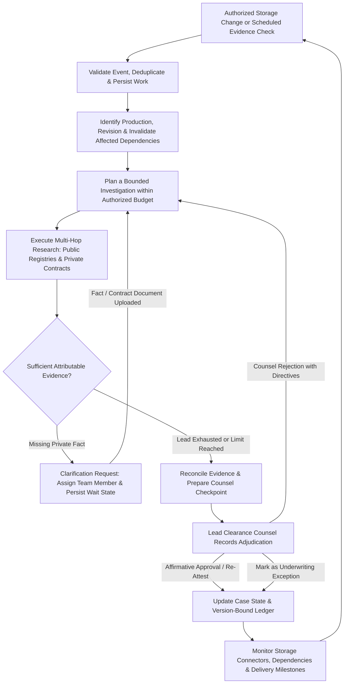
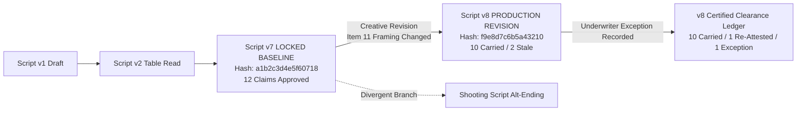
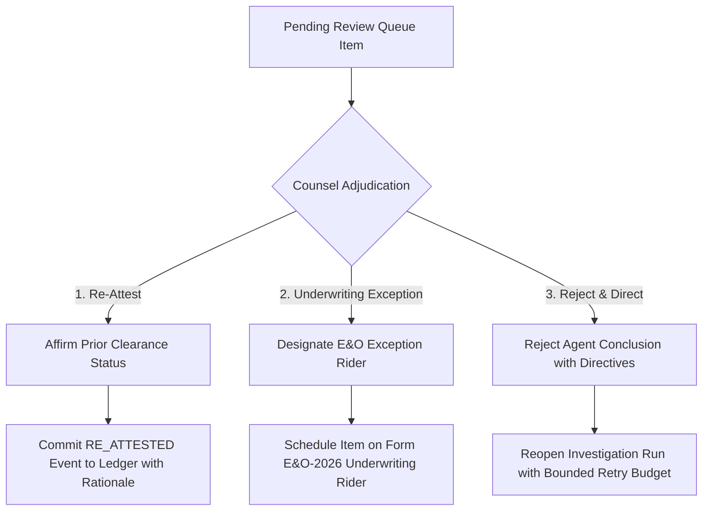

# 01. Enterprise Command Center: Information Architecture & Workspace Topology

> **Document Status**: Complete & Authoritative Architectural Specification  
> **System**: Lienmark — Entertainment Clearance & Title Insurance Change Control System  
> **Module**: Enterprise Command Center Information Architecture (Sprint 4A+ Recovery Scope)  
> **Target Audience**: Lead Clearance Counsel, Production Executives, E&O Underwriters, Frontend Engineers  
> **Review Date**: September 6, 2026  
> **Reference Baseline**: `output/legacy_capability_review_2026-09-06/RECOVERY_MAP.md` (Sections 1, 2, 7)  

---

## 1. Executive Context & Core Product Thesis

Lienmark replaces the traditional, brittle paradigm of static 80-to-150 page clearance binders with an **event-driven, continuous investigation and clearance change control platform**. In motion picture and television production, script revisions and editorial cuts happen continuously. When a production transitions from a locked baseline ($V_{\text{baseline}}$) to an active shooting revision ($V_{\text{active}}$), producers and clearance counsel face a costly dilemma: either re-vet every rights-bearing asset from scratch, or allow clearance review to lapse, inviting catastrophic distributor rejections, trademark injunctions, or E&O policy exclusions.

### 1.1 The Governing Product Loop
As established in Section 2 of the Lienmark Recovery Map, the core operating loop of the platform is:



### 1.2 Enterprise Principles & Invariant Guarantees
1. **Mathematical Conservation Invariant ($f(v_7, v_7) = 12/12$)**: When an identical cut or document is re-evaluated, 100% of valid prior counsel approvals carry forward at **$0.00 incremental legal cost** and zero dispatched external API queries.
2. **Defensive Fail-Closed Doctrine**: No external search failure, timeout (504), rate limit (429), or missing document ever defaults to "approved." An unverified or conflicting asset defaults to `NEEDS_REVIEW` or `EXCEPTION`.
3. **Statutory Non-Binding Guarantee**: In strict accordance with unauthorized practice of law (UPL) doctrines and insurance carrier compliance, all system outputs are framed as **evidentiary briefs and clearance change control records**, explicitly disclaiming automated policy binding or legal certainty.
4. **Append-Only Cryptographic Lineage**: Every state transition, research artifact, human clarification, and counsel adjudication is committed to an immutable SHA-256 hash-chained event ledger: $H_n = \text{SHA256}(H_{n-1} \parallel \text{Event}_n)$.
5. **No Synthetic Telemetry**: Progress indicators represent authentic agent tool execution, evidence retrieval, and stance evaluation—fake timer bars and scripted timeouts are strictly banned.

---

## 2. Command Center Workspace Architecture

The Command Center provides **six dedicated workspaces** organized to support distinct operational workflows across production executives, legal analysts, clearance counsel, and underwriter auditors.

```
┌────────────────────────────────────────────────────────────────────────────────────────────────────────────────────────┐
│                                       LIENMARK ENTERPRISE COMMAND CENTER TOPOLOGY                                      │
├───────────────────┬──────────────────────────────────────────────────────────────────────────┬─────────────────────────┤
│ GLOBAL NAVIGATION │ WORKSPACE VIEWPORT                                                       │ CONTEXT & TELEMETRY     │
│                   │                                                                          │                         │
│ [1] INBOX         │  Active Workspace Content:                                               │ Global Health: ONLINE   │
│ [2] PRODUCTIONS   │  • High-density data tables with keyboard navigation (`j`/`k`)           │ Live Storage: 3 Folders │
│ [3] INVESTIGATIONS│  • Persistent split-screen review panes                                  │ API Budget: 82% Remain  │
│ [4] EVIDENCE      │  • Multi-dimensional evidence inspectors                                │ Unbroken Ledger Hash    │
│ [5] DECISIONS     │  • Real-time SSE/WebSocket activity stream                               │ Studio Audio: [M] Mute  │
│ [6] POLICY        │  • Contextual drawers and slide-overs                                    │ User: Sarah Jenkins, Esq│
└───────────────────┴──────────────────────────────────────────────────────────────────────────┴─────────────────────────┘
```

---

## 3. Workspace 1: Inbox (Triage & Urgency Routing)

### 3.1 Purpose & Ergonomics
The **Inbox** is the zero-inbox operational cockpit for production legal ops. It surfaces all items requiring human attention across active productions, prioritizing by legal exposure, delivery schedule proximity, and blocker age.

### 3.2 Information Hierarchy & Blocker Classification
Items are automatically categorized into four prioritized urgency tiers:
- **P0: Delivery Blocker (Critical)**: Production shooting or distributor delivery scheduled within 72 hours with unresolved clearance exceptions or unvetted focal assets.
- **P1: Reopened Decision (High)**: A previously approved baseline claim invalidated by creative drift (prominence shift, dialogue addition) or fresh adverse external evidence.
- **P2: Clarification Response Waiting (Medium)**: Investigation blocked awaiting private contract upload, music supervisor response, or director intent confirmation.
- **P3: Routine Review (Standard)**: New low-prominence background assets identified by ingestion with high-confidence corroboration ready for routine review.

### 3.3 Data Contract & Schema (`InboxItem`)
```typescript
export type BlockerSeverity = 'P0_CRITICAL' | 'P1_HIGH' | 'P2_MEDIUM' | 'P3_STANDARD';

export type InboxItemCategory = 
  | 'reopened_creative_drift'
  | 'adverse_external_evidence'
  | 'clarification_pending'
  | 'unassigned_intake'
  | 'delivery_deadline_breach';

export interface InboxItem {
  inbox_id: string;
  production_id: string;
  production_title: string;
  stable_lineage_key: string;
  asset_name: string;
  asset_type: 'script_dialogue' | 'music_sync' | 'prop_brand' | 'archival_footage' | 'talent_likeness';
  severity: BlockerSeverity;
  category: InboxItemCategory;
  summary_headline: string;
  detailed_context: string;
  assigned_to_user_id: string | null;
  assigned_to_name: string | null;
  created_at: string;
  age_hours: number;
  delivery_deadline: string | null;
  time_to_deadline_hours: number | null;
  target_version_id: string;
  baseline_version_id: string;
  requires_counsel_signoff: boolean;
  active_investigation_run_id: string | null;
}
```

### 3.4 Component Layout & Wireframe (ASCII)
```
┌────────────────────────────────────────────────────────────────────────────────────────────────────────────────────────┐
│ INBOX: Clearance Blockers & Action Queue                                          [Filters: All Productions ▼] [P0-P1]  │
├────────────────────────────────────────────────────────────────────────────────────────────────────────────────────────┤
│ Triage Metrics:  [ 2 P0 Blockers ]  [ 5 P1 Reopened ]  [ 3 Waiting Facts ]  [ Avg Resolution: 4.2h ]                   │
├────┬──────────┬─────────────┬────────────────────────────────────┬────────────────────┬──────────────┬────────────────┤
│PRI │ SEVERITY │ PRODUCTION  │ ITEM & CLEARANCE CONFLICT          │ ASSIGNED TO        │ AGING / DUE  │ QUICK ACTION   │
├────┼──────────┼─────────────┼────────────────────────────────────┼────────────────────┼──────────────┼────────────────┤
│[!] │ P0 CRIT  │ Shadows     │ music_cue_midnight_serenade        │ Sarah Jenkins, Esq │ 4h / DUE 18h │ [Review Now ➔] │
│    │          │ Over B'way  │ Vanguard Media Worldwide Excl.     │ Lead Counsel       │ SHOOT BLOCK  │                │
├────┼──────────┼─────────────┼────────────────────────────────────┼────────────────────┼──────────────┼────────────────┤
│[!] │ P1 HIGH  │ Shadows     │ poster_noir_detective_magazine     │ Sarah Jenkins, Esq │ 12h / DUE 3d │ [Inspect Diff] │
│    │          │ Over B'way  │ V7 2s bg blur ➔ V8 14s focal frame │ Lead Counsel       │              │                │
├────┼──────────┼─────────────┼────────────────────────────────────┼────────────────────┼──────────────┼────────────────┤
│[?] │ P2 MED   │ Dune Rogue  │ prop_vintage_whiskey_label         │ Marcus Vance       │ 28h / DUE 5d │ [Ping Coord.]  │
│    │          │ (Ep 104)    │ Need producer bill of sale receipt │ Clearance Coord.   │ Awaiting Doc │                │
├────┼──────────┼─────────────┼────────────────────────────────────┼────────────────────┼──────────────┼────────────────┤
│[✓] │ P3 STD   │ Manhattan 4 │ art_monet_reproduction_loft       │ Unassigned         │ 36h / DUE 8d │ [Auto-Carry]   │
│    │          │ Feature Cut │ Public domain pre-1928 confirmed   │ [Claim Item]       │              │                │
└────┴──────────┴─────────────┴────────────────────────────────────┴────────────────────┴──────────────┴────────────────┘
 [Batch Reassign]   [Export Blocker Report]   [Snooze with Audit Note]              Showing 4 of 14 Active Items
```

---

## 4. Workspace 2: Productions (Catalog, Baselines & Storage)

### 4.1 Purpose & Ergonomics
The **Productions** workspace manages the production portfolio lifecycle. It acts as the canonical registry for titles, format types (feature, episodic series, unscripted docudrama), baseline versions ($V_{\text{baseline}}$), revision lineages, and continuous storage synchronization.

### 4.2 Revision Tree & Invalidation Mechanics
When a new draft or cut is uploaded to a connected storage folder, the system builds an immutable directed acyclic graph (DAG) connecting the new revision to its parent baseline:



### 4.3 Connected Storage Folder Management
Connectors watch designated cloud storage targets. Supported engines:
- **Google Cloud Storage (GCS)**: Service account HMAC / IAM credentials with Pub/Sub storage notification webhooks (`google.storage.object.finalize`).
- **Dropbox Business**: Scoped app folder permissions with webhook change listeners (`/list_folder/longpoll`).
- **Google Drive**: Service account folder delegation with Google Drive Changes API (`drive.changes.watch`).

*Security Invariant*: Watched folders enforce strict file type white-listing (`.pdf`, `.fdx`, `.edl`, `.xml`) and SHA-256 duplicate content hashing. Duplicate file drops or renames bypass research dispatch, consuming $0.00 in compute.

### 4.4 Data Contract & Schema (`ProductionProfile`)
```typescript
export interface ConnectedFolderConfig {
  connector_id: string;
  provider: 'gcs' | 'dropbox' | 'google_drive';
  bucket_or_folder_id: string;
  folder_path: string;
  sync_enabled: boolean;
  last_sync_timestamp: string;
  auth_status: 'authorized' | 'token_expired' | 'access_denied';
  file_pattern_filter: string[]; // e.g., ["*.pdf", "*.fdx"]
  webhook_subscription_id: string | null;
}

export interface ProductionVersionSummary {
  version_id: string;
  parent_version_id: string | null;
  label: string;
  cut_type: 'writers_draft' | 'table_read' | 'locked_baseline' | 'shooting_script' | 'conformed_editor_cut';
  created_at: string;
  content_sha256: string;
  total_claims_count: number;
  cleared_claims_count: number;
  open_blockers_count: number;
  storage_file_path: string;
}

export interface ProductionProfile {
  production_id: string;
  title: string;
  production_company: string;
  lead_counsel_name: string;
  carrier_policy_binder: string;
  deductible_usd: number;
  default_territory_scope: 'worldwide' | 'north_america' | 'domestic_theatrical';
  connected_folders: ConnectedFolderConfig[];
  versions: ProductionVersionSummary[];
  active_baseline_version_id: string;
  active_shooting_version_id: string;
  created_at: string;
  updated_at: string;
}
```

---

## 5. Workspace 3: Investigations (Live Runs & Tool Telemetry)

### 5.1 Purpose & Ergonomics
The **Investigations** workspace is the real-time runtime control room. It visualizes autonomous multi-hop research passes, active tool executions, evidence stance calculations, and spend governors.

### 5.2 Real-Time Action Feed vs. Fake Progress Bars
In legacy implementations, progress was simulated using arbitrary client-side `setTimeout()` loops (`elapsed < 300ms ➔ Stage 1; elapsed < 650ms ➔ Stage 2`). Lienmark's architecture mandates **authentic, event-driven telemetry**. Every card in the feed represents an actual system trace emitted by the backend orchestrator:

```
[Agent Tool Action] ➔ [Raw Provider Observation] ➔ [Stance Reconciliation] ➔ [Next Plan Step]
```

### 5.3 Run State Machine
Investigation runs transition through deterministic lifecycle states:

| Lifecycle State | Description & Reviewer Ergonomics |
|---|---|
| `queued` | Work registered, deduplicated against SHA-256 cache, awaiting budget allocation. |
| `investigating` | Active multi-hop research: issuing registry search, extracting web text, fetching contract. |
| `waiting_for_information` | Blocked on missing private fact. Clarification request assigned; worker in sleep state. |
| `waiting_for_budget` | Allocated token or API call quota exhausted. Awaiting producer/admin budget unlock. |
| `ready_for_review` | Evidence retrieved and reconciled. Packaged into Counsel Checkpoint Queue. |
| `completed` | All items adjudicated, ledger updated, and E&O exceptions schedule generated. |
| `failed` | Unhandled system exception or provider timeout exhausted retries. Degraded gracefully. |
| `superseded` | A newer script revision was ingested before completion; run marked obsolete to prevent wasted spend. |

### 5.4 Data Contract & Schema (`InvestigationRun`)
```typescript
export type InvestigationRunState = 
  | 'queued'
  | 'investigating'
  | 'waiting_for_information'
  | 'waiting_for_budget'
  | 'ready_for_review'
  | 'completed'
  | 'failed'
  | 'superseded';

export interface ToolExecutionRecord {
  step_id: string;
  timestamp: string;
  tool_name: 'parallel_search' | 'loc_copyright_api' | 'ascap_ace_lookup' | 'private_contract_retriever';
  query_issued: string;
  provider_status_code: number;
  latency_ms: number;
  stance_verdict: 'supporting' | 'contradictory' | 'informational' | 'insufficient';
  excerpt_preview: string;
  source_anchor_url: string;
  is_cached_result: boolean;
}

export interface InvestigationRun {
  run_id: string;
  production_id: string;
  target_version_id: string;
  baseline_version_id: string;
  state: InvestigationRunState;
  initiated_by: 'storage_webhook' | 'counsel_reinvestigation' | 'scheduled_refresh' | 'manual_intake';
  claims_in_scope: string[];
  tool_executions: ToolExecutionRecord[];
  budget_allocated_usd: number;
  budget_spent_usd: number;
  api_calls_count: number;
  api_calls_limit: number;
  created_at: string;
  finished_at: string | null;
}
```

### 5.5 Component Layout & Wireframe (ASCII)
```
┌────────────────────────────────────────────────────────────────────────────────────────────────────────────────────────┐
│ INVESTIGATIONS: Run #inv_88291 — Shadows Over Broadway (Cut v7 ➔ v8)               [State: INVESTIGATING] [Cancel Run] │
├────────────────────────────────────────────────────────────────────────────────────────────────────────────────────────┤
│ Budget Telemetry: [API Calls: 2 / 10 Used]  [Spent: $0.14 / $5.00 Cap]  [Elapsed: 1,842ms]  [Worker: coordinator-01]  │
├────────────────────────────────────────────────────────────────────────────────────────────────────────────────────────┤
│ REAL-TIME ADAPTIVE INVESTIGATION FEED                                                                                  │
├────────────────────────────────────────────────────────────────────────────────────────────────────────────────────────┤
│ [12:41:02.101] [DAG INGESTION] Ingestion complete. Invariant preserved: 10 Carried / 2 Reopened.                      │
│                ➔ Dependency invalidation triggered on `poster_noir_detective` (Item 11) & `midnight_serenade` (Item 12)│
│                                                                                                                        │
│ [12:41:02.340] [TOOL: Parallel Search API] Issued query: "Crime Detective Magazine 1946 Shadows Over Broadway"        │
│                ➔ HTTP 200 OK | Latency: 142.5ms | Provider Call ID: `call_par_7719`                                  │
│                ➔ Source: Library of Congress US Copyright Office Catalog (cocatalog.loc.gov)                           │
│                ➔ Excerpt: "Registration Class B, No. 44102, published Oct 1946. Renewal search: ZERO renewals filed"  │
│                ➔ Stance: [SUPPORTING: Public Domain]                                                                   │
│                                                                                                                        │
│ [12:41:02.580] [TOOL: Parallel Search API] Issued query: "Midnight Serenade jazz sync rights copyright owner 2026"    │
│                ➔ HTTP 200 OK | Latency: 178.2ms | Provider Call ID: `call_par_7720`                                  │
│                ➔ Source: ASCAP ACE Repertory Bulletin & Billboard Rights Database                                      │
│                ➔ Excerpt: "Worldwide exclusive master & sync rights acquired Aug 2026 by Vanguard Media Holdings LLC"   │
│                ➔ Stance: [CONTRADICTORY: Rights Dispute Flagged]                                                       │
│                                                                                                                        │
│ [12:41:03.110] [GATE CHECKPOINT] Research complete within authorized budget. Synthesizing Counsel Briefings...         │
│                ➔ Route dispatched to Counsel Checkpoint Queue. Reviewer Sarah Jenkins notified.                        │
└────────────────────────────────────────────────────────────────────────────────────────────────────────────────────────┘
```

---

## 6. Workspace 4: Evidence (Bifurcated Repository & Source Inspector)

### 6.1 Purpose & Ergonomics
The **Evidence** workspace manages all corroborated citations and contracts. In entertainment legal clearance, conflating public web findings with confidential talent agreements violates both attorney-client privilege and producer confidentiality covenants. This workspace enforces a **strict bifurcated repository architecture**:
1. **Public Evidence Repository**: Web search hits, copyright registrations, trademark gazettes, historical newspaper clippings, and public domain catalog entries.
2. **Private Contract Repository**: Signed option purchase agreements, composer work-for-hire contracts, location releases, and E&O insurance endorsement addenda.

```
┌────────────────────────────────────────────────────────────────────────────────────────────────────────────────────────┐
│ EVIDENCE WORKSPACE: Bifurcated Clearance Repository                                                                    │
├───────────────────────────────────────────────────────────┬────────────────────────────────────────────────────────────┤
│ REPOSITORY A: PUBLIC CITATIONS & REGISTRIES               │ REPOSITORY B: PRIVATE CONTRACTS & RELEASES                 │
│ • Parallel Search API external excerpts                   │ • Executed Composer Agreement (ASCAP / BMI)                │
│ • Library of Congress (cocatalog.loc.gov)                 │ • Star Appearance Rider & Likeness Clearance               │
│ • USPTO Trademark Electronic Search System (TESS)         │ • Location Agreement & Property Release                    │
│ • Historical public domain catalog proofs                 │ • Producer Option Purchase Agreement (OPA)                 │
│ • Archived raw HTTP response payloads & SHA-256 hashes    │ • Scoped permission clauses with direct PDF page anchors   │
└───────────────────────────────────────────────────────────┴────────────────────────────────────────────────────────────┘
```

### 6.2 Data Contracts & Schemas
```typescript
export interface PublicEvidenceRecord {
  evidence_id: string;
  claim_key: string;
  source_type: 'copyright_registry' | 'trademark_gazette' | 'court_opinion' | 'trade_press' | 'parallel_search';
  source_title: string;
  source_url: string;
  publisher: string;
  retrieval_timestamp: string;
  retrieval_latency_ms: number;
  stance: 'supporting' | 'contradictory' | 'informational' | 'insufficient';
  extracted_excerpt: string;
  raw_payload_sha256: string;
  is_archived_snapshot_available: boolean;
  http_response_code: number;
}

export interface PrivateContractClause {
  clause_id: string;
  claim_key: string;
  document_id: string;
  document_filename: string;
  contract_type: 'composer_agreement' | 'sync_license' | 'talent_release' | 'option_purchase' | 'location_release';
  parties_involved: string[];
  effective_date: string;
  expiration_date: string | null;
  territory_scope: string; // e.g., "Worldwide, in perpetuity"
  media_scope: string;     // e.g., "All media now known or hereafter devised"
  page_number: number;
  clause_heading: string;
  verbatim_clause_text: string;
  confidentiality_tier: 'production_legal_only' | 'producer_accessible' | 'underwriter_auditable';
  file_storage_uri: string;
}
```

### 6.3 Deep Source Viewer Component
The **Deep Source Viewer** embeds side-by-side verification:
- **Left Column**: Highlighting the claim's narrative context in the script cut.
- **Center Column**: Rendered text of the public citation or private contract clause with matching keywords highlighted in gold (`#F59E0B`).
- **Right Column**: Cryptographic metadata inspector (SHA-256 payload hash, retrieval timestamp, provider call ID, and fail-closed integrity verification badge).

---

## 7. Workspace 5: Decisions (Counsel Adjudication & Checkpoints)

### 7.1 Purpose & Ergonomics
The **Decisions** workspace is the sovereign legal terminal for Lead Clearance Counsel. Here, human attorneys exercise non-delegable judgment. Under Lienmark's fail-closed governance model, **AI agents never make clearance approvals**; they organize evidence and present recommendations.

### 7.2 The Three Statutory Adjudication Actions
Counsel has three explicit paths for every pending item:



1. **Re-Attest (`re_attest`)**: Counsel affirms that the creative delta or external evidence does not alter clearance validity (e.g., confirming that *Crime Detective Magazine* 1946 is public domain despite increased screen time).
2. **Flag as Warranty Exception (`exception`)**: Counsel acknowledges a legitimate third-party rights claim (e.g., Vanguard Media's acquisition of *Midnight Serenade* sync rights) and designates the item for listing on the underwriter's warranty exclusions schedule.
3. **Reject with Reinvestigation Directive (`reject_and_reinvestigate`)**: Counsel rejects the agent's findings as incomplete or uncorroborated, attaching mandatory instructions for the agent to execute (e.g., *"Query the Harry Fox Agency catalog and check for co-publisher split agreements before flagging as disputed"*).

### 7.3 Data Contract & Schema (`CounselAdjudicationRecord`)
```typescript
export interface CounselAdjudicationRecord {
  adjudication_id: string;
  stable_lineage_key: string;
  production_id: string;
  target_version_id: string;
  reviewer_identity: string; // e.g. "Sarah Jenkins, Esq."
  reviewer_bar_number?: string;
  action_type: 're_attest' | 'exception' | 'reject_and_reinvestigate';
  statutory_basis: '17_usc_107_fair_use' | 'public_domain_lapsed_renewal' | 'express_license_agreement' | 'de_minimis_use' | 'custom_counsel_rationale';
  counsel_rationale: string;
  reinvestigation_directive?: string | null;
  adjudicated_at: string;
  supersedes_event_id: string;
  cryptographic_event_hash: string;
  previous_event_hash: string;
}
```

### 7.4 Component Layout & Wireframe (ASCII)
```
┌────────────────────────────────────────────────────────────────────────────────────────────────────────────────────────┐
│ DECISIONS: Counsel Checkpoint Gate (Item 12 of 12)                                [Reviewer: Sarah Jenkins, Esq. ▾]   │
├────────────────────────────────────────────────────────────────────────────────────────────────────────────────────────┤
│ ASSET: `music_cue_midnight_serenade` | Asset Type: Music Sync | Scene: SC 14 (00:14:22) | Status: [STALE / DISPUTED]   │
├────────────────────────────────────────────────────────────────────────────────────────────────────────────────────────┤
│ FOUR-DIMENSIONAL LEGAL BREAKDOWN                                                                                       │
│ 1. Creative Change:     Duration: 20s background jazz trio (Identical staging between V7 and V8)                       │
│ 2. External Evidence:   ASCAP ACE / Billboard: Worldwide exclusive rights acquired August 2026 by Vanguard Media LLC.  │
│ 3. Private Agreement:   Production cue-sheet relies on 1998 library license; current term expired July 31, 2026.       │
│ 4. Statutory Policy:    CRITICAL E&O RISK — Sync use without active license breaches standard distributor warranty.   │
├────────────────────────────────────────────────────────────────────────────────────────────────────────────────────────┤
│ PRIOR BASELINE APPROVAL (Script Cut v7 — Locked)                                                                       │
│ Approved by: Sarah Jenkins, Esq. on 2026-08-12 | Basis: 1998 Library Master License | Status: [CARRIED_FORWARD -> STALE]│
├────────────────────────────────────────────────────────────────────────────────────────────────────────────────────────┤
│ COUNSEL DISPOSITION FORM                                                                                               │
│ Statutory Basis: [ Express License Exception / Underwriter Rider  ▼ ]                                                  │
│ Counsel Rationale / Instructions:                                                                                      │
│ ┌────────────────────────────────────────────────────────────────────────────────────────────────────────────────────┐ │
│ │ Designating as Form E&O-2026 Schedule A Exception. Production coordinator must obtain quotation from Vanguard     │ │
│ │ Media Holdings LLC prior to final distributor delivery mix. Added to insurer warranty exclusion schedule.        │ │
│ └────────────────────────────────────────────────────────────────────────────────────────────────────────────────────┘ │
│ [ ✓ RE-ATTEST CLAIM ]    [ ⚠️ FLAG AS UNDERWRITING EXCEPTION ]    [ ✕ REJECT FINDING & DIRECT REINVESTIGATION ]        │
└────────────────────────────────────────────────────────────────────────────────────────────────────────────────────────┘
```

---

## 8. Workspace 6: Connections & Policy (Connectors & Governance)

### 8.1 Purpose & Ergonomics
The **Connections & Policy** workspace is the enterprise governance center. It manages organization-level storage connectors, API spend governors, role-based security configurations, and company E&O underwriting profiles.

### 8.2 Spend & Rate Governors
To prevent runaway LLM or external search API expenditures, the governor enforces multi-layered controls:
- **Max Cost Per Investigation Run**: Hard cap (default: $5.00 USD). When breached, investigation transitions to `waiting_for_budget`.
- **Max External Search Queries Per Claim**: Hard limit (default: 3 queries). Prevents recursive rabbit holes.
- **Provider Circuit Breaker**: If Parallel Search returns consecutive 504s or 429s, system trips the breaker, uses cached historical evidence, flags the item as `INSUFFICIENT`, and alerts counsel without pipeline crash.

### 8.3 Company E&O Policy Settings
Clearance standards adapt to specific underwriting requirements:
- **Primary Underwriting Carrier**: Gallagher, Chubb, Hiscox, Front Row Insurance Brokers.
- **Policy Form Number**: Default `Form E&O-2026.1`.
- **Self-Insured Retention (Deductible)**: e.g., $25,000 / $50,000 / $100,000 USD.
- **Fair-Use Assessment Rigor**: Conservative (default: all unlicensed art requires exception rider) vs. Documented Fair-Use (Four-Factor fair use checklist enabled).

### 8.4 Data Contract & Schema (`CompanyPolicyConfig`)
```typescript
export interface BudgetGovernorSettings {
  max_run_cost_usd: number;
  max_queries_per_claim: number;
  max_search_retries: number;
  circuit_breaker_error_threshold: number;
  budget_exhaustion_behavior: 'pause_and_notify' | 'degrade_to_offline_cache' | 'fail_closed';
}

export interface CompanyPolicyConfig {
  organization_id: string;
  organization_name: string;
  primary_carrier: 'gallagher' | 'chubb' | 'hiscox' | 'front_row' | 'other';
  policy_binder_id: string;
  deductible_usd: number;
  require_counsel_bar_number: boolean;
  allow_analyst_pre_clearing: boolean;
  budget_governor: BudgetGovernorSettings;
  active_territories: string[];
  governance_audit_retention_days: number;
}
```

---

## 9. Global Navigation & Ergonomic Design Tokens

### 9.1 Design Token Architecture
Lienmark uses an obsidian dark-mode palette engineered for high-stress legal review environments, minimizing eye fatigue during marathon script clearance reviews.

```css
:root {
  /* Surfaces */
  --bg-primary: #0A0D14;       /* Deep obsidian black */
  --bg-surface: #121824;       /* Glassmorphic elevation container */
  --bg-surface-hover: #1E2638; /* Active hover elevation */
  --bg-card: #1B2640;          /* Secondary card container */

  /* Brand Accents & State Identifiers */
  --accent-gold: #F59E0B;      /* Premium legal gold accent / Stale item alert */
  --accent-cyan: #38BDF8;      /* Parallel AI / Telemetry blue / Re-Attested */
  --accent-emerald: #10B981;   /* Carried-forward cleared green */
  --accent-crimson: #EF4444;   /* Warranty exception / Critical risk red */

  /* Text & Contrast */
  --text-primary: #F1F5F9;     /* Slate 100 high contrast */
  --text-muted: #94A3B8;       /* Slate 400 secondary */
  --border-color: #2E3D60;     /* Subtle container hairline border */

  /* Typography */
  --font-sans: 'Inter', -apple-system, BlinkMacSystemFont, sans-serif;
  --font-display: 'Outfit', sans-serif;
  --font-mono: 'JetBrains Mono', 'SF Mono', monospace;
}
```

### 9.2 Universal Reviewer Hotkeys
To maximize reviewer velocity, the Command Center exposes standardized keyboard shortcuts:
- `j` / `k`: Next / Previous claim in active table or queue.
- `1`: Adjudicate: Re-Attest Claim.
- `2`: Adjudicate: Flag as Underwriting Exception.
- `3`: Adjudicate: Reject Finding & Direct Reinvestigation.
- `Space`: Expand / Collapse Split-Screen Source Viewer.
- `m`: Mute / Unmute Studio Auditory Cues.
- `Cmd+K` / `Ctrl+K`: Open Universal Command Palette.

---

## 10. Summary Verification Matrix

| Workspace | Primary Persona | Key User Action | Invariant Enforced |
|---|---|---|---|
| **1. Inbox** | Clearance Coordinator | Triage overdue blockers & assign investigations | SLA countdown tracking; P0 delivery blocker alert |
| **2. Productions** | Supervising Producer | Manage revisions & connect cloud storage folders | SHA-256 duplicate deduplication; $f(v_7, v_7) = 12/12$ |
| **3. Investigations** | Legal Tech Analyst | Monitor live multi-hop research & API spend | Real-time tool action feed; no fake timer progress bars |
| **4. Evidence** | Legal Research Lead | Corroborate claims against public & private sources | Strict bifurcation: public citations vs confidential contracts |
| **5. Decisions** | Lead Clearance Counsel | Authoritative human disposition & checkpoint sign-off | Fail-closed gate; affirmative three-action adjudication |
| **6. Policy** | Studio Legal Ops Admin | Configure budget governors & E&O carrier policies | Hard spend caps; circuit breakers; tamper-evident logging |
