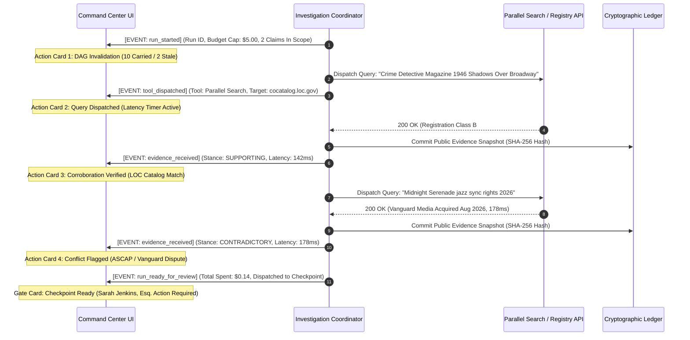
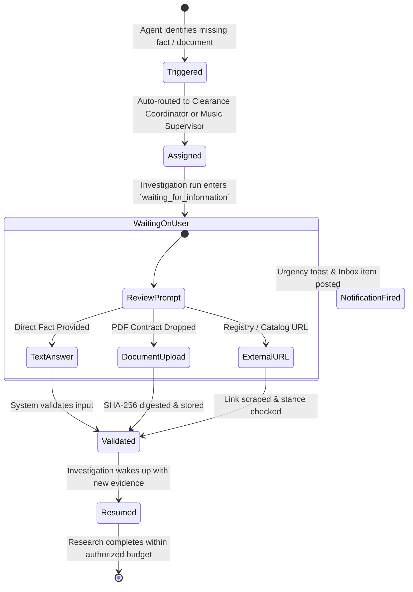

# 02. Enterprise Command Center: Interaction Flows, Activity Feed & Reviewer Ergonomics

> **Document Status**: Complete & Authoritative Architectural Specification  
> **System**: Lienmark — Entertainment Clearance & Title Insurance Change Control System  
> **Module**: Reviewer Ergonomics, Interaction States, Real-Time Activity Feed & Form E&O-2026 Print Engine  
> **Target Audience**: Lead Clearance Counsel, Frontend Architects, Design System Engineers, E&O Underwriters  
> **Review Date**: September 6, 2026  
> **Reference Baseline**: `output/legacy_capability_review_2026-09-06/RECOVERY_MAP.md` (Sections 1, 2, 7)  

---

## 1. Executive Ergonomics & Reviewer Mental Model

In film and television clearance, legal counsel operates under extreme liability and time pressure. Clearance attorneys review hundreds of potential rights issues across multiple script revisions under tight production shooting schedules. 

The traditional user experience of clearance software suffers from severe ergonomic failures:
- **Disjointed Context**: Reviewers must tab between script PDFs, copyright registry websites, contract shared drives, and static spreadsheet ledgers.
- **The "Black Box" Illusion**: AI clearance tools display either opaque "cleared" badges or simulated progress bars with no inspectable proof of what was actually searched.
- **Cognitive Exhaustion**: Redundant manual review of hundreds of unchanged background assets burns hours of senior attorney billing without reducing risk.
- **Unprintable Digital Output**: Digital dashboards fail to produce court-admissible, underwriter-ready print artifacts conforming to insurance carrier warranty schedules.

Lienmark solves these ergonomic failures through **four foundational interaction paradigms**:
1. **Real-Time Authentic Activity Stream**: Replacing fake progress bars with an inspectable `Action ➔ Evidence ➔ Result ➔ Next Step` event feed.
2. **Persistent Split-Screen Matrix & 4D Inspector**: Maintaining uninterrupted visual script context, side-by-side revision diffs, and direct registry citations without modal context switching.
3. **Collaborative Clarification Loops**: Seamlessly pausing autonomous research to capture missing private facts or agreements from production team members, then resuming the exact run.
4. **Dual-Mode Underwriting Binder**: Seamlessly transitioning from a sleek, dark digital luxury terminal to an ivory-white, ink-conserving statutory `@media print` legal schedule.

---

## 2. Deep-Dive Specification 1: Real-Time Activity Feed & Adaptive Investigation

### 2.1 The Failure of Synthetic Progress Bars
In legacy prototypes, investigation execution was simulated on the frontend using hardcoded intervals:
```typescript
// BANNED ANTI-PATTERN: Synthetic timeout progress bars
if (elapsed < 300) setEvalStageIdx(0); // 0%
else if (elapsed < 650) setEvalStageIdx(1); // 25%
else if (elapsed < 1000) setEvalStageIdx(2); // 50%
```
This synthetic pattern creates a false sense of security, hides network retries and provider degradation, and destroys legal credibility with counsel and judges.

### 2.2 The 4-Beat Event Progression Model
Lienmark replaces synthetic timers with an authentic Server-Sent Events (SSE) / WebSocket stream where every visual card represents a verified backend transition:



### 2.3 ASCII Wireframe: Live Activity Feed
```
┌────────────────────────────────────────────────────────────────────────────────────────────────────────────────────────┐
│ LIVE INVESTIGATION FEED: Run #inv_88291 — Shadows Over Broadway (Cut v7 ➔ v8)              [Worker: coord-01] [ACTIVE] │
├────────────────────────────────────────────────────────────────────────────────────────────────────────────────────────┤
│ METRICS: [ Budget: $0.14 / $5.00 Cap ]  [ Network Calls: 2 ]  [ Retries: 0 ]  [ Wall Time: 1,842ms ]  [ Fail-Closed: ON]│
├────────────────────────────────────────────────────────────────────────────────────────────────────────────────────────┤
│ [12:41:02.101] ⚡ STEP 1: CLEARANCE DAG INGESTION & INVALIDATION                                                       │
│                ├─ Event: Ingested Script Cut v8 (SHA-256: f9e8d7c6b5a43210)                                           │
│                ├─ Invariant: 10 of 12 prior decisions carried forward ($0.00 review cost)                             │
│                └─ Invalidated: `poster_noir_detective` (Item 11) & `midnight_serenade` (Item 12)                       │
│                                                                                                                        │
│ [12:41:02.340] 🔍 STEP 2: MULTI-HOP REGISTRY SEARCH (Item 11: Crime Detective Magazine)                               │
│                ├─ Tool: Parallel Search API ➔ Target: cocatalog.loc.gov                                               │
│                ├─ Query: "Crime Detective Magazine 1946 Shadows Over Broadway copyright renewal"                     │
│                ├─ Status: HTTP 200 OK | Latency: 142.5ms | Call ID: `call_par_7719`                                   │
│                ├─ Excerpt: "Class B #44102, published Oct 1946. Renewal search: ZERO renewals filed."                 │
│                └─ Stance: [✓ SUPPORTING (Public Domain Confirmed)]                                                    │
│                                                                                                                        │
│ [12:41:02.580] ⚠️ STEP 3: CONFLICT ARBITRATION & FACT SEARCH (Item 12: Midnight Serenade)                             │
│                ├─ Tool: Parallel Search API ➔ Target: ascap.com / Billboard Bulletin                                  │
│                ├─ Query: "Midnight Serenade jazz sync rights copyright owner 2026"                                    │
│                ├─ Status: HTTP 200 OK | Latency: 178.2ms | Call ID: `call_par_7720`                                   │
│                ├─ Excerpt: "Worldwide exclusive master & sync rights acquired Aug 2026 by Vanguard Media Holdings LLC"│
│                └─ Stance: [✕ CONTRADICTORY (Third-Party Exclusive Assignment)]                                        │
│                                                                                                                        │
│ [12:41:03.110] 🛡️ STEP 4: COUNSEL CHECKPOINT SYNTHESIS & HANDOFF                                                      │
│                ├─ Status: Autonomous investigation completed within budget ($0.14 spent of $5.00 limit)               │
│                ├─ Route: 2 items dispatched to Counsel Checkpoint Queue.                                              │
│                └─ Notification: Fired to Lead Clearance Counsel (Sarah Jenkins, Esq.)                                 │
└────────────────────────────────────────────────────────────────────────────────────────────────────────────────────────┘
```

### 2.4 Circuit Breakers & Graceful Degradation States
Under adverse network or provider conditions, the activity feed dynamically reflects fail-closed degradation:
- **504 Gateway Timeout / 429 Rate Limit**: Feed logs the timeout, displays an amber `RETRYING (Attempt 1/3)` badge, and initiates exponential backoff (500ms, 1500ms, 4500ms).
- **Exhausted Retries**: The feed does NOT crash or halt the pipeline. It marks the claim as `STANCE: INSUFFICIENT`, falls back to cached historical evidence with a visible `[CACHED SNAPSHOT: 18 DAYS OLD]` pill, and routes the asset directly to counsel with an explicit disclaimer.

---

## 3. Deep-Dive Specification 2: Persistent Split-Screen Matrix & 4D Inspector

### 3.1 Reviewer Ergonomics: The Persistent Split-Screen
Modal popups interrupt reviewer train-of-thought, conceal adjacent scene context, and make rapid keyboard navigation impossible. Lienmark deploys a **persistent split-screen layout**:
- **Left Pane (40% width)**: Cinematic Claims Matrix (`ClaimsTable.tsx`), displaying high-contrast rows, scene timecodes, asset badges, and clearance states. Keyboard navigation (`j`/`k`) immediately syncs the inspector.
- **Center/Right Pane (60% width)**: The 4D Clearance Inspector (`ExplanationDrawerComponent.tsx`), presenting the side-by-side script diff, attributable registry evidence, private contract terms, and locked prior baseline records.
- **Bottom Dock**: Sticky Counsel Checkpoint Action Bar (`ReviewActionComponent.tsx`) for immediate adjudication without scrolling.

### 3.2 Side-by-Side Visual Script Diff
The Inspector highlights exact differences between Script Cut $V_{\text{baseline}}$ (v7) and $V_{\text{active}}$ (v8):

#### Case Study: Item 11 (`poster_noir_detective_magazine`)
- **Cut v7 Baseline**: Incidental background wall blur (2 seconds duration). Set dressing behind secondary character. Relied on 17 U.S.C. § 107 de minimis use.
- **Cut v8 Production Revision**: Focal close-up (14 seconds duration). Lead detective tears poster from wall, holds it into the camera plane, and recites headline dialogue: *"Shadows Over Broadway! They knew everything back in 1946."*
- **Reviewer Impact**: Creative shift invalidates de minimis defense. Parallel search identifies that 1946 magazine renewal lapsed in 1974, allowing counsel to affirm clearance on public domain grounds.

#### Case Study: Item 12 (`music_cue_midnight_serenade`)
- **Cut v7 Baseline**: Atmospheric background jazz trio playing in bar (20 seconds duration). Relied on 1998 production library sync license.
- **Cut v8 Production Revision**: Creative staging identical. External evidence shift: Vanguard Media Holdings LLC acquired worldwide exclusive rights in August 2026, and the 1998 library license expired July 31, 2026.
- **Reviewer Impact**: Critical E&O warranty breach. Requires counsel to designate item as a Form E&O-2026 Schedule A Exception.

### 3.3 ASCII Wireframe: Persistent Split-Screen & 4D Inspector
```
┌────────────────────────────────────────────────────────────────────────────────────────────────────────────────────────┐
│ LIENMARK CLEARANCE COMMAND CENTER — Shadows Over Broadway (Cut v7 ➔ v8)                   [Reviewer: Sarah Jenkins] [M]│
├───────────────────────────────────────────────────────────┬────────────────────────────────────────────────────────────┤
│ PRODUCTION RIGHTS MATRIX (12 Claims Ingested)             │ 4D CLEARANCE INSPECTOR: `poster_noir_detective_magazine`   │
├───────────────────────────────────────────────────────────┼────────────────────────────────────────────────────────────┤
│ [All (12)]  [Stale (2)]  [Carried (10)]  [Resolved (0)]   │ SCENE: SC 42 (00:41:12) | ASSET TYPE: Prop / Magazine Cover│
├──────┬──────────────┬─────────────────────────┬───────────┤                                                            │
│SCENE │ ASSET TYPE   │ LINEAGE KEY             │ STATUS    │ 1. SIDE-BY-SIDE VISUAL SCRIPT DIFF                         │
├──────┼──────────────┼─────────────────────────┼───────────┤ ┌───────────────────────────┬────────────────────────────┐ │
│SC 01 │ Dialog       │ script_dialogue_intro   │ [CARRIED] │ │ SCRIPT CUT v7 (LOCKED)    │ SCRIPT CUT v8 (REVISED)    │ │
│SC 04 │ Prop Brand   │ neon_sign_radiant_blue  │ [CARRIED] │ ├───────────────────────────┼────────────────────────────┤ │
│SC 12 │ Architecture │ building_exterior_trib  │ [CARRIED] │ │ Duration: 2s duration     │ Duration: 14s close-up     │ │
│SC 14 │ Music Sync   │ music_cue_midnight_ser  │ [STALE !] │ │ Context: Incidental wall  │ Context: Detective tears   │ │
│SC 22 │ Talent       │ extra_likeness_bartend  │ [CARRIED] │ │ blur behind actor. Soft   │ poster off wall, inspects  │ │
│►SC 42│ Prop / Mag   │ poster_noir_detective   │ [STALE !] │ │ focus set dressing.       │ cover, thrusts into camera │ │
│SC 48 │ Wardrobe     │ fedora_hat_vintage_40s  │ [CARRIED] │ │                           │ plane for focal dialogue.  │ │
└──────┴──────────────┴─────────────────────────┴───────────┤ └───────────────────────────┴────────────────────────────┘ │
                                                            │                                                            │
                                                            │ 2. EXTERNAL REGISTRY CITATION (cocatalog.loc.gov)          │
                                                            │ ├─ Source: Library of Congress US Copyright Office         │
                                                            │ ├─ Query: "Crime Detective Magazine 1946 renewal"         │
                                                            │ ├─ Latency: 142.5ms | Stance: [✓ SUPPORTING: Public Domain]│
                                                            │ └─ Excerpt: "Class B #44102, published Oct 1946. Renewal   │
                                                            │    records search confirms ZERO renewals filed 1973-1975." │
                                                            │                                                            │
                                                            │ 3. INSPECTABLE PRIOR BASELINE APPROVAL (Script Cut v7)     │
                                                            │ ├─ Approved by: Sarah Jenkins, Esq. on 2026-08-12          │
                                                            │ ├─ Statutory Basis: 17 U.S.C. § 107 De Minimis Background  │
                                                            │ └─ Hash: `sha256:7f89a1b2c3d4e5f6...` [Audit Verified]     │
├───────────────────────────────────────────────────────────┴────────────────────────────────────────────────────────────┤
│ COUNSEL CHECKPOINT ACTION BAR                                                                    [Hotkeys: 1, 2, 3]    │
├────────────────────────────────────────────────────────────────────────────────────────────────────────────────────────┤
│ Statutory Rationale: [ Public Domain — Lapsed 28-Year Renewal (Class B Copyright)                                   ▼] │
│ Counsel Findings:    [ Cover art is public domain: LOC records confirm 1946 registration lapsed without renewal in 1974] │
│                                                                                                                        │
│ [ (1) ✓ RE-ATTEST CLEARANCE ]        [ (2) ⚠️ FLAG AS EXCEPTION ]        [ (3) ✕ REJECT & DIRECT REINVESTIGATION ]     │
└────────────────────────────────────────────────────────────────────────────────────────────────────────────────────────┘
```

---

## 4. Deep-Dive Specification 3: Interactive Clarifying Question & Resolution Workflow

### 4.1 Trigger Conditions
When an autonomous investigation agent encounters an ambiguous factual parameter or missing document that cannot be resolved via public web search, it halts the run and generates a **Durable Clarification Request**.

Common triggers:
- **Missing License Agreement**: Script indicates a music cue, but no corresponding PDF license exists in the connected Dropbox or GCS folder.
- **Ambiguous Work Title**: Multiple songs share the same title (e.g., *"Hold On"* recorded by 40+ artists).
- **Physical Prop Provenance**: A vintage prop appears in close-up; counsel needs the clearance coordinator's bill-of-sale receipt.

### 4.2 Clarification Lifecycle & Team Routing


### 4.3 Wireframe: `ClarifyingQuestionModal.tsx`
```
┌────────────────────────────────────────────────────────────────────────────────────────────────────────────────────────┐
│ ❓ CLEARANCE CLARIFICATION REQUEST: Action Required                                                     [ESC to Close]  │
├────────────────────────────────────────────────────────────────────────────────────────────────────────────────────────┤
│ PRODUCTION: Shadows Over Broadway | ASSET: `music_cue_midnight_serenade` | SCENE: SC 14 | SEVERITY: [P0 CRITICAL]     │
├────────────────────────────────────────────────────────────────────────────────────────────────────────────────────────┤
│ 1. INVESTIGATION CONTEXT & AMBIGUITY                                                                                   │
│ Investigation run #inv_88291 encountered conflicting rights ownership for "Midnight Serenade". Public ASCAP registry  │
│ records reveal an exclusive assignment to Vanguard Media Holdings LLC in August 2026. Production cue-sheet references │
│ an older 1998 library license.                                                                                         │
│                                                                                                                        │
│ 2. SPECIFIC LEGAL QUESTION                                                                                             │
│ "Does production have an executed synchronization rider or direct extension with Vanguard Media Holdings LLC, or is   │
│ the production relying exclusively on the legacy 1998 Master License?"                                                 │
├────────────────────────────────────────────────────────────────────────────────────────────────────────────────────────┤
│ 3. ASSIGNMENT & ESCALATION                                                                                             │
│ Assigned Team Member: [ Marcus Vance (Clearance Coordinator)                                                        ▼] │
│ Due Date:             [ 2026-09-07 18:00 UTC (18 hours remaining — Shooting Schedule Blocker)                       ] │
├────────────────────────────────────────────────────────────────────────────────────────────────────────────────────────┤
│ 4. RESOLUTION INPUT (Choose One)                                                                                       │
│ (•) OPTION A: UPLOAD EXECUTED CONTRACT / RIDER PDF                                                                     │
│     ┌────────────────────────────────────────────────────────────────────────────────────────────────────────────────┐ │
│     │ 📂 Drag & drop executed license PDF here, or [Browse Files]                                                    │ │
│     │ Supported: .pdf, .docx, .scans | Automatically indexed and committed to Private Contract Repository           │ │
│     └────────────────────────────────────────────────────────────────────────────────────────────────────────────────┘ │
│ ( ) OPTION B: DIRECT FACTUAL CONFIRMATION                                                                              │
│     [ Provide written confirmation or cue-sheet correction notes...                                                  ] │
│ ( ) OPTION C: DESIGNATE AS UNOBTAINABLE                                                                                │
│     [x] Confirm license cannot be obtained; route immediately to Counsel Checkpoint as an Underwriting Exception.     │
├────────────────────────────────────────────────────────────────────────────────────────────────────────────────────────┤
│ [ ✕ Cancel & Keep Waiting ]                                               [ 🚀 Submit Resolution & Resume Run ]        │
└────────────────────────────────────────────────────────────────────────────────────────────────────────────────────────┘
```

---

## 5. Deep-Dive Specification 4: Form E&O-2026 Underwriting Binder (Dual-Mode Specification)

### 5.1 Dual-Mode Architecture
E&O insurance carriers (Gallagher, Chubb, Hiscox) and studio risk managers require two diametrically opposed formats:
1. **Digital Luxury Viewer**: An ultra-sleek obsidian dark-mode interface for real-time collaboration, equipped with interactive cryptographic audit trees, glowing metric cards, and responsive drawer inspectors.
2. **Statutory Ivory-White Legal Printout (`@media print`)**: A strictly paginated, black-and-white / dark-slate document formatted for physical legal binders and distributor delivery packets.

### 5.2 Four-Tier Underwriting Binder Structure
The Form E&O-2026 Exceptions Schedule is divided into four authoritative tiers:
- **Header & Disclaimers**: Prominent non-binding warranty banner and simulated counsel persona disclosure.
- **Section I: Open Exceptions & High-Risk Exclusions**: Unresolved third-party claims excluded from underwriter warranty (e.g., *Midnight Serenade* Vanguard Media dispute).
- **Section II: Certified Re-Attested Public Domain & Fair-Use Assets**: Items where creative drift was affirmed cleared by counsel with statutory citations (e.g., *Crime Detective Magazine* 1946 lapsed copyright).
- **Section III: Certified Carried-Forward Ledger**: Unchanged baseline assets cleared at $0.00 review cost with cryptographic context hashes.
- **Section IV: Legal Attestation & Underwriter Signatures**: Wet-signature and digital RSA-256 signature blocks, Genesis ledger hash, and chain-of-title attestation.

### 5.3 Exact `@media print` CSS Specification
```css
/* ==========================================================================
   FORM E&O-2026 STATUTORY PRINT ENGINE — PRODUCTION STYLESHEET
   Targets: Standard US Letter (8.5 x 11 in) / A4 Legal Binders
   ========================================================================== */

@media print {
  /* 1. Reset Root & Force Ink-Friendly White Paper */
  html, body {
    background: #FFFFFF !important;
    color: #0F172A !important;
    font-size: 9.5pt !important;
    line-height: 1.35 !important;
    font-family: 'Times New Roman', Times, Georgia, serif !important;
    margin: 0 !important;
    padding: 0 !important;
    -webkit-print-color-adjust: exact !important;
    print-color-adjust: exact !important;
  }

  @page {
    size: letter portrait;
    margin: 12mm 15mm 12mm 15mm;
  }

  /* 2. Suppress All Interactive Browser Elements */
  .no-print,
  .print-hidden,
  .print\:hidden,
  nav,
  header,
  footer.app-footer,
  button,
  .btn-print,
  input,
  textarea,
  .hud-container,
  .activity-feed-controls {
    display: none !important;
  }

  /* 3. Strip Shadows, Halos, Blur & Dark Backgrounds */
  * {
    box-shadow: none !important;
    text-shadow: none !important;
    filter: none !important;
    backdrop-filter: none !important;
    -webkit-backdrop-filter: none !important;
  }

  .print-document {
    background: #FFFFFF !important;
    color: #0F172A !important;
    border: none !important;
    padding: 0 !important;
    max-width: 100% !important;
    margin: 0 !important;
  }

  /* 4. Page Break Controls */
  .break-inside-avoid,
  .print-break-inside-avoid,
  tr,
  .schedule-item-card {
    break-inside: avoid !important;
    page-break-inside: avoid !important;
  }

  .print-page-break-before {
    page-break-before: always !important;
    break-before: page !important;
  }

  /* 5. Typography & Legal Borders */
  h1, h2, h3, h4 {
    color: #000000 !important;
    font-family: 'Times New Roman', Times, serif !important;
    font-weight: bold !important;
  }

  .print-document .border-slate-700,
  .print-document .border-slate-800,
  .print-document .border-b-2 {
    border-color: #000000 !important;
    border-width: 0.75pt !important;
  }

  /* 6. High-Contrast Legal Badge Inks */
  .badge-carried {
    background: #ECFDF5 !important;
    color: #047857 !important;
    border: 0.5pt solid #059669 !important;
    font-weight: bold !important;
    font-size: 8pt !important;
  }

  .badge-reattested {
    background: #F0F9FF !important;
    color: #0369A1 !important;
    border: 0.5pt solid #0284C7 !important;
    font-weight: bold !important;
    font-size: 8pt !important;
  }

  .badge-exception {
    background: #FEF2F2 !important;
    color: #B91C1C !important;
    border: 0.5pt solid #DC2626 !important;
    font-weight: bold !important;
    font-size: 8pt !important;
  }

  /* 7. Statutory Disclaimers */
  .statutory-disclaimer-box {
    background-color: #F8FAFC !important;
    border: 1pt solid #000000 !important;
    color: #000000 !important;
    padding: 8pt !important;
    font-size: 8pt !important;
    line-height: 1.25 !important;
  }
}
```

### 5.4 ASCII Wireframe: Digital Luxury vs. Legal Print Layout
```
DIGITAL LUXURY VIEWER (SCREEN)                     IVORY WHITE LEGAL PRINT (@media print)
┌──────────────────────────────────────────────┐   ┌──────────────────────────────────────────────┐
│ [★] LIENMARK CLEARANCE SUITE   [Download PDF]│   │ FORM E&O-2026 CLEARANCE EXCEPTIONS SCHEDULE  │
│ PRODUCTION: Shadows Over Broadway            │   │ Standard Form E&O-2026.1 | Policy: GL-889102 │
├──────────────────────────────────────────────┤   ├──────────────────────────────────────────────┤
│ METRICS: [ 10 Carried ] [ 1 Re-Att ] [ 1 Ex ]│   │ STATUTORY NON-BINDING WARRANTY DISCLAIMER:   │
│ Glowing Obsidian Glass Cards (#121824)       │   │ All findings are evidentiary clearance change│
├──────────────────────────────────────────────┤   │ records. Coverage subject to signed binder.  │
│ SECTION I: OPEN CLEARANCE EXCEPTIONS         │   ├──────────────────────────────────────────────┤
│ ┌──────────────────────────────────────────┐ │   │ SECTION I: UNRESOLVED CLEARANCE EXCEPTIONS   │
│ │ ⚠️ music_cue_midnight_serenade           │ │   │ Item 12: music_cue_midnight_serenade         │
│ │ Vanguard Media Holdings Exclusive Rights │ │   │ Scene: SC 14 | Rights Conflict: Vanguard     │
│ └──────────────────────────────────────────┘ │   ├──────────────────────────────────────────────┤
│ SECTION II: RE-ATTESTED PUBLIC DOMAIN        │   │ SECTION II: RE-ATTESTED PUBLIC DOMAIN ASSETS │
│ ┌──────────────────────────────────────────┐ │   │ Item 11: poster_noir_detective_magazine      │
│ │ ✓ poster_noir_detective_magazine         │ │   │ Scene: SC 42 | Basis: Lapsed 1974 LOC renewal│
│ └──────────────────────────────────────────┘ │   ├──────────────────────────────────────────────┤
│ [Cryptographic Audit Ledger Drawer Button]   │   │ SECTION III: CERTIFIED CARRIED-FORWARD (10)  │
│ [Interactive Parallel Source Drilldown]      │   │ Items 1–10: Validated $f(v7,v8)=10/12 ($0)   │
└──────────────────────────────────────────────┘   ├──────────────────────────────────────────────┤
                                                   │ SECTION IV: UNDERWRITING SIGNATURE BLOCK     │
                                                   │ Lead Counsel: Sarah Jenkins, Esq. [SEAL]     │
                                                   │ Signature: __________________ Date: ________ │
                                                   └──────────────────────────────────────────────┘
```

---

## 6. Detailed Design Tokens, Micro-Interactions & Reviewer Ergonomics

### 6.1 Color & Surface Elevation System
| Token Name | Hex Value | Semantic Usage |
|---|---|---|
| `--bg-primary` | `#0A0D14` | Primary viewport background (obsidian deep space) |
| `--bg-surface` | `#121824` | Elevated glassmorphic panels and data tables |
| `--bg-surface-hover` | `#1E2638` | Interactive row hover and focus states |
| `--accent-gold` | `#F59E0B` | Stale items, clearance warnings, search queries |
| `--accent-cyan` | `#38BDF8` | Parallel AI telemetry, active step badges, re-attested items |
| `--accent-emerald` | `#10B981` | Carried forward items, verified approvals ($0 review cost) |
| `--accent-crimson` | `#EF4444` | High-risk clearance exceptions, critical delivery blockers |
| `--border-color` | `#2E3D60` | Subtle container hairline borders |

### 6.2 Micro-Interactions & Auditory Ergonomics
- **Row Selection**: Tapping a row in the Claims Matrix uses a `150ms cubic-bezier(0.16, 1, 0.3, 1)` transition, applying a high-contrast sky border (`#38BDF8`) and immediately populating the 4D Inspector.
- **Auditory Cues**:
  - `playVerifiedAttestationSound()`: Clean, subtle 520Hz ascending dual-tone chime when counsel re-attests an asset.
  - `playVerifiedExceptionSound()`: Low 220Hz resonant tone when counsel designates an underwriting exception.
  - *Studio Mute*: Global toggle accessible via `m` key or dashboard icon. State persists in `localStorage`.

### 6.3 Accessibility Standards (WCAG 2.1 AA)
1. **Never Color-Alone**: Every clearance state combines:
   - Distinct Icon (`CheckCircle2` for Carried, `AlertTriangle` for Stale, `ShieldAlert` for Exception, `Zap` for Re-Attested).
   - High-contrast text label (`CARRIED FORWARD`, `STALE / REOPENED`, `EXCEPTION`, `RE-ATTESTED`).
   - Accessible ARIA attributes (`role="status"`, `aria-label="Claim status: Carried forward"`).
2. **Contrast Ratios**: All text tokens maintain at least `7:1` contrast against dark surfaces (`#F1F5F9` on `#0A0D14` exceeds `14:1`).
3. **Keyboard Navigation**: Complete dashboard navigable via `Tab`, `ArrowUp`, `ArrowDown`, `j`, `k`, and numeric action keys (`1`, `2`, `3`).

---

## 7. Verification & Implementation Traceability

| Component File | Key Functionality Specified | Compliance Gate |
|---|---|---|
| `frontend/app/page.tsx` | Main Command Center layout, keyboard shortcuts, SSE state | G-4A-01, G-4A-04, G-4B-01 |
| `frontend/app/components/ClaimsTable.tsx` | High-contrast matrix, instant row selection, search/filter | G-4A-04, G-4A-10 |
| `frontend/app/components/ExplanationDrawerComponent.tsx` | Side-by-side script diff, LOC/ASCAP citations, locked v7 baseline | G-4A-05, G-4A-06 |
| `frontend/app/components/MathematicalConservationRibbon.tsx` | $12 = 10 + 1 + 1$ conservation identity, real telemetry | G-4A-01, G-4B-05 |
| `frontend/app/components/ClarifyingQuestionModal.tsx` | Durable clarification loop, contract dropzone, team assignment | G-4A-07, G-4B-02 |
| `frontend/app/report/[production_id]/page.tsx` | Form E&O-2026 SSR report, `@media print` CSS engine, 4 tiers | G-4A-08, G-4B-04 |
