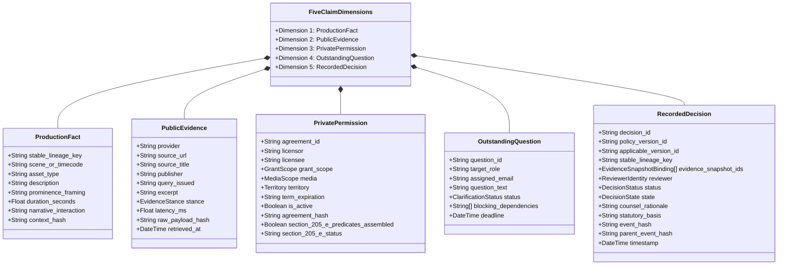
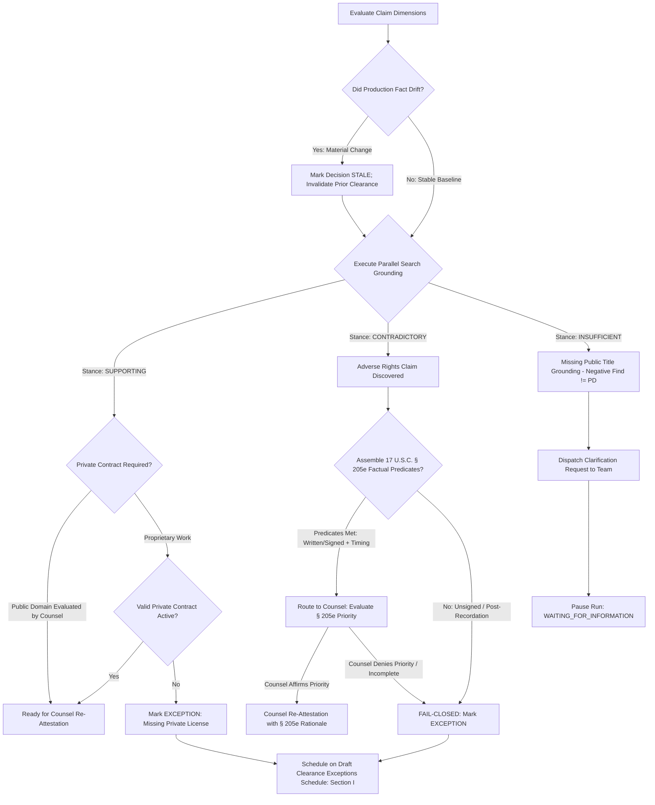

# Public Evidence vs. Private Permission & The 5 Claim Dimensions

**Lienmark Legal Operations & Clearance Architecture Specification**  
**Document Reference:** `docs/investigation/01_public_evidence_vs_private_permission.md`  
**Classification:** Core System Architecture / Legal Ops Specification  
**Status:** Canonical Release (v1.0.0)  
**Governing Standard:** Draft Clearance Exceptions Schedule for counsel and underwriter review  

---

## Executive Summary & Foundational Tenet

In film, television, and media clearance operations, intellectual property title risk cannot be evaluated through a single data lens. A catastrophic industry failure mode—frequently observed in naive legal automation—is conflating **public catalog status** with **private contractual authorization**:
1. **Public Web Searches and Registries** reflect whether an asset exists in an external index, whether its copyright was registered or renewed, who the recorded administrator is, or whether statutory protection has lapsed. However, *public search retrieves attributable evidence; it does NOT automatically prove public-domain status, ownership, or permission for a particular use.* Crucially, negative search results (absence of finding or absence of an indexed renewal record) do not equal public domain. The agent's role is strictly to preserve evidence excerpts, retrieval dates, and source URLs for counsel review.
2. **Private Negotiated Contracts** reflect bilateral agreements (licenses, releases, options, quitclaims). However, *a private agreement is legally voidable or unavailing if the grantor does not possess an unbroken, unencumbered chain of title in the public record*, or if an adverse transfer was recorded prior to the transaction under 17 U.S.C. § 205.

Lienmark enforces an architectural and evidentiary firewall between **Public Evidence** and **Private Permission**, reconciles them through deterministic legal operators (including assembling factual predicates under 17 U.S.C. § 205(e) for counsel review), and models every production asset across **The 5 Claim Dimensions**. All clearance evaluations feed the **Draft Clearance Exceptions Schedule for counsel and underwriter review**, which serves strictly as a decision-support leave-behind rather than a self-executing binder or autonomous policy endorsement.

---

## 1. The Core Legal Distinction: Public Evidence vs. Private Permission

```
┌─────────────────────────────────────────────────────────────────────────────────────────────┐
│                                   THE CLEARANCE DILEMMA                                     │
├──────────────────────────────────────────────┬──────────────────────────────────────────────┤
│               PUBLIC EVIDENCE                │              PRIVATE PERMISSION              │
│     (External Registries & Open Web)         │        (Bilateral Executed Contracts)        │
├──────────────────────────────────────────────┼──────────────────────────────────────────────┤
│ • Library of Congress Copyright Office       │ • Synchronization & Master Use Licenses      │
│ • ASCAP / BMI / SESAC Repertories            │ • Talent & Actor Likeness Releases           │
│ • USPTO Trademark Electronic Search (TESS)   │ • Artwork / Prop Rental Location Agreements  │
│ • Open Web Search (Parallel API v1)          │ • Script Options & Chain-of-Title Deeds      │
├──────────────────────────────────────────────┼──────────────────────────────────────────────┤
│ Evidentiary Boundary:                        │ Contractual Scope & Validity:                │
│ Retrieves attributable evidence only;        │ Establishes direct covenant not to sue,      │
│ does NOT prove public domain, title, or      │ scope of permitted media/territory, and      │
│ permission. Negative findings != PD.         │ warranties/indemnities from the licensor.    │
├──────────────────────────────────────────────┼──────────────────────────────────────────────┤
│ Fatal Blind Spot:                            │ Fatal Blind Spot:                            │
│ Cannot prove production has secured rights.  │ Worthless if licensor lacked authority, if   │
│ Agent preserves excerpts, dates & URLs       │ rights lapsed, or adverse transfer recorded. │
│ for human legal counsel review.              │ § 205(e) priority requires strict conditions.│
└──────────────────────────────────────────────┴──────────────────────────────────────────────┘
                                       │
                                       ▼
           ┌────────────────────────────────────────────────────────┐
           │        LIENMARK EVIDENCE RECONCILIATION ENGINE         │
           │  Reconciles Public Stance against Private Contract     │
           │  Assembles 17 U.S.C. § 205(e) Predicates for Counsel   │
           │  Generates Decision-Support Leave-Behind for Review    │
           └────────────────────────────────────────────────────────┘
```

### 1.1 Public Search Evidentiary Boundary: Attributable Evidence vs. Legal Proof
Public search engines and registry queries retrieve **attributable evidence**; they do **NOT** automatically prove public-domain status, ownership, or permission for a particular use.
- **Negative Search Results Do Not Equal Public Domain:**
  A search that returns zero hits or finds no record of a copyright renewal registration does *not* prove that a work has entered the public domain. The absence of an indexed finding may result from:
  1. Incomplete historical digitization of card catalogs (e.g., pre-1978 Copyright Office records scanned in batches);
  2. Unregistered or unpublished works protected under federal statutory life-plus terms (17 U.S.C. § 302);
  3. Automatic copyright restoration under 17 U.S.C. § 104A (URAA/GATT), which restored U.S. copyright in certain foreign works without requiring U.S. renewal registrations;
  4. Catalog indexing lag, spelling variants, pseudonyms, or corporate name changes.
- **Evidentiary Role of the Agent:**
  The automated system functions strictly as an evidentiary research pipeline. It preserves:
  1. Attributable verbatim evidence excerpts;
  2. Exact UTC retrieval dates and timestamps;
  3. Authoritative, fully qualified source URLs and provider tracking IDs;
  4. Cryptographic SHA-256 request and response payload hashes.
  These artifacts are preserved for human legal counsel review. The agent never makes substantive declarations of public-domain status or legal immunity.
- **Core Industry Failure Modes:**
  1. **The Sound Recording vs. Composition Bifurcation:**
     A public domain composition search may confirm that Claude Debussy’s *Clair de Lune* (published 1905) has expired copyright status worldwide. However, if the production cut uses a 2018 master recording performed by the Philadelphia Orchestra, utilizing that audio without a private master recording license constitutes copyright infringement of the sound recording under 17 U.S.C. § 106(1) & (6).
  2. **Derivative Works & Term Restorations:**
     Under 17 U.S.C. § 104A (the Uruguay Round Agreements Act / GATT), foreign works published without formalities in their country of origin that fell into the U.S. public domain may have had their U.S. copyright restored automatically on January 1, 1996. A shallow search declaring "No US copyright renewal found" will trigger fatal underwriter liability if foreign restoration applies.
  3. **Trademark Context vs. Right of Publicity:**
     A USPTO search demonstrating that a trademark is "DEAD" or abandoned does not authorize using the product's associated packaging if the packaging features proprietary trade dress, copyrighted artwork, or unauthorized celebrity endorsements violating state statutory rights of publicity (e.g., Cal. Civ. Code § 3344).

### 1.2 Why Private Contracts Alone Fail & The Statutory Bounds of 17 U.S.C. § 205(e)
1. **Wild Deeds & Broken Chain of Title:**
   A production may hold an executed "Worldwide All-Media Sync License" from an indie music publisher. However, if the public records of the U.S. Copyright Office demonstrate that the songwriter executed an adverse assignment of all renewal rights to a major publishing administrator, the production’s license is a "wild deed." Under 17 U.S.C. § 205(d), the recorded transfer prevails.
2. **Accurate Statutory Framework of 17 U.S.C. § 205(e):**
   Section 205(e) of Title 17, U.S. Code, governs priority between a nonexclusive license and a conflicting transfer of copyright ownership. It provides:
   > *"A nonexclusive license, whether recorded or not, prevails over a conflicting transfer of copyright ownership if the license is evidenced by a written instrument signed by the owner of the rights licensed or such owner's duly authorized agent, and if—*  
   > *(1) the license was taken before execution of the transfer; or*  
   > *(2) the license was taken in good faith before recordation of the transfer and without notice of it."*
   
   **Critical Statutory Bounds:**
   - **No Blanket "Contract Priority Shield":** § 205(e) must NOT be treated as an unconditional "contract priority shield" or blanket legal defense. It does not confer statutory immunity against infringement claims or quiet title automatically.
   - **Strict Scope of Application:** § 205(e) applies exclusively to *nonexclusive licenses* in conflict with a *transfer of copyright ownership*. It does not protect an exclusive license (which is itself a transfer of copyright ownership governed by § 205(d)), does not cure licenses granted by an entity lacking copyright ownership, does not override conflicting transfers executed prior to the license unless the licensee acted in good faith before recordation and without notice, and does not excuse uses exceeding the express contractual scope (media, term, territory).
   - **Sole Role of the Agent:** The automated system's role is strictly limited to assembling and verifying the factual predicates required for counsel evaluation:
     (1) Confirming whether the license is in a written instrument signed by the copyright owner or authorized agent; and
     (2) Determining whether the license was taken before execution of the transfer, OR was taken in good faith before recordation of the transfer and without notice of it.
     The agent **NEVER** declares statutory immunity or priority; only human legal counsel can evaluate these factual predicates and determine priority.

### 1.3 Factual Predicate Assembly for 17 U.S.C. § 205(e) Evaluation
When public evidence searches surface an adverse rights claim (e.g., a contemporary publisher claiming copyright assignment or a master rights dispute), Lienmark’s `EvidenceReconciliationService` does NOT apply an automatic shield or convert adverse findings to cleared status. Instead, it systematically compiles the statutory factual predicates for legal counsel:
- **Predicate Verification Protocol:**
  1. *Written & Signed Instrument:* Confirms whether the production holds a written agreement signed by the copyright owner or authorized agent.
  2. *Temporal & Notice Analysis:* Determines whether the license was taken prior to execution of the conflicting transfer, OR taken in good faith prior to Copyright Office recordation and without notice.
  3. *Scope & Term Concordance:* Validates whether the licensed scope (media, territory, duration) encompasses the scripted production usage.
- **Workflow State & Routing:**
  - The raw public stance (`CONTRADICTORY`) is preserved. The claim is flagged as `CONTRADICTORY (PREDICATES_ASSEMBLED_FOR_205E_REVIEW)`.
  - The matter is routed to production clearance counsel with an assembled evidentiary packet. Counsel evaluates the statutory predicates and enters a `RecordedDecision` with detailed legal rationale.
  - If no signed written agreement exists, or if the license was taken after recordation or with notice of the adverse transfer, the system enforces a hard fail-closed stop: status is recorded as `EXCEPTION`, and the asset is scheduled on Section I (Open Exceptions & Rejections) of the **Draft Clearance Exceptions Schedule for counsel and underwriter review**.
- **Nature of the Output:**
  The resulting schedule serves as a **decision-support leave-behind** for counsel and underwriter evaluation, NOT a self-executing binder or autonomous policy endorsement.

---

## 2. The 5 Claim Dimensions

Every intellectual property claim tracked in Lienmark must be fully expressed across **five distinct, orthogonal dimensions**. Decoupling these dimensions ensures that an artistic edit, a catalog sale, or a legal review does not corrupt other facets of the clearance record.



---

### Dimension 1: Production Fact (What Appears in the Cut)
Captures the empirical reality of how the creative asset is utilized within the film or television timeline. This data is extracted from screenplays, Edit Decision Lists (EDL), Final Cut Pro XMLs, Avid AAFs, or review cuts.

* **Key Schema Attributes:**
  * `stable_lineage_key`: Immutable cross-version identifier (e.g. `poster_noir_detective_magazine`, `music_cue_midnight_serenade`).
  * `version_id`: Script cut or timeline revision identifier (e.g. `v7`, `v8`).
  * `scene_or_timecode`: Exact script scene or cinematic timecode (`01:14:22:04 - 01:14:36:12`).
  * `asset_type`: Categorical taxonomy: `music_composition`, `music_master`, `artwork`, `trademark`, `prop`, `real_person`, `synthetic_media`, `literary_text`.
  * `prominence_framing`: Detailed physical framing (`background_blur`, `incidental_set_dressing`, `prominent_foreground`, `focal_dialogue_interaction`).
  * `duration_seconds`: Measured screen time duration.
  * `narrative_interaction`: Description of character dialogue, physical contact, or defamatory context.
  * `context_hash`: SHA-256 digest of scene text, dialogue, and prominence parameters. Any creative drift generates a divergent `context_hash`, immediately invalidating downstream legal clearance.

```json
{
  "production_fact": {
    "stable_lineage_key": "poster_noir_detective_magazine",
    "version_id": "v8",
    "scene_or_timecode": "SCENE 42 (01:14:22:04)",
    "asset_type": "artwork",
    "description": "1946 Crime Detective Magazine cover artwork prop",
    "prominence_framing": "14s close-up focal dialogue",
    "duration_seconds": 14.2,
    "narrative_interaction": "Lead detective pulls poster off wall, inspects cover closely, thrusts into camera plane while speaking dialogue.",
    "spoken_dialogue": "Shadows Over Broadway! They knew everything back in 1946.",
    "context_hash": "e3b0c44298fc1c149afbf4c8996fb92427ae41e4649b934ca495991b7852b855"
  }
}
```

---

### Dimension 2: Public Evidence (Attributable External Source)
Captures verified findings retrieved through runtime search queries and public intellectual property registries via the Parallel Search API v1.

* **Evidentiary Boundary:**
  Public search retrieves attributable evidence; it does NOT automatically prove public-domain status, ownership, or permission for a particular use. Negative search results (absence of finding or absence of an indexed renewal record) do not equal public domain. The agent strictly preserves evidence excerpts, retrieval dates, and source URLs for human legal counsel review.

* **Key Schema Attributes:**
  * `provider`: External provider name (`Parallel Search API v1`).
  * `provider_call_id`: Upstream tracking ID for vendor telemetry (`prl_search_998124_pub`).
  * `query_issued`: Exact, redacted keyword and boolean query sent to the index.
  * `source_url`: Verifiable, fully qualified HTTP(S) URL of the catalog record.
  * `source_title`: Official title of the web page or registry database entry.
  * `publisher`: Entity maintaining the record (e.g. `Library of Congress`, `ASCAP`, `USPTO`).
  * `retrieved_at`: ISO 8601 UTC timestamp of retrieval.
  * `raw_payload_hash`: SHA-256 hash of the complete search request payload.
  * `retrieval_latency_ms`: Roundtrip network latency measured in milliseconds.
  * `excerpt`: Verbatim text extract proving the finding, preserved as attributable evidence.
  * `stance`: Deterministic semantic stance evaluated against clearance objectives:
    * `SUPPORTING`: Attributable external record corroborates claim parameters (e.g., historical registration record located). Does NOT constitute an autonomous legal ruling of public domain or title clearance.
    * `CONTRADICTORY`: Surfaces conflicting claimant, adverse copyright assignment, or active trademark.
    * `INFORMATIONAL`: Relevant background facts without conclusive rights determination.
    * `INSUFFICIENT`: Search returned zero hits, timed out, or resulted in ambiguous entities. Negative findings do NOT equal public domain.

```json
{
  "public_evidence": {
    "provider": "Parallel Search API v1",
    "provider_call_id": "prl_search_loc_1946_det",
    "query_issued": "Crime Detective Magazine 1946 Shadows Over Broadway copyright renewal",
    "source_url": "https://cocatalog.loc.gov/cgi-bin/Pwebrecon.cgi?v1=1946-crime-detective",
    "source_title": "US Copyright Office Historical Catalog (cocatalog.loc.gov)",
    "publisher": "Library of Congress",
    "retrieved_at": "2026-09-03T14:31:02.184Z",
    "raw_payload_hash": "8f4b23a10e7b99c0c18d34e56b4f7a28e9102c3d4e5f6a7b8c9d0e1f2a3b4c5d",
    "retrieval_latency_ms": 142.5,
    "excerpt": "Registration #B-1946-8821 expired 1974 without timely renewal under 17 U.S.C. § 304(a). Cover artwork entered public domain in the United States.",
    "stance": "SUPPORTING",
    "http_status": 200,
    "domain": "cocatalog.loc.gov"
  }
}
```

---

### Dimension 3: Private Permission (Negotiated Agreement Terms)
Encapsulates bilateral contractual grants obtained by the production from rights holders, talent, guilds, or licensing agencies.

* **Key Schema Attributes:**
  * `agreement_id`: Unique tracking reference for the legal contract (e.g. `AGR-2026-PROP-0091`).
  * `licensor`: Exact legal corporate entity granting rights.
  * `licensee`: Exact production entity named in license (e.g. `Lienmark Productions Inc. / Midnight Diner LLC`).
  * `grant_scope`: Explicit enumeration of granted rights (`synchronization`, `master_use`, `print_reproduction`, `promotional_trailer`, `in_context_advertising`).
  * `media_scope`: Permitted media formats (`all_media_now_known_or_hereafter_devised`, `theatrical_and_streaming_only`, `linear_broadcast_only`).
  * `term`: Permitted duration of use (`perpetuity`, `ten_years_from_delivery`, `festival_rights_only_12_months`).
  * `territory`: Permitted geographic distribution (`worldwide`, `universe`, `north_america_only`).
  * `is_active`: Boolean indicating whether contract is currently executed and unexpired.
  * `section_205_e_predicates_assembled`: Boolean certifying whether the agent has compiled the statutory factual predicates under 17 U.S.C. § 205(e) (signed written instrument, execution/recordation sequence, absence of notice flags) for counsel evaluation. Does NOT declare statutory priority or immunity.
  * `section_205_e_status`: Descriptive status of the statutory predicate assembly (e.g. `Inapplicable — work in public domain; no conflicting transfer exists`, `Predicates assembled: Signed instrument on file; pending counsel priority evaluation`).
  * `agreement_hash`: SHA-256 cryptographic digest of the executed agreement text or PDF artifact.

```json
{
  "private_permission": {
    "agreement_id": "AGR-2026-PROP-0091",
    "licensor": "Old Hollywood Prop House & Vintage Archives Inc.",
    "licensee": "Midnight Diner Productions LLC",
    "grant_scope": "Physical prop rental and incidental background dressing display",
    "media_scope": "All media now known or hereafter devised",
    "term": "Perpetuity",
    "territory": "Worldwide",
    "is_active": true,
    "section_205_e_predicates_assembled": false,
    "section_205_e_status": "Inapplicable — work in public domain; no conflicting transfer exists.",
    "agreement_hash": "4a7d1ed414474e4033ac29ccb8653d9befe85e43192e3a5160ebbe8a123f1396",
    "counsel_comment": "Prop rental agreement grants physical possession only; explicitly disclaims intellectual property indemnification for copyright on magazine cover."
  }
}
```

---

### Dimension 4: Outstanding Question (Unresolved Facts & Inquiries)
Represents missing evidentiary links, ambiguous identity splits, or missing physical documents that block final legal adjudication.

* **Key Schema Attributes:**
  * `question_id`: Globally unique identifier (`clr_req_midnight_serenade_master`).
  * `target_role`: Assigned production role responsible for answer (`LINE_PRODUCER`, `MUSIC_SUPERVISOR`, `POST_SUPERVISOR`, `CLEARANCE_COORDINATOR`, `OUTSIDE_COUNSEL`).
  * `assigned_email`: Email address of the accountable human.
  * `question_text`: Precise, context-specific inquiry specifying the exact factual deficiency.
  * `required_document_type`: Anticipated document (`executed_master_license`, `isrc_metadata_sheet`, `talent_waiver`).
  * `status`: Workflow state (`OPEN`, `WAITING_FOR_INFORMATION`, `RESOLVED`, `EXPIRED`).
  * `blocking_dependencies`: Array of claim IDs or lineage keys whose approval is held in suspense.
  * `deadline`: Hard operational deadline matching post-production delivery cutoffs.

```json
{
  "outstanding_question": {
    "question_id": "clr_req_midnight_serenade_master",
    "target_role": "MUSIC_SUPERVISOR",
    "assigned_email": "supervisor@midnightdinerfilm.com",
    "question_text": "ASCAP records reveal composition 'Midnight Serenade' is administered by Kobalt, but Vanguard Media Holdings asserts an August 2026 worldwide exclusive master assignment. Please provide: (1) The commercial sound recording ISRC code used in the v8 edit, and (2) The executed Master Use License from Vanguard Media.",
    "required_document_type": "master_use_license_pdf",
    "status": "WAITING_FOR_INFORMATION",
    "blocking_dependencies": ["music_cue_midnight_serenade"],
    "created_at": "2026-09-04T09:12:00Z",
    "deadline": "2026-09-12T17:00:00Z"
  }
}
```

---

### Dimension 5: Recorded Decision (Actor, Timestamp, Version)
The immutable, cryptographically verifiable record of human legal counsel's adjudication. Automated agents *never* execute Dimension 5 records; they prepare the evidence for counsel. To guarantee provenance and evidentiary integrity, every recorded decision permanently binds the exact `policy_version_id`, `evidence_snapshot_ids` with UTC retrieval timestamps, and `counsel_rationale`.

* **Key Schema Attributes:**
  * `decision_id`: Unique record ID (`dec_v8_poster_noir_counsel_001`).
  * `policy_version_id`: Mandatory identifier of the canonical clearance policy and underwriting ruleset locked at decision time (e.g. `policy_v2026.09_r01`). Permanently bound to ensure auditability and historical replayability.
  * `applicable_version_id`: Script cut or production revision locked to this decision (`v8`).
  * `stable_lineage_key`: Cross-version asset identifier (`poster_noir_detective_magazine`).
  * `evidence_snapshot_ids`: Mandatory array of external evidence snapshot references, each permanently binding the snapshot ID to its exact UTC retrieval timestamp (e.g. `[{"snapshot_id": "ev_snap_loc_1946_det_001", "retrieved_at": "2026-09-03T14:31:02.184Z"}]`). Guarantees an immutable link between counsel's determination and the exact public records retrieved.
  * `reviewer`: Fully qualified reviewer identity (Attorney Name, Professional Title, Law Firm/Clearance Org, Bar ID / Reference).
  * `action`: Legal action taken (`re_attest`, `reject`, `exception`).
  * `status`: Adjudicated status (`APPROVED`, `APPROVED_WITH_CONDITION`, `REJECTED`, `NEEDS_REVIEW`).
  * `state`: Version change control state (`RE_ATTESTED`, `EXCEPTION`, `CARRIED_FORWARD`).
  * `counsel_rationale`: Mandatory substantive legal analysis justifying the decision under governing statutory frameworks, authored and signed by human counsel. Automated agents are strictly prohibited from populating or modifying this field.
  * `statutory_basis`: Applicable code citation (e.g. `17 U.S.C. § 304(a)`, `17 U.S.C. § 107`, `17 U.S.C. § 205(e)`, `15 U.S.C. § 1115(b)`).
  * `parent_event_hash`: SHA-256 hash of the preceding ledger event (genesis hash `0000...0000` if root).
  * `event_hash`: SHA-256 canonical hash binding reviewer, timestamp, policy_version_id, applicable_version_id, stable_lineage_key, evidence_snapshot_ids, decision, rationale, and parent hash.

```json
{
  "recorded_decision": {
    "decision_id": "dec_v8_poster_noir_001",
    "policy_version_id": "policy_v2026.09_r01",
    "applicable_version_id": "v8",
    "stable_lineage_key": "poster_noir_detective_magazine",
    "evidence_snapshot_ids": [
      {
        "snapshot_id": "ev_snap_loc_1946_det_001",
        "retrieved_at": "2026-09-03T14:31:02.184Z"
      }
    ],
    "reviewer": {
      "reviewer_id": "counsel_sjenkins_001",
      "name": "Sarah Jenkins, Esq.",
      "title": "Lead Production Clearance Counsel",
      "organization": "Lienmark Legal Partners LLP",
      "is_fictional_demo": false
    },
    "action": "re_attest",
    "status": "APPROVED",
    "state": "RE_ATTESTED",
    "counsel_rationale": "Re-attested for Cut v8 revised prominence (14s focal close-up with spoken dialogue). De minimis defense under Sandoval v. New Line Cinema is voided by foreground staging. However, clearance is affirmed under public domain doctrine: US Copyright Office records (cocatalog.loc.gov) confirm Registration #B-1946-8821 was published in 1946 and was not renewed during the statutory 28th year renewal window (1974) under 17 U.S.C. § 304(a). Work entered US public domain on January 1, 1975. Counsel independently verified inapplicability of foreign term restoration under 17 U.S.C. § 104A.",
    "statutory_basis": "17 U.S.C. § 304(a)",
    "timestamp": "2026-09-04T16:45:12.821Z",
    "parent_event_hash": "c7a8b9d0e1f2a3b4c5d6e7f8a9b0c1d2e3f4a5b6c7d8e9f0a1b2c3d4e5f6a7b8",
    "event_hash": "9d8e7f6a5b4c3d2e1f0a9b8c7d6e5f4a3b2c1d0e9f8a7b6c5d4e3f2a1b0c9d8e"
  }
}
```

---

## 3. Authoritative Public Source Registries & Query Protocols

Lienmark’s `ParallelSearchService` executes targeted query protocols against four authoritative intellectual property registries, validating ownership provenance and statutory terms:

```
                  ┌──────────────────────────────────────────────────┐
                  │            PARALLEL SEARCH API V1                │
                  │   Structured Research Runtime & Grounding        │
                  └─────────────────────────┬────────────────────────┘
                                            │
         ┌──────────────────┬───────────────┴──────────────┬──────────────────┐
         ▼                  ▼                              ▼                  ▼
┌─────────────────┐┌─────────────────┐           ┌─────────────────┐┌─────────────────┐
│ cocatalog.loc.gov││ ASCAP ACE / BMI │           │   USPTO TESS    ││  SONGVIEW DB   │
│ US Copyright    ││ PRO Repertoires │           │ US Trademarks   ││ Combined ASCAP │
│ Office Catalog  ││ Music Admin     │           │ Brand Registry  ││ & BMI Database │
└─────────────────┘└─────────────────┘           └─────────────────┘└─────────────────┘
```

### 3.1 Library of Congress US Copyright Office Historical Catalog (`cocatalog.loc.gov`)
* **Jurisdiction / Authority:** Federal Statutory Register under Title 17, U.S. Code.
* **Target Registrations:**
  * Works published prior to January 1, 1978: Class A (Books), Class B (Periodicals), Class E (Music), Class G (Works of Art), Class L/M (Motion Pictures).
  * Statutory Renewal Records (Class R): Mandatory 28th-year renewal filings for works published between 1928 and 1963. Absence of a Class R record establishes public domain expiration under 17 U.S.C. § 304(a).
  * Post-1978 Automated Records: Online catalog registrations from January 1, 1978 to present.
  * Recorded Documents & Assignments (17 U.S.C. § 205): Recordation of adverse transfers, mortgages, and termination notices under 17 U.S.C. §§ 203, 304(c).
* **Evidentiary Boundary Notice:**
  Queries against `cocatalog.loc.gov` retrieve attributable historical records. The absence of an indexed renewal record in search results is an attributable evidentiary finding; it does NOT automatically prove public-domain status as a matter of law. Negative search results do not equal public domain. Gaps in historical digitization, foreign copyright restoration under 17 U.S.C. § 104A, and title variations must be evaluated by legal counsel. The agent preserves evidence excerpts, retrieval dates, and source URLs for counsel review.
* **Target Query Formats:**
  ```http
  POST https://api.parallel.ai/v1/search
  Content-Type: application/json
  x-api-key: ${PARALLEL_API_KEY}

  {
    "objective": "Verify Library of Congress copyright registration and 28th year statutory renewal status for 'Crime Detective Magazine' published 1946.",
    "search_queries": [
      "site:cocatalog.loc.gov 'Crime Detective' 1946 renewal",
      "'Crime Detective Magazine' 'Shadows Over Broadway' copyright registration renewal Class B Class R",
      "US Copyright Office catalog 'Crime Detective' 1974 renewal"
    ],
    "mode": "fast",
    "max_chars_total": 4000
  }
  ```

### 3.2 ASCAP ACE Repertory (`ascap.com/ace-title-search`) & BMI Repertoire
* **Jurisdiction / Authority:** U.S. Performing Rights Organizations (PROs) operating under federal antitrust consent decrees (U.S. District Court for the Southern District of New York).
* **Target Rights:**
  * Small performing rights, songwriter splits, publisher shares, and administrative entities.
  * Identification of master sync administration companies (e.g., Kobalt, Sony Music Publishing, Universal Music Publishing Group, Concord Music).
  * Society splits: Multi-society registrations between ASCAP, BMI, and SESAC.
* **Target Query Formats:**
  ```http
  POST https://api.parallel.ai/v1/search
  Content-Type: application/json
  x-api-key: ${PARALLEL_API_KEY}

  {
    "objective": "Identify registered writers, publishers, and administrative entities for musical composition 'Midnight Serenade'.",
    "search_queries": [
      "site:ascap.com 'Midnight Serenade' ACE title search work ID",
      "site:bmi.com repertoire 'Midnight Serenade' writer publisher split",
      "'Midnight Serenade' jazz sync licensing administrator Kobalt Vanguard"
    ],
    "mode": "fast",
    "max_chars_total": 4000
  }
  ```

### 3.3 USPTO Trademark Electronic Search System (TESS / Trademark Search)
* **Jurisdiction / Authority:** United States Patent and Trademark Office under the Lanham Act (15 U.S.C. § 1051 et seq.).
* **Target Registrations:**
  * Registered trademarks (Principal and Supplemental Registers).
  * International Classes relevant to entertainment productions:
    * IC 009: Recorded media, motion pictures, video games.
    * IC 025: Clothing and apparel.
    * IC 032: Non-alcoholic beverages (soft drinks, beer).
    * IC 034: Tobacco and smokers' articles.
    * IC 041: Entertainment services, motion picture production.
  * Live vs. Dead status, disclaimer statements, Section 8/15 continuous use declarations.
* **Target Query Formats:**
  ```http
  POST https://api.parallel.ai/v1/search
  Content-Type: application/json
  x-api-key: ${PARALLEL_API_KEY}

  {
    "objective": "Determine live/dead status and registered owner of trademark 'COCA-COLA' and 'MARLBORO' for scripted product appearances.",
    "search_queries": [
      "site:uspto.gov 'Coca-Cola' trademark registration status IC 032",
      "USPTO trademark search 'Marlboro' Philip Morris live dead status packaging"
    ],
    "mode": "fast",
    "max_chars_total": 4000
  }
  ```

---

## 4. Evidence Reconciliation & 17 U.S.C. § 205(e) Priority Evaluation

When Public Evidence and Private Permission interact, Lienmark evaluates the composite clearance status using deterministic propositional logic, assembling factual predicates for counsel adjudication:



### Deterministic Truth Table

| Public Evidence Stance | Private Contract Status | 17 U.S.C. § 205(e) Factual Predicates Assembled? | Decision State | Target Workflow Action | Draft Clearance Exceptions Schedule Placement |
|:---|:---|:---|:---|:---|:---|
| `SUPPORTING` (Attributable catalog record found; negative search != PD) | `None Required (PD evaluated by counsel)` | N/A | `RE_ATTESTED` | Route to Counsel for substantive review and sign-off | Section II (Re-Attested Items) |
| `SUPPORTING` | `Active & Valid` | N/A (Consensual Grant) | `CARRIED_FORWARD` | Carry Forward Prior Approval if context_hash unchanged | Section III (Carried Forward Approvals) |
| `CONTRADICTORY` (Adverse Claim) | `Active Nonexclusive License on File` | **Yes (Signed written instrument; executed prior to transfer or good faith pre-recordation w/o notice)** | `NEEDS_COUNSEL_REVIEW` (Promoted to `RE_ATTESTED` upon counsel sign-off) | Route to Counsel with § 205(e) evidentiary packet; counsel evaluates statutory priority (Agent never declares immunity) | Section I (Open Exceptions) pending review; Promoted to Section II upon counsel sign-off with recorded rationale |
| `CONTRADICTORY` (Adverse Claim) | `None on File` | **No** | `EXCEPTION` | **Hard Stop; Fail-Closed Enforced** | **Section I (Open Exceptions & Rejections)** |
| `CONTRADICTORY` | `Expired / Mismatched Scope / Unsigned` | **No** | `EXCEPTION` | Hard Stop; Require License Amendment | **Section I (Open Exceptions & Rejections)** |
| `INSUFFICIENT` (Negative search result or timeout; does NOT equal PD) | `None on File` | No | `STALE` | Dispatch Clarification Request; preserve query, timestamp & URL for counsel | Section I (Open Exceptions) / Investigation Queue |

---

## 5. Defensive Implementation Invariants

The backend (`backend/core/` and `backend/services/`) and frontend (`frontend/app/components/`) strictly preserve the following architectural guarantees:

1. **Cryptographic Payload Tamper-Evidence:** Every `PublicEvidenceSnapshot` must compute a deterministic SHA-256 hash of its request payload (`raw_payload_hash`). A snapshot lacking a hash or containing an altered URL is rejected by the serialization validator.
2. **Strict Fail-Closed Stance on Network Degradation & Negative Search Results:** If the Parallel Search API returns an HTTP 429 (rate-limit), 5xx server failure, or network timeout, the system *must never* default to `SUPPORTING` or assume public domain. Negative search results (absence of finding) do not equal public domain. It must emit an `INSUFFICIENT` stance with `is_degraded: true`, triggering visible amber warning banners in the Clearance Inspector (`ExplanationDrawerComponent.tsx`).
3. **No Unauthenticated Autonomous Approvals & Statutory § 205(e) Boundary:** While automated agents have unbounded latitude to issue search queries, assemble evidence snapshots, and verify factual predicates, *no agent possesses the authority to create or sign a `RecordedDecision` or declare statutory priority/immunity under 17 U.S.C. § 205(e)*. The agent's role is strictly limited to assembling factual predicates (verifying signed written instruments, comparing execution/recordation timelines, and flagging notice indicators) and preserving attributable public evidence for counsel. Any attempt by background workers to write `status: APPROVED` or declare legal clearance without a valid `ReviewerIdentity` and counsel rationale raises an immediate `UnauthorizedApprovalError`.
4. **Permanent Separation of Storage:** Public search logs and private contract PDFs are stored in cryptographically isolated storage partitions. Private contract text is never emitted into external search payloads, preventing client-side script prompt injections from leaking proprietary agreements into third-party search indexes.
5. **Explicit Decision Provenance Binding:** Every `RecordedDecision` must cryptographically and structurally bind the exact `policy_version_id`, an array of `evidence_snapshot_ids` paired with their UTC retrieval timestamps, and the mandatory `counsel_rationale`. If any of these fields is omitted or null, the decision is rejected as non-compliant and cannot be promoted to an approved state or incorporated into the Draft Clearance Exceptions Schedule.
