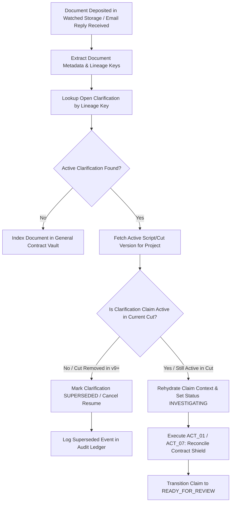

# Adaptive Research, Multi-Hop Lead Chasing & Persistent Human Clarification Loops

**Lienmark Legal Operations & Clearance Architecture Specification**  
**Document Reference:** `docs/investigation/02_adaptive_research_and_clarification_loops.md`  
**Classification:** Autonomous Systems Architecture & Legal Ops Workflow  
**Status:** Canonical Release (v2.1.0)  
**Governing Standard:** Form E&O-2026 Resilient Investigation & Human Review Protocol  
**Related Documents:**
- [`../architecture/02_agent_orchestration_and_adk_pipeline.md`](../architecture/02_agent_orchestration_and_adk_pipeline.md)
- [`01_public_evidence_vs_private_permission.md`](01_public_evidence_vs_private_permission.md)
- [`03_underwriting_schedule_and_delivery_artifacts.md`](03_underwriting_schedule_and_delivery_artifacts.md)

---

## Executive Summary

Clearance investigations in entertainment media cannot succeed as single-shot, static searches or pre-baked fixture lookups. Rights in music, visual art, archival footage, and brand properties are fragmented across complex administrative chains, co-publishers, artist estates, and corporate acquisitions. Naive retrieval pipelines that execute one query and immediately output a clearance decision suffer catastrophic error rates, either asserting false public domain status or failing to discover critical adverse claimants.

This specification establishes Lienmark's canonical **Adaptive Research, Multi-Hop Investigation Engine, and Persistent Clarification Loop**. It addresses the historical implementation gaps in `backend/orchestration/adk_pipeline.py` and `backend/services/revalidation_planner.py`, instituting:
1. **True Dynamic Agency:** One logical coordinator per investigation operating inside a durable workflow, eliminating mock workflow nodes and hardcoded fixtures.
2. **The Coordinator Decision Loop:** A continuous, evidence-chained 8-action decision matrix answering: *“Given this claim, the evidence collected, the missing facts, and the remaining budget, what useful action should happen next?”*
3. **Granular Claim Suspension:** Suspending only the individual affected claim (`waiting_for_information`) while allowing sibling claims to proceed concurrently within shared budget limits.
4. **Superseded Revision Verification:** Validating whether a newer script/cut revision has superseded an outstanding question before resuming work upon document ingestion.
5. **Strict Runtime Boundaries:** Enforcing identity, session-scoped tenant isolation, budget pre-reservations, and the strict distinction between AI proposals and non-delegable legal approvals.

---

## 1. Remediation of Implementation Gaps & True Dynamic Agency

### 1.1 The Prototype Anti-Patterns

A thorough engineering review of the prototype codebase revealed critical discrepancies between the intended clearance architecture and the actual implementation:

```
┌────────────────────────────────────────────────────────────────────────────────────────┐
│                        LEGACY IMPLEMENTATION GAP IDENTIFICATION                        │
├────────────────────────────────────────────────────────────────────────────────────────┤
│ 1. THE DISCONNECTED LLMAGENT ANTI-PATTERN (adk_pipeline.py:222-262)                    │
│    • adk_pipeline.py constructed an official LlmAgent equipped with specialist tools.  │
│    • However, the returned Workflow graph was populated with dummy FunctionNodes that  │
│      returned static dictionaries:                                                     │
│      def targeted_search_node(ctx): return {"phase": "...", "status": "COMPLETED"}     │
│    • The agent was never wired into the node execution; the workflow was an unlinked  │
│      facade that failed to execute dynamic tool calls.                                 │
├────────────────────────────────────────────────────────────────────────────────────────┤
│ 2. HARDCODED ASSET DRIFT & FIXTURE-ASSIGNED STANCES                                    │
│    • adk_pipeline.py (line 105) explicitly hardcoded asset keys:                       │
│      is_known_drift = key in ("poster_noir_detective_magazine", "music_cue_...")       │
│    • revalidation_planner.py (lines 227-232) assigned legal stances via string heuristics:│
│      if "poster_noir" in key.lower(): expected_stance = EvidenceStance.SUPPORTING      │
│      elif "midnight" in key.lower(): expected_stance = EvidenceStance.CONTRADICTORY    │
│    • This replaced genuine cognitive investigation with pre-scripted fixtures, defeating│
│      the purpose of autonomous research.                                               │
├────────────────────────────────────────────────────────────────────────────────────────┤
│ 3. COARSE-GRAINED RUN-LEVEL SUSPENSION                                                 │
│    • When a clarification was required for one claim, the entire pipeline run was      │
│      paused, freezing all independent claim investigations across the production.      │
└────────────────────────────────────────────────────────────────────────────────────────┘
```

### 1.2 True Dynamic Agency: One Logical Coordinator per Investigation

Lienmark remediates these defects by establishing **True Dynamic Agency**:
- **One Logical Coordinator per Investigation:** An authoritative Google ADK `LlmAgent` (powered by Gemini 2.5 Pro) maintains working memory for the investigation and governs the multi-hop research traversal.
- **Connected Dynamic Execution:** Workflow nodes actively invoke the coordinator's reasoning loop, passing the cumulative working context and receiving next-action directives.
- **Zero Fixture Assumptions:** All stance evaluations, claim splits, and reformulations derive strictly from empirical evidence retrieved live from public registries and private repositories.

---

## 2. The Coordinator Decision Loop & 8-Action Decision Matrix

### 2.1 The Governing Invariant

At every step of an investigation, the ADK Coordinator repeatedly evaluates:

$$\boxed{\text{“Given this claim, the evidence collected, the missing facts, and the remaining budget, what useful action should happen next?”}}$$

Evidence returned by one action **must directly influence and condition the next action**. The coordinator dynamically selects from an explicit **8-Action Decision Matrix**:

```
                              ┌───────────────────────────────┐
                              │    CLAIM WORKING CONTEXT      │
                              │  • Claim Metadata & History   │
                              │  • Accumulated Evidence       │
                              │  • Missing Facts Identified   │
                              │  • Remaining Execution Budget │
                              └───────────────┬───────────────┘
                                              │
                                              ▼
                              ┌───────────────────────────────┐
                              │  COORDINATOR DECISION LOOP    │
                              │     (Gemini 2.5 Pro LLM)      │
                              └───────────────┬───────────────┘
                                              │ Selects Next Action
            ┌────────────────┬────────────────┼────────────────┬────────────────┐
            ▼                ▼                ▼                ▼                ▼
     ┌──────────────┐ ┌──────────────┐ ┌──────────────┐ ┌──────────────┐ ┌──────────────┐
     │ 1. RETRIEVE  │ │  2. SEARCH   │ │  3. INSPECT  │ │   4. SPLIT   │ │5. REFORMULATE│
     │   PRIVATE    │ │    PUBLIC    │ │   SPECIFIC   │ │INVESTIGATION │ │    QUERY     │
     │  AGREEMENTS  │ │   SOURCES    │ │    SOURCE    │ │ (Comp/Master)│ │(Disambiguate)│
     └──────┬───────┘ └──────┬───────┘ └──────┬───────┘ └──────┬───────┘ └──────┬───────┘
            │                │                │                │                │
            └────────────────┴────────────────┼────────────────┴────────────────┘
                                              │
                      ┌───────────────────────┴───────────────────────┐
                      ▼                                               ▼
               ┌──────────────┐ ┌──────────────┐               ┌──────────────┐
               │ 6. REQUEST   │ │  7. PREPARE  │               │   8. STOP    │
               │CLARIFICATION │ │ REVIEW BRIEF │               │  UNRESOLVED  │
               │(Suspend Claim│ │ (Synthesize  │               │ (Fail-Closed │
               │  Only)       │ │  Form E&O)   │               │  Exception)  │
               └──────────────┘ └──────────────┘               └──────────────┘
```

### 2.2 Explicit 8-Action Decision Matrix

| Action Code | Action Name | Primary Trigger Condition | Tool / Mechanism Invoked | Evidence Feedback & Next Step |
| :--- | :--- | :--- | :--- | :--- |
| `ACT_01` | **Retrieve Private Agreements** | Baseline license unverified, or public search revealed adverse claimant that studio might hold rights to. | Scoped query to `gs://lienmark-contracts-{org}/` via `PrivateContractRetrievalTool`. | Returns contract passages. If license terms cover the use, proceed to `ACT_07` (Brief). If terms are missing or ambiguous, proceed to `ACT_06` (Clarification). |
| `ACT_02` | **Search Public Sources** | Initial claim intake or modified scene context requires external title and copyright verification. | Dispatches targeted query to Parallel Search API v1 targeting official public domain and registration catalogs. | Returns `PublicEvidenceSnapshot`. If title collision occurs, triggers `ACT_05` (Reformulate). If composite rights detected, triggers `ACT_04` (Split). |
| `ACT_03` | **Inspect a Specific Source** | Prior search hit references a specific registration number, renewal certificate, or assignment schedule. | Dispatches deep HTTP fetch or registry parser targeting the specific document URI or catalog identifier. | Returns verbatim schedule terms, renewal record dates, or claimant transfer history. Clarifies ambiguity from prior excerpt. |
| `ACT_04` | **Split the Investigation** | Evidence confirms asset embodies multiple distinct rights holders (e.g. musical composition vs master recording). | Subdivides parent claim into independent child claims with dedicated rights sub-goals. | Deploys concurrent child investigation paths under shared budget quota. Each child evaluates independently. |
| `ACT_05` | **Reformulate a Query** | Search returned zero hits, entity collisions (>20 hits), or low-quality scraper results. | Applies deterministic reformulation rules (adding year, artist, catalog number, or stripping broken domain filters). | Dispatches reformulated query to Parallel Search API v1. Increments reformulation counter against budget limit. |
| `ACT_06` | **Request Clarification** | Required fact is private and absent from both public registries and internal contract storage. | Emits structured `ClarificationRequest` to assigned human production role (Line Producer, Music Supervisor). | Suspends **only the affected claim** into `waiting_for_information`. Unaffected sibling claims continue. |
| `ACT_07` | **Prepare a Review Brief** | Sufficient evidence assembled to construct complete 4D legal clearance analysis. | Invokes Formatter Tool to synthesize Creative Shift, Public Evidence, Private Contract Shield, and Statutory Policy Basis. | Compiles draft clearance proposal for Counsel Inspector and Form E&O-2026 Underwriter Exception schedule. |
| `ACT_08` | **Stop with an Unresolved Finding** | Budget governor cap reached, 3-hop retry limit hit, or irreconcilable adverse evidence found. | Packages all attempted queries, partial excerpts, and missing facts into a formal audit record. | Sets claim stance to `INSUFFICIENT` / `UNRESOLVED_EXCEPTION` (fail-closed). Schedules on Form E&O Section I. |

### 2.3 Concrete Evidence-Chaining Walkthrough

The following real-world example demonstrates how the evidence returned by one action directly governs the next action without static hardcoding:

```
[CYCLE 1: INITIAL PUBLIC SEARCH]
Claim: Music Cue "Midnight Serenade" (Scene 42, 20s foreground feature)
Coordinator Question: What useful action should happen next?
Selected Action: ACT_02 (Search Public Sources)
Query: site:ascap.com/ace-title-search OR site:songfile.com "Midnight Serenade"
Evidence Returned:
  - ASCAP Work ID: 4910291
  - Writers: David Miller (CAE/IPI 102941)
  - Publisher: Kobalt Music Publishing (100% share)
  - Excerpt Note: "Commercial Sound Recording assigned August 2026 to Vanguard Media Holdings LLC."
Analysis: Evidence reveals composite rights! Composition is administered by Kobalt, but master sound
recording is held by an adverse assignee (Vanguard Media Holdings LLC).

[CYCLE 2: RIGHTS DECOMPOSITION]
Coordinator Question: What useful action should happen next?
Selected Action: ACT_04 (Split the Investigation)
Sub-Claims Created:
  - Sub-Claim 2A: "Midnight Serenade (Musical Composition / Sync)"
  - Sub-Claim 2B: "Midnight Serenade (Master Sound Recording)"

[CYCLE 3: CONCURRENT INVESTIGATION]
Sub-Claim 2A (Composition):
  - Coordinator Action: ACT_01 (Retrieve Private Agreements)
  - Query: "Kobalt Music Publishing" "Midnight Serenade" sync license
  - Evidence Returned: Found Blanket Studio Sync License #KB-2025-9912 (covers worldwide theatrical sync).
  - Next Action: ACT_07 (Prepare Review Brief -> APPROVED_WITH_CONDITION).

Sub-Claim 2B (Master Recording):
  - Coordinator Action: ACT_01 (Retrieve Private Agreements)
  - Query: "Vanguard Media Holdings LLC" master recording license
  - Evidence Returned: 0 matches in studio contract repository.
  - Next Action: ACT_06 (Request Clarification -> Dispatched to Music Supervisor).
  - State: Sub-Claim 2B transitions to WAITING_FOR_INFORMATION. Sub-Claim 2A is READY_FOR_REVIEW.
```

---

## 3. Concurrency & Granular Claim Suspension Architecture

### 3.1 Non-Blocking Claim-Level Isolation

Lienmark explicitly forbids run-level pausing for clarification requests. An entertainment clearance run evaluates dozens of creative assets across an entire script cut. If a missing prop invoice suspended the entire workflow, legal clearance for the entire motion picture would grind to a halt.

```
┌────────────────────────────────────────────────────────────────────────────────────────┐
│                   GRANULAR CLAIM CONCURRENCY & BUDGET POOLING                          │
├────────────────────────────────────────────────────────────────────────────────────────┤
│ INVESTIGATION RUN: run_v8_reval_99812                                                  │
│ Tenant / Org: org_warner_bros | Project: proj_midnight_diner | Script Cut: v8          │
│ Global Run Status: IN_PROGRESS                                                         │
│ Shared Budget Pool: 15 Parallel API Calls (Used: 6) | 20 LLM Inferences (Used: 7)      │
├────────────────────────────────────────────────────────────────────────────────────────┤
│ CLAIM 1: "poster_noir_detective_magazine"                                              │
│ • State: READY_FOR_REVIEW                                                              │
│ • Action History: [ACT_02 Search Public] ──► [ACT_03 Inspect LOC] ──► [ACT_07 Brief]   │
│ • Stance: APPROVED_PUBLIC_DOMAIN (Pre-1978 non-renewal confirmed via USCO Class R)     │
├────────────────────────────────────────────────────────────────────────────────────────┤
│ CLAIM 2: "music_cue_midnight_serenade_master"                                          │
│ • State: WAITING_FOR_INFORMATION (SUSPENDED)                                           │
│ • Action History: [ACT_02 Search Public] ──► [ACT_04 Split] ──► [ACT_06 Clarification] │
│ • Deficiency: Missing Master Use License from Vanguard Media Holdings LLC              │
│ • Assigned: Elena Rostova (Music Supervisor) | Due: 72h                                │
├────────────────────────────────────────────────────────────────────────────────────────┤
│ CLAIM 3: "neon_sign_acme_diner"                                                        │
│ • State: READY_FOR_REVIEW                                                              │
│ • Action History: [ACT_01 Retrieve Vault] ──► [ACT_07 Brief]                           │
│ • Stance: APPROVED_CONTRACT_SHIELD (Prop House Clearance Agreement #PH-8812)          │
├────────────────────────────────────────────────────────────────────────────────────────┤
│ CLAIM 4: "vintage_radio_broadcast_speech"                                              │
│ • State: INVESTIGATING                                                                 │
│ • Action History: [ACT_02 Search Public] ──► [ACT_05 Reformulate Query]                │
│ • Active Worker: Executing Parallel Search Query 2 of 3                                │
└────────────────────────────────────────────────────────────────────────────────────────┘
```

#### Concurrency Invariants:
1. **Independent State Machines:** Every claim progresses through its own lifecycle independently:
   $$\text{ClaimState} \in \{\text{EVALUATING}, \text{INVESTIGATING}, \text{WAITING\_FOR\_INFO}, \text{READY\_FOR\_REVIEW}, \text{UNRESOLVED\_EXCEPTION}\}$$
2. **Global Run Lifecycle:** The parent run is `IN_PROGRESS` as long as at least one claim is active (`EVALUATING` or `INVESTIGATING`). When all claims reach either terminal states (`READY_FOR_REVIEW`, `UNRESOLVED_EXCEPTION`) or suspended states (`WAITING_FOR_INFO`), the run transitions to `PAUSED_PENDING_INPUT`.
3. **Shared Budget Reservation:** All concurrent claims draw from a unified, thread-safe budget ledger governed by `ExecutionBudgetGovernor`.

### 3.2 Superseded Revision Verification on Resumption

When a human responds to a clarification or drops a missing contract into cloud storage, the system must **never blindly resume execution without revision validation**.

In fast-moving productions, directors frequently cut scenes between revisions. If Scene 42 was eliminated in Cut v9, resuming a Cut v8 clarification regarding Scene 42 wastes legal fees, API spend, and compute time.



#### The Resumption Guard Logic:
```python
async def handle_clarification_fulfillment(
    clarification_id: str,
    uploaded_document_uri: str,
    project_id: str,
) -> FulfillmentResult:
    clarification = await firestore_client.get_clarification(clarification_id)
    latest_cut = await production_service.get_latest_cut(project_id)
    
    # Check if the asset still exists in the active revision
    lineage_key = clarification.stable_lineage_key
    claim_in_latest_cut = await production_service.find_asset_in_cut(
        cut_id=latest_cut.cut_id, lineage_key=lineage_key
    )
    
    if not claim_in_latest_cut:
        logger.info(
            f"Clarification {clarification_id} for asset '{lineage_key}' superseded; "
            f"asset does not exist in latest cut '{latest_cut.cut_id}'."
        )
        await firestore_client.update_clarification(
            clarification_id=clarification_id,
            status="SUPERSEDED",
            resolution_note=f"Asset eliminated in cut {latest_cut.cut_id}.",
        )
        return FulfillmentResult(status="SUPERSEDED", resumed=False)
    
    # Active claim confirmed: rehydrate and resume
    await resume_claim_investigation(
        run_id=clarification.run_id,
        claim_id=clarification.claim_id,
        new_artifact_uri=uploaded_document_uri,
    )
    return FulfillmentResult(status="RESUMED", resumed=True)
```

### 3.3 Separation of Worker Execution Time vs. Investigation Elapsed Time

Clearance systems operate across two fundamentally distinct time scales:

```
┌────────────────────────────────────────────────────────────────────────────────────────┐
│                     TEMPORAL SEPARATION: COMPUTE VS. ELAPSED TIME                      │
├────────────────────────────────────────────────────────────────────────────────────────┤
│ WORKER EXECUTION TIME (Synchronous Compute)                                            │
│ • Scope: Microservices, HTTP calls, model inference, parser routines.                 │
│ • Execution Duration: 5.0 seconds to 30.0 seconds per tool call.                       │
│ • Compute Infrastructure: Ephemeral Cloud Run container / Cloud Function.              │
│ • Timeout Enforcement: Strict 10.0s HTTP socket timeout; 45.0s lease timeout.          │
│ • Resource Cost: Zero compute cost once the tool invocation returns.                   │
├────────────────────────────────────────────────────────────────────────────────────────┤
│ INVESTIGATION ELAPSED TIME (Asynchronous Legal Lifecycle)                              │
│ • Scope: Contract drafting, supervisor replies, agent licensing negotiations.          │
│ • Execution Duration: Hours, Days, Weeks.                                              │
│ • Compute Infrastructure: NONE. Zero compute threads or memory locks held.             │
│ • State Persistence: Serialized state snapshot stored in Cloud Firestore.              │
│ • SLA Enforcement: Automated reminder at 24h; escalation to Open Exception at 72h.    │
└────────────────────────────────────────────────────────────────────────────────────────┘
```

---

## 4. Multi-Hop Lead Chasing, Entity Decomposition & Reformulation

### 4.1 Rights Sub-Goal Decomposition Protocol

When an asset is evaluated, the coordinator dynamically maps it into legal sub-goals:

* **Music Assets:**
  1. *Composition / Publishing Rights (Musical Work):* Author of melody/lyrics; public domain vs copyright status; publishing administrator (ASCAP, BMI, SESAC, PRS, GEMA).
  2. *Mechanical & Synchronization Rights:* Authorized audio-visual synchronization licensor; worldwide vs territorial administration.
  3. *Master Sound Recording Rights (Phonorecord):* Ownership of physical master recording used in edit (commercial label vs production library vs studio session).
  4. *Performer Consents & Union P&H:* SAG-AFTRA or AFM union sound recording agreements requiring secondary market residuals.
* **Artwork & Literary Assets:**
  1. *Underlying Author / Artist:* Life plus 70 years calculation or pre-1978 publication without statutory copyright renewal under 17 U.S.C. § 304(a).
  2. *Derivative Rights:* Authorized reproduction vs unauthorized variant.
  3. *Moral Rights (VARA - 17 U.S.C. § 106A):* Modification or distortion of recognized visual art.
* **Brand & Trademark Assets:**
  1. *Registered Mark & Owner:* USPTO Principal Register status and owner identity.
  2. *Context of Use:* Editorial realism, nominative fair use, or commercial disparagement / trademark tarnishment (15 U.S.C. § 1125(c)).

### 4.2 Entity Extraction & Secondary Lead Chasing

Upon receiving raw text from public search, the coordinator extracts candidate entities for secondary investigation:

```python
class ExtractedEntityLead(BaseModel):
    lead_type: Literal["administrator", "publisher", "record_label", "estate", "assignee"]
    entity_name: str
    source_citation: str
    confidence: float = Field(..., ge=0.0, le=1.0)
    recommended_query: str

def extract_secondary_leads(
    search_hit: Dict[str, Any],
    stable_lineage_key: str,
) -> List[ExtractedEntityLead]:
    leads = []
    text = " ".join(search_hit.get("excerpts", []))
    
    # Lead Pattern 1: Publishing Administrator Discovery
    if "administered by" in text.lower() or "admin by" in text.lower():
        admin = parse_administrator_entity(text)
        leads.append(ExtractedEntityLead(
            lead_type="administrator",
            entity_name=admin,
            source_citation=search_hit.get("url", ""),
            confidence=0.92,
            recommended_query=f"'{admin}' sync licensing catalog '{stable_lineage_key}'"
        ))
        
    # Lead Pattern 2: Adverse Master Assignment Discovery
    if "assigned to" in text.lower() or "exclusive master rights" in text.lower():
        assignee = parse_assignee_entity(text)
        leads.append(ExtractedEntityLead(
            lead_type="assignee",
            entity_name=assignee,
            source_citation=search_hit.get("url", ""),
            confidence=0.95,
            recommended_query=f"'{assignee}' copyright assignment master recording '{stable_lineage_key}'"
        ))
    return leads
```

### 4.3 Self-Correction & Query Reformulation Tactics

When queries yield inconclusive results, the coordinator applies deterministic self-correction algorithms (`ACT_05`):

| Failure Pattern | Diagnosis | Reformulation Strategy | Example Before -> After |
|:---|:---|:---|:---|
| **Title Collision** | Over 20 distinct works share the title in ASCAP/BMI; ambiguous attribution. | Specialize query by injecting extracted artist, release year, or director context. | `"Midnight Serenade"` -> `"Midnight Serenade" jazz trio 1948 "David Miller"` |
| **Domain Query Failure** | Query syntax with strict `site:` operators returns 0 hits due to registry URL changes. | Relax domain constraint while preserving cryptographic search terms and target registry name. | `site:cocatalog.loc.gov "Crime Detective" 1946` -> `US Copyright Office catalog "Crime Detective Magazine" 1946 renewal` |
| **Weak Excerpt / Aggregator Spam** | Top hits come from lyric wikis, fan blogs, or unauthorized aggregators. | Invalidate search hits. Re-anchor query targeting official registries and trade bulletins. | `"Clair de Lune" rights` -> `"Clair de Lune" Debussy public domain copyright expiration catalog` |
| **Pre-1978 Ambiguity** | Work published between 1928 and 1977 lacks proof of 28th-year renewal. | Issue targeted Class R (Renewal) search against LOC historical records. | `"Shadows Over Broadway" 1946` -> `"Shadows Over Broadway" Class R copyright renewal 1974 1975` |

---

## 5. Persistent Clarification Loops & Watched Folder Ingestion

### 5.1 Role-Based Routing & Task Assignment

Clarification requests are assigned strictly based on production role accountability:

```
┌─────────────────────────────────────────────────────────────────────────────────────────────┐
│                             CLARIFICATION REQUEST ROUTING                                   │
├─────────────────────────┬──────────────────────────────────┬────────────────────────────────┤
│ ROLE                    │ TYPICAL DEFICIENCIES ASSIGNED    │ MANDATED ARTIFACT REQUIRED     │
├─────────────────────────┼──────────────────────────────────┼────────────────────────────────┤
│ **Line Producer**       │ Budgeted license fees, trailer   │ Executed master use license,   │
│                         │ exclusions, delivery schedules   │ distributor delivery schedule  │
├─────────────────────────┼──────────────────────────────────┼────────────────────────────────┤
│ **Music Supervisor**    │ Sound recording ISRC, commercial │ Dual-executed sync & master    │
│                         │ cue sheet, master label identity │ licenses, PRO cue sheet draft  │
├─────────────────────────┼──────────────────────────────────┼────────────────────────────────┤
│ **Clearance Coord.**    │ Prop rental scope, product       │ Location release, prop house   │
│                         │ placement release, set dressing  │ clearance agreement            │
├─────────────────────────┼──────────────────────────────────┼────────────────────────────────┤
│ **Lead Outside Counsel**│ Statutory fair use evaluation,   │ Formal defense opinion letter, │
│                         │ trademark nominative use defense │ signed underwriting rider      │
└─────────────────────────┴──────────────────────────────────┴────────────────────────────────┘
```

### 5.2 Canonical Clarification Request Schema

```json
{
  "request_id": "clr_2026_0904_ms_012",
  "run_id": "run_v8_reval_99812",
  "project_id": "proj_midnight_diner_feature",
  "target_version_id": "v8",
  "stable_lineage_key": "music_cue_midnight_serenade",
  "target_role": "MUSIC_SUPERVISOR",
  "assigned_email": "musicsuper@midnightdinerfilm.com",
  "assigned_name": "Elena Rostova",
  "urgency": "HIGH",
  "title": "Missing Master Recording License & ISRC Code",
  "question_text": "Production Cut v8 retains 20s of 'Midnight Serenade' in Scene 42. ASCAP registry verification confirms composition is owned by Kobalt Music, but master recording synchronization rights were exclusively assigned in August 2026 to Vanguard Media Holdings LLC. Public search indicates an adverse copyright lien. Please provide: (1) The commercial master recording ISRC code used in the cut; and (2) The executed Master Use License from Vanguard Media Holdings LLC.",
  "required_document_type": "master_license_pdf",
  "blocking_dependencies": [
    "music_cue_midnight_serenade",
    "cue_sheet_entry_12"
  ],
  "status": "WAITING_FOR_INFORMATION",
  "created_at": "2026-09-04T10:15:30Z",
  "due_date": "2026-09-10T17:00:00Z",
  "satisfaction_payload": null
}
```

### 5.3 Watched Folder Ingestion Pipeline

Lienmark implements zero-click resumption when contracts or releases are dropped into monitored Cloud Storage buckets (`gs://lienmark-contracts-{org}/`):

```
┌────────────────────────────────────────────────────────────────────────────────────────┐
│                        WATCHED FOLDER INGESTION PIPELINE                               │
└───────────────────────────────────┬────────────────────────────────────────────────────┘
                                    │
                       1. File Drop Event Trigger (GCS Object Finalize)
                                    │
                                    ▼
┌────────────────────────────────────────────────────────────────────────────────────────┐
│  STEP 1: SECURE INGESTION, MIME VALIDATION & CONTENT HASHING                           │
│  • Compute SHA-256 Digest: 4a7d1ed414474e4033ac29cc...                                │
│  • Validate PDF structure; reject password-protected, encrypted, or executable macros  │
│  • Check duplicate ingest register: Prevent redundant token spend                      │
└───────────────────────────────────┬────────────────────────────────────────────────────┘
                                    │
                                    ▼
┌────────────────────────────────────────────────────────────────────────────────────────┐
│  STEP 2: CLAUSE EXTRACTION & METADATA PARSING                                          │
│  • Extract Licensor: "Vanguard Media Holdings LLC"                                     │
│  • Extract Licensee: "Midnight Diner Productions LLC"                                  │
│  • Extract Grant Scope: "Synchronization and Master Use for Feature Film"              │
│  • Extract Term: "Perpetuity" & Territory: "Worldwide"                                 │
│  • Verify 17 U.S.C. § 205(e) Written Instrument Signature Attributes                   │
└───────────────────────────────────┬────────────────────────────────────────────────────┘
                                    │
                                    ▼
┌────────────────────────────────────────────────────────────────────────────────────────┐
│  STEP 3: ASSET MATCHING & SUPERSEDED REVISION CHECK                                    │
│  • Query open ClarificationRequest records where status = WAITING_FOR_INFORMATION      │
│  • Match asset lineage key: music_cue_midnight_serenade                                │
│  • MANDATORY CHECK: Does asset still exist in latest script/cut revision?              │
│    ├── IF NO: Mark clarification SUPERSEDED; abort resumption; log audit record        │
│    └── IF YES: Proceed to Step 4                                                       │
└───────────────────────────────────┬────────────────────────────────────────────────────┘
                                    │
                                    ▼
┌────────────────────────────────────────────────────────────────────────────────────────┐
│  STEP 4: AUTOMATED CLAIM RESUMPTION & CONTRACT SHIELD RECONCILIATION                   │
│  • Wake up suspended claim: Transition status to INVESTIGATING                         │
│  • Invoke ACT_01 & ACT_07: Reconcile contract shield against public Vanguard hit       │
│  • Deterministic Reconciler promotes claim state to APPROVED_WITH_CONDITION            │
│  • Transition claim to READY_FOR_REVIEW; alert Clearance Counsel for sign-off          │
└────────────────────────────────────────────────────────────────────────────────────────┘
```

---

## 6. Counsel Rejection and Reinvestigation Loop

Automated agents never have the final clearance authority. When Clearance Counsel reviews an AI-generated briefing and rejects the proposed stance, the system captures counsel's exact instructions and dispatches a scoped reinvestigation.

### 6.1 Rejection Capture & Immutable Ledger Entry

When counsel rejects a finding, the system records an immutable audit transaction:

```json
{
  "action": "reject",
  "stable_lineage_key": "music_cue_midnight_serenade",
  "prior_decision_id": "dec_v8_midnight_proposal_001",
  "new_decision_id": "dec_v8_midnight_rejected_counsel",
  "prior_state": "EXCEPTION",
  "new_state": "STALE",
  "prior_status": "NEEDS_REVIEW",
  "new_status": "REJECTED",
  "reviewer": {
    "reviewer_id": "counsel_sjenkins_001",
    "name": "Sarah Jenkins, Esq.",
    "title": "Lead Production Clearance Counsel",
    "organization": "Lienmark Legal Partners LLP"
  },
  "counsel_rationale": "Proposed finding relied on 1948 public domain notation in liner notes. Rejected: The 2026 Vanguard Media assignment specifically claims newly recorded arrangement and remastering. Agent must search Copyright Office records for supplemental registration Form SR for this specific master.",
  "reinvestigation_directive": "Query cocatalog.loc.gov specifically for Sound Recording (Class SR) registrations by Vanguard Media Holdings LLC for 'Midnight Serenade' between 2020 and 2026. Do not accept composition public domain status as resolving the master recording.",
  "statutory_basis": "17 U.S.C. §§ 102(a)(7), 106(6), 504(c)",
  "timestamp": "2026-09-04T14:20:10Z",
  "parent_event_hash": "9d8e7f6a5b4c3d2e1f0a9b8c7d6e5f4a3b2c1d0e9f8a7b6c5d4e3f2a1b0c9d8e",
  "event_hash": "2c3d4e5f6a7b8c9d0e1f2a3b4c5d6e7f8a9b0c1d2e3f4a5b6c7d8e9f0a1b2c3d"
}
```

### 6.2 Scoped Follow-Up Investigation Dispatch

1. **Isolation of Scope:** Reinvestigation is strictly confined to the rejected claim node and downstream deliverables (e.g., cue sheet). Untouched claims are not re-executed, conserving organization budget.
2. **Directive as Primary Objective:** The `reinvestigation_directive` is prepended to the coordinator's reasoning context as an explicit, high-priority objective:
   ```json
   {
     "objective": "COUNSEL REINVESTIGATION DIRECTIVE: Query cocatalog.loc.gov specifically for Sound Recording (Class SR) registrations by Vanguard Media Holdings LLC for 'Midnight Serenade' between 2020 and 2026. Do not accept composition public domain status as resolving the master recording.",
     "search_queries": [
       "site:cocatalog.loc.gov 'Vanguard Media' 'Midnight Serenade' Class SR",
       "'Vanguard Media Holdings' 'Midnight Serenade' sound recording copyright registration 2026"
     ],
     "mode": "advanced",
     "max_chars_total": 4000
   }
   ```
3. **Anti-Oscillation Guard:** The system enforces a **3-Rejection Cap**. If counsel rejects an automated finding 3 consecutive times, automated searching is permanently terminated. The claim is locked as an **Unresolved Exception** on Form E&O-2026 Section I, requiring human legal settlement or creative replacement.

---

## 7. Strict Runtime Boundaries & Security Enforcements

The coordinator operates within strict security and governance constraints enforced by the application runtime:

```
┌────────────────────────────────────────────────────────────────────────────────────────┐
│                        RUNTIME BOUNDARY ENFORCEMENT MATRIX                             │
├─────────────────────────┬───────────────────────────────┬──────────────────────────────┤
│ RESPONSIBILITY          │ GOVERNED BY                   │ STRICT INVARIANT ENFORCED    │
├─────────────────────────┼───────────────────────────────┼──────────────────────────────┤
│ **Identity & Tenant**   │ Application Runtime / OIDC    │ Scoped strictly by server    │
│                         │ Session Context               │ JWT. Zero model-selected     │
│                         │                               │ organization IDs allowed.    │
├─────────────────────────┼───────────────────────────────┼──────────────────────────────┤
│ **Budget Quota**        │ ExecutionBudgetGovernor       │ Pre-reserves quota before    │
│                         │                               │ tool dispatch. Halts run on  │
│                         │                               │ violation.                   │
├─────────────────────────┼───────────────────────────────┼──────────────────────────────┤
│ **Contract Retrieval**  │ PrivateContractRetrievalTool  │ Returns verbatim passages;   │
│                         │                               │ CANNOT grant clearance.      │
├─────────────────────────┼───────────────────────────────┼──────────────────────────────┤
│ **Brief Generation**    │ ReviewBriefFormatterTool      │ Generates draft proposals;   │
│                         │                               │ CANNOT execute legal sign-off│
├─────────────────────────┼───────────────────────────────┼──────────────────────────────┤
│ **Ledger Commits**      │ InvalidationEngine &          │ Commits must be signed and   │
│                         │ Append-Only Store             │ hash-chained deterministically│
├─────────────────────────┼───────────────────────────────┼──────────────────────────────┤
│ **Tool Output Envelope**│ AuthoritativeToolEnvelope     │ Must record SHA-256 payload  │
│                         │                               │ digest, uncertainty, status. │
└─────────────────────────┴───────────────────────────────┴──────────────────────────────┘
```

### 7.1 Provenance, Uncertainty & Execution Envelope

Every tool result delivered to the coordinator must conform to the authoritative envelope schema:

```python
class AuthoritativeToolEnvelope(BaseModel):
    tool_name: str
    execution_id: str = Field(default_factory=lambda: f"exec_{uuid.uuid4().hex[:8]}")
    timestamp_utc: str
    status: Literal["success", "transient_error", "circuit_broken", "rate_limited", "timeout"]
    latency_ms: float
    raw_payload_hash: str  # SHA-256 digest of external provider raw response
    source_uri: Optional[str] = None
    provider_call_id: Optional[str] = None
    uncertainty_score: float = Field(..., ge=0.0, le=1.0)
    unresolved_questions: List[str] = Field(default_factory=list)
    payload: Dict[str, Any]
```

---

## 8. Summary of Guarantees

1. **No Hardcoded Shortcuts:** All drift evaluations and stance reconciliations occur dynamically through live registry search and private contract inspection.
2. **Granular Productivity:** Human clarification requests suspend only the affected claim; sibling investigations progress concurrently under a shared budget.
3. **No Stale Work:** Ingested documents are checked against the latest active revision before resuming suspended tasks, preventing wasted effort on cut scenes.
4. **Non-Delegable Compliance:** AI agents recommend and format; licensed legal counsel decides and signs; the immutable ledger audits and protects.
