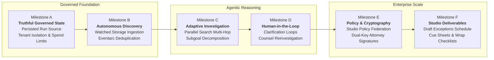
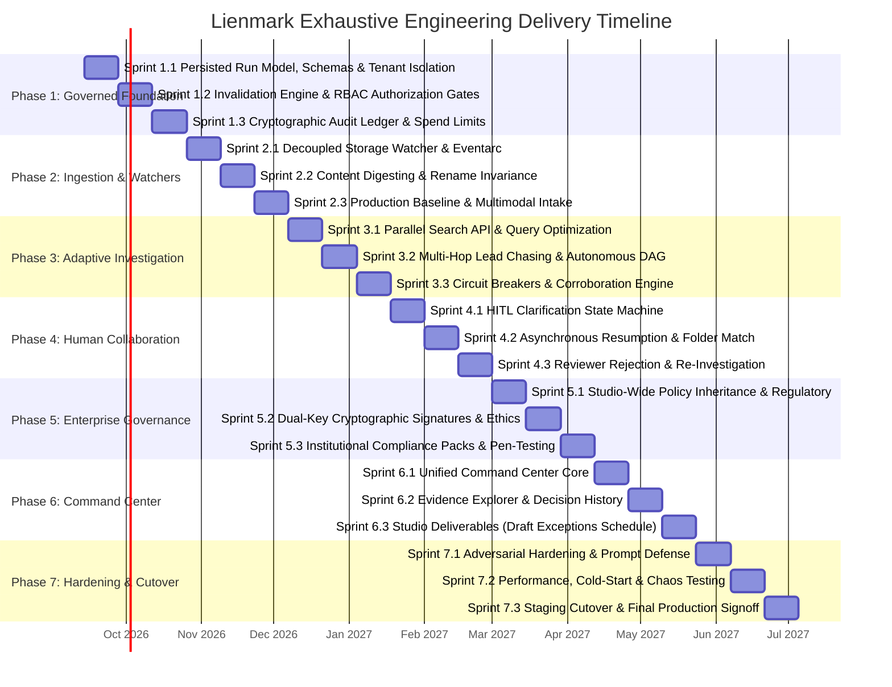
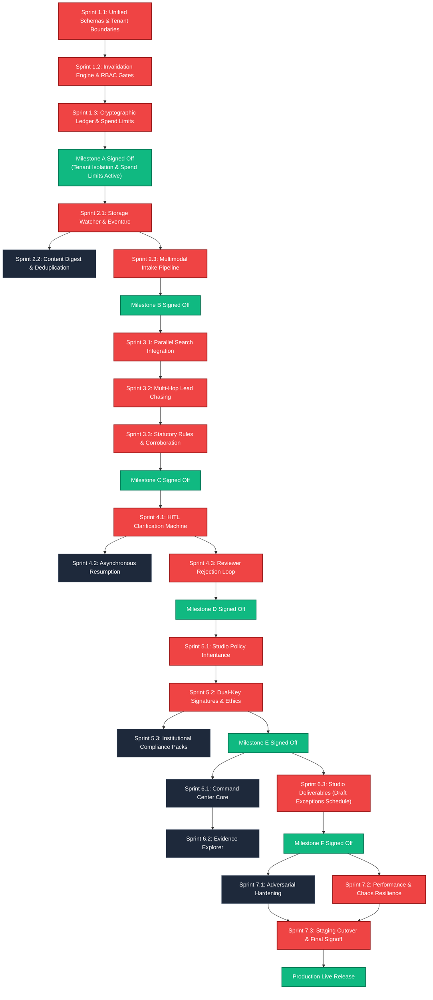

# Master Exhaustive Engineering Build Roadmap
## Lienmark: Autonomous Clearance Change Control & E&O Invalidation Engine

> **Document Status:** Authoritative Engineering Build Specification  
> **Target Path:** `docs/roadmap/01_exhaustive_engineering_build_roadmap.md`  
> **Author:** Lead Program Manager & Build Roadmap Architect  
> **Date of Publication:** September 6, 2026  
> **Governing Baselines:** `output/legacy_capability_review_2026-09-06/RECOVERY_MAP.md`, `docs/TARGET_ARCHITECTURE.md`, `docs/EVALUATION_AND_TRACEABILITY.md`  
> **Execution Profile:** Deep-Thinking Multi-Phase Engineering Execution (`/boost /orchestrate /effort max`)

---

## 1. Executive Summary & Strategic Sequencing

### 1.1 The Recovery Thesis & Architecture Demarcation
Historical development cycles accumulated ambitious architectural vision documents alongside placeholder scaffolding (53 out of 55 agent files in `backend/agents/` previously matched minimal pass-through stubs, while feature toggles offered cosmetic demo configurations). Furthermore, legacy prototypes relied on automatic demo reconciliation and fixture-backed state.

This roadmap repudiates cosmetic demonstration mechanisms in favor of an **authentic, enterprise-grade, bounded-autonomy clearance engine**. Lienmark builds directly upon the substantive, production-grade core residing in:
- `backend/core/` (deterministic dependency analysis, delta diffing, statutory rule evaluations);
- `backend/services/` (evidence extraction, provider normalization, rate-limited research clients);
- `backend/storage/firestore_client.py` (versioned entity persistence and run storage);
- `backend/orchestration/adk_pipeline.py` (Google Cloud Agent Builder & GenAI ADK workflow coordination).

The governing operational doctrine of Lienmark is strictly bounded:
$$\text{Product Behavior} = \text{Detect Relevant Change} \longrightarrow \text{Determine Impact DAG} \longrightarrow \text{Investigate Within Budget} \longrightarrow \text{Resolve Missing Facts} \longrightarrow \text{Preserve Evidence \& Decisions}$$

### 1.2 The Six Acceptance Milestones (Milestones A through F)
Delivery is structured around six objective, gate-checked Acceptance Milestones established in `RECOVERY_MAP.md` §9. Progress is judged not by calendar burn, but by empirical proof under live execution.

> [!IMPORTANT]
> **Architectural Sequencing Rationale (Finding 5 from User Review):**  
> In initial architectural sequencing, multi-tenant isolation, RBAC authorization, and execution spending limits were deferred to Phase 5. This created a critical security and governance flaw: **you cannot connect private cloud storage or ingest real studio production materials without tenant boundaries, RBAC, and spending limits already enforced in the foundation.** Connecting private storage buckets (`gs://<tenant>-locked-drafts/`) or parsing proprietary screenplays without strict tenant isolation risks catastrophic intellectual property leakage, while initiating automated research without hard spend governors risks unchecked API depletion. Consequently, minimum identity, tenant isolation, authorization, and spending limits have been elevated directly into the **Phase 1 Foundation** (Milestone A).

#### Milestone A: Truthful Governed State, Multi-Tenant Boundary & Spending Guardrails
* **Core Deliverable:** Unified single-source-of-truth persistence layer on Firestore; complete removal of synthetic demo fixtures; strict multi-tenant data and execution isolation (`/organizations/{org_id}/productions/{prod_id}/runs/{run_id}`); baseline 4-tier Role-Based Access Control (`Producer`, `Analyst`, `Reviewer`, `Admin`); and execution budget governor with hard spend limits (`max_api_spend_usd`).
* **Demonstration That Counts:** Storage and API calls enforce tenant boundaries fail-closed; non-attorney roles are rejected from clearance overrides; duplicate runs incur strictly \$0 in external API spend; hard spend caps enforce `waiting_for_budget` pause without data loss or artificial completion; dashboard, investigation logs, and underwriting reports read from identical persisted database records.
* **Anchor Sprints:** Sprints 1.1, 1.2, 1.3.

#### Milestone B: Autonomous Background Discovery & Watched Storage Ingestion
* **Core Deliverable:** Decoupled backend watcher loop observing authorized tenant-isolated cloud storage buckets (`gs://<tenant>-locked-drafts/`); Eventarc cloud triggers; SHA-256 content digesting and rename invariance—operating under the active tenant boundaries and budget caps established in Phase 1.
* **Demonstration That Counts:** With the browser completely closed, an engineer uploads an unseen revision PDF via standard cloud CLI to their tenant bucket. A clearance run is autonomously provisioned in Firestore. An identical upload or folder rename incurs zero new API spend and resolves in $<100\text{ ms}$ from cache.
* **Anchor Sprints:** Sprints 2.1, 2.2, 2.3.

#### Milestone C: Adaptive Investigation & Parallel Search Multi-Hop
* **Core Deliverable:** Dynamic query synthesis across the official Parallel Search API; multi-hop entity traversal (chasing estates, publishing conglomerates, label subsidiaries); rights subgoal decomposition (composition vs. master recording vs. sync); strictly bounded by the Phase 1 Budget Governor.
* **Demonstration That Counts:** Ingesting an ambiguous, multi-layered music claim autonomously spawns subgoals; low-confidence initial queries trigger inverse domain steering (`-lyrics -youtube -spotify`); no source yields explicit uncertainty without hallucinating false clearance; external spend remains strictly below the pre-flight budget ceiling.
* **Anchor Sprints:** Sprints 3.1, 3.2, 3.3.

#### Milestone D: Human-in-the-Loop Clarification & Reviewer Reinvestigation
* **Core Deliverable:** Suspend-and-resume investigation state machine (`waiting_for_information`); interactive clarifying question dispatch; autonomous folder unblocking upon agreement ingestion; counsel rejection and directed re-investigation; authorization verified strictly against Phase 1 RBAC reviewer roles.
* **Demonstration That Counts:** When private contract facts are missing, the pipeline suspends execution, registers an open clarification, and unloads from worker memory. Uploading the requested contract PDF autonomously resumes the suspended run. Clearance counsel rejecting a finding routes the claim back to the research worker with counsel directives injected.
* **Anchor Sprints:** Sprints 4.1, 4.2, 4.3.

#### Milestone E: Advanced Enterprise Governance, Studio Policy Federation & Cryptographic Signatures
* **Core Deliverable:** Studio Policy Inheritance engine (`backend/core/policy_engine.py`); Dual-Key Cryptographic Attorney Signatures (`backend/security/dual_key_signer.py`); Attorney Ethics & Conflict-of-Interest Pre-Screening (`backend/security/ethics_checker.py`); and automated institutional compliance evidence packs (`output/evidence_pack/`).
* **Demonstration That Counts:** High-risk clearances require two valid, non-identical digital signatures (Reviewing Counsel + Supervising Partner); parent studio clearance policies dynamically cascade down to productions; ethics pre-screener blocks conflicted counsel assignment; evidence packs pass air-gapped underwriter audits.
* **Anchor Sprints:** Sprints 5.1, 5.2, 5.3.

#### Milestone F: Studio Deliverables & Command Center
* **Core Deliverable:** Production-grade 6-destination operational Command Center; automated generation of the **Draft Clearance Exceptions Schedule for counsel and underwriter review**; ASCAP/BMI Music Cue Sheets; Post-Production Wrap Checklists; ISO/SOC audit trail export.
* **Demonstration That Counts:** A completion bond underwriter or clearance attorney logs into the Command Center, inspects unresolved high-exposure items, verifies cryptographic SHA-256 ledger integrity, and exports the Draft Clearance Exceptions Schedule for counsel and underwriter review alongside certified cue sheets and wrap checklists.
* **Anchor Sprints:** Sprints 6.1, 6.2, 6.3.

### 1.3 Prioritized Acceptance Test Suite & Telemetry Specification

#### 1.3.1 Canonical Acceptance Test Cases
To guarantee that the engine exhibits authentic bounded autonomy rather than deterministic demonstration scripting, the platform is verified against five distinct, unfamiliar test scenarios requiring differentiated workflow execution:

1. **Test Case 1: Existing Permission (Private Agreement Covers Use)**
   * *Scenario:* Screenplay revision introduces an in-scene commercial product or musical cue covered by an existing executed master agreement already present in the tenant repository.
   * *Required Workflow:* Engine extracts asset identity, queries the tenant agreement index, performs semantic clause extraction, confirms term/territory/media scope matches the scene context, and carries the claim forward.
   * *Cost & Path:* Zero external Parallel Search API calls (\$0.00 external spend); transitions to `attorney_review_required` / `cleared_private` with clause citation.
2. **Test Case 2: Ambiguous Identity (Multiple Works with Same Title, Catalog Lookup)**
   * *Scenario:* Screenplay references a track or artwork with a generic or heavily duplicated title (e.g., "Hold On" or "The Awakening") without specifying composer or performer.
   * *Required Workflow:* Engine detects entity ambiguity; suspends automated clearance; triggers targeted catalog lookup subgoals against PRO/ISWC/Copyright registries; compiles a ranked disambiguation candidate set for counsel review.
   * *Cost & Path:* Status transitions to `needs_disambiguation` / `waiting_for_information`; strictly zero false green badges or speculative auto-assignments.
3. **Test Case 3: Missing Agreement (Promotional Trailer Use Missing from Feature License)**
   * *Scenario:* Production possesses a feature-film synchronization license, but creative re-cutting places the cue into an unbonded theatrical teaser / promotional campaign where trailer rights were explicitly carved out or omitted.
   * *Required Workflow:* Legal rule engine flags scope deficiency (theatrical feature granted, promotional marketing excluded); suspends investigation; emits a high-priority clarifying request to Legal/Line Producer requesting a supplemental trailer rider.
   * *Cost & Path:* Run transitions to `waiting_for_information`; session state persists durably across server restarts; unblocks autonomously upon trailer rider upload.
4. **Test Case 4: Contradictory Evidence (Adverse Claim Discovered in External Registry)**
   * *Scenario:* Script incorporates an ostensibly public domain work, but external registry / legal docket search uncovers active litigation, renewal dispute, or adverse trademark opposition.
   * *Required Workflow:* Engine flags stance `CONTRADICTORY`; calculates elevated risk score; invalidates prior clearance assumption; places claim into `unresolved_exception` on the Draft Clearance Exceptions Schedule; mandates dual-key counsel adjudication.
   * *Cost & Path:* Immediate fail-closed exception; never marks as cleared; surfaces prominently on underwriter schedule.
5. **Test Case 5: Provider Failure (Parallel Search Timeout Triggering Fail-Closed Circuit Breaker)**
   * *Scenario:* External research provider suffers HTTP 504 gateway timeout, rate-limit 429, or network partition during active multi-hop search.
   * *Required Workflow:* Retry exponential backoff exhausts configured threshold; circuit breaker trips fail-closed; does not crash, swallow exceptions, or fall back to ungrounded LLM hallucination; records `PROVIDER_TIMEOUT_CIRCUIT_BROKEN` in audit ledger.
   * *Cost & Path:* Transitions claim to `PENDING_RETRY` / `STALE`; partial investigation state preserved; flags operational alert in Command Center Inbox.

#### 1.3.2 Non-Negotiable Acceptance Assertions
All acceptance test executions must satisfy four non-negotiable assertions:
* **Assertion 1: Dynamic Workflow Divergence:** Workflow paths must differ appropriately based on evidence (private agreement lookup vs catalog disambiguation vs HITL clarification vs adverse invalidation vs circuit breaker).
* **Assertion 2: Durable Session Survival:** Investigation state must survive application and container restarts (`waiting_for_information`, `waiting_for_budget`, `ready_for_review`), restoring fully from Firestore and the audit ledger without data corruption.
* **Assertion 3: Budget Governor Discipline:** Respects spending budgets strictly (\$0.00 external spend on duplicates or cached entities; hard spend cap enforced mid-run with graceful pause in `waiting_for_budget`).
* **Assertion 4: Truthful State Guarantee:** The system never manufactures artificial completion or green badges; unresolved, ambiguous, or failed states are preserved transparently.

#### 1.3.3 Before-and-After Metric Display & Empirical Demarcation
To eliminate ambiguity between empirical results and modeled projections, all system dashboards, summary cards, and generated reports enforce strict separation:

* **The 6 Exact Empirical Measured Metrics (`[MEASURED TELEMETRY]`):**
  1. **Approvals Preserved:** Count of carried-forward claims where prior clearance remains valid and unmodified.
  2. **Claims Reopened:** Count of claims invalidated into `stale` status due to creative script edits or adverse evidence.
  3. **Missing Facts Resolved:** Count of clarifying items answered, private agreements uploaded, or catalog ambiguities disambiguated.
  4. **Blockers Remaining:** Count of unresolved exceptions, missing licenses, or unadjudicated high-exposure claims preventing delivery.
  5. **Research Spend (\$):** Exact cumulative external API costs incurred in USD (LLM tokens + search API query fees).
  6. **Elapsed Time:** Exact wall-clock runtime in milliseconds/seconds from intake ingestion to schedule generation.

* **Strict Demarcation Standard:**
  - `[MEASURED TELEMETRY]`: Hard, verifiable, database-backed counters derived from actual run logs.
  - `[MODEL ESTIMATE]`: Modeled industry baselines (e.g., Estimated Legal Hours Saved: $14.5\text{ hrs} \times \$450/\text{hr} = \$6,525$; Modeled Query Reduction: $83.3\%$ vs un-indexed re-clearance).
  - Telemetry displays must never conflate financial estimates with empirical measurements; UI components badge modeled values with `[MODEL ESTIMATE]` and empirical values with `[MEASURED TELEMETRY]`.

---

## 2. Engineering Phases & Sprint Topology

The engineering build spans **7 structured phases** containing **21 exhaustive two-week sprints**:

| Phase | Sprints | Focus Area | Primary Milestone Anchor |
|---|---|---|---|
| **Phase 1** | Sprints 1.1 – 1.3 | Core Truthfulness, Tenant Isolation & Governed Foundation | Milestone A |
| **Phase 2** | Sprints 2.1 – 2.3 | Autonomous Ingestion & Storage Watchers | Milestone B |
| **Phase 3** | Sprints 3.1 – 3.3 | Adaptive ADK Investigation & Parallel Grounding | Milestone C |
| **Phase 4** | Sprints 4.1 – 4.3 | Active Human Collaboration & Clarification Loops | Milestone D |
| **Phase 5** | Sprints 5.1 – 5.3 | Advanced Enterprise Governance & Cryptographic Signatures | Milestone E |
| **Phase 6** | Sprints 6.1 – 6.3 | Operational Command Center & Studio Deliverables | Milestone F |
| **Phase 7** | Sprints 7.1 – 7.3 | Verification, Hardening & Staging Cutover | Final Production Readiness |

---

## 3. Exhaustive Sprint-by-Sprint Specifications

---

### Phase 1: Core Truthfulness, Tenant Isolation & Governed Foundation

#### Sprint 1.1: Persisted Run Model, Unified Entity Schemas & Multi-Tenant Boundaries
* **Sprint Objectives & Deliverables:**
  - Eliminate all in-memory mock fixtures, simulated state, and hardcoded demo shortcuts from the backend runtime.
  - Establish authoritative Pydantic v2 canonical domain models and TypeScript contract definitions across all layers, with mandatory `organization_id` tenant scoping.
  - Implement the single-source-of-truth database repository pattern on Google Cloud Firestore (`backend/storage/firestore_client.py`) with physical collection partitioning: `/organizations/{org_id}/productions/{prod_id}/runs/{run_id}`.
  - Deploy minimum identity and tenant context isolation in backend middleware (`TenantContextMiddleware` in `backend/api/middleware/tenant.py`), validating JWT organization claims fail-closed on every request.
  - Enforce tenant-scoping query decorators across repository operations, ensuring no query or storage operation executes without an authenticated `organization_id`.
  - Deploy the immutable lifecycle state machine for investigation runs (`queued`, `investigating`, `waiting_for_information`, `waiting_for_budget`, `ready_for_review`, `completed`, `failed`, `cancelled`, `superseded`).

* **Detailed Task Matrix:**
  - **Backend:**
    1. Define core domain entities in `backend/domain/models.py`: `Organization`, `Production`, `ProductionVersion`, `DocumentRecord`, `CreativeUse`, `InvestigationRun`, `EvidenceRecord`, `CounselDecision`, `AuditEvent`, `ReportSnapshot`—every entity strictly enforcing non-nullable `organization_id`.
    2. Implement repository abstraction `backend/storage/repository.py` with strict tenant-scoping query decorator: automatically append `.where("organization_id", "==", tenant_id)` to all Firestore operations.
    3. Implement `TenantContextMiddleware` in `backend/api/middleware/tenant.py` extracting and validating `tenant_id` from verified JWT claims; raise HTTP 401/403 fail-closed if tenant context is missing or mismatched.
    4. Remove synthetic bypass methods in `backend/core/` that auto-cleared mock claims without persistence.
    5. Implement run lifecycle manager `backend/core/lifecycle.py` enforcing legal state transitions.
  - **Frontend:**
    1. Generate strict TypeScript interfaces in `frontend/types/domain.ts` matching Pydantic schemas using `openapi-typescript`.
    2. Implement `TenantProvider` in React context: store active organization metadata, branding, and permissions.
    3. Purge hardcoded mock objects from `frontend/app/page.tsx` and state stores; bind view models directly to backend REST endpoints (`GET /api/v1/productions/{id}/runs`).
  - **Data / Infrastructure:**
    1. Provision Firestore database instances in Google Cloud (Native Mode) with collection groups: `/organizations/{org_id}/productions/{prod_id}/runs/{run_id}`.
    2. Deploy Firestore Security Rules validating tenant ownership matching for client-initiated operations.
    3. Deploy local Firestore emulator configuration in `docker-compose.test.yml` for automated CI test suites.
    4. Configure composite indexes in `firestore.indexes.json` for complex entity filtering (`organization_id`, `project_id`, `version_id`, `status`, `created_at`).

* **Pre-conditions, Invariants, and Acceptance Gates:**
  - *Pre-conditions:* Clean GCP project provisioned with Application Default Credentials (ADC) and Firestore API enabled.
  - *Invariants:* Every persisted claim and run must possess a cryptographically valid UUIDv4 identifier and an RFC 3339 UTC timestamp. No database read or write may execute without an authenticated, validated `organization_id`. Cross-tenant data leakage is strictly prohibited.
  - *Acceptance Gate:* `tests/test_domain_persistence.py` executes 1,000 randomized state transitions against the Firestore emulator with zero un-persisted states; `tests/test_multitenant_isolation.py` attempts 200 unauthorized cross-tenant operations and asserts 100% fail-closed rejection with HTTP 403/404.

* **Risk Pre-Mortem & Mitigation:**
  - *Risk:* Transitioning away from fixtures causes frontend renders to fail with undefined field errors during edge cases.
  - *Mitigation:* Enforce strict Zod schema validation on the frontend API boundary; any schema mismatch renders a defensive error boundary rather than crashing the client application.

---

#### Sprint 1.2: Deterministic Dependency Graph, Invalidation Engine & RBAC Authorization Gates
* **Sprint Objectives & Deliverables:**
  - Implement the clearance dependency graph engine in `backend/core/dependency_graph.py`.
  - Implement generalized script AST delta-diffing capable of analyzing arbitrary screenplay revisions (additions, deletions, scene shifts, dialogue alterations).
  - Deliver the fail-closed selective invalidation engine: when Revision $N+1$ is ingested, carry forward unimpacted claims while invalidating affected claims into `stale` status.
  - Deploy baseline 4-tier Role-Based Access Control (RBAC) model: `Producer`, `Analyst`, `Reviewer` (Clearance Counsel), `Admin`.
  - Enforce backend role authorization gates at all clearance decision API endpoints (`@require_role(["Reviewer", "Admin"])`): mere platform authentication grants zero clearance override authority.
  - Enforce version-bounding: prevent newer revisions from silently inheriting approvals from older drafts.

* **Detailed Task Matrix:**
  - **Backend:**
    1. Build `backend/core/delta_engine.py`: Screenplay semantic diffing comparing scene headings, dialogue blocks, parentheticals, and action descriptions.
    2. Implement `backend/core/dependency_graph.py`: Directed Acyclic Graph (DAG) mapping `CreativeUse` nodes to parent scene contexts and evidence prerequisites.
    3. Formulate the invalidation rule evaluator: classify changes into `ChangeKind` (`ADDED`, `MATERIALLY_MODIFIED`, `REMOVED`, `UNCHANGED`).
    4. Implement RBAC authorization decorators in `backend/api/security/rbac.py`: `@require_role(["Reviewer", "Admin"])`; assert that `Producer` and `Analyst` roles cannot mutate clearance states.
    5. Enforce the version-bound propagation rule: if `scene_or_timecode` or dialogue context shifts materially, mark prior `CounselDecision` as `stale` and schedule re-investigation.
  - **Frontend:**
    1. Build `frontend/components/diff/RevisionDeltaViewer.tsx`: visual side-by-side script comparison highlighting added, modified, and deleted clearance elements.
    2. Add visual dependency indicators in `ClaimsTable.tsx` distinguishing carried-forward claims (green badge with prior version link) from invalidated claims (amber stale badge).
    3. Enforce UI role gating: hide clearance override actions from `Producer` and `Analyst` roles; show review controls exclusively to authenticated `Reviewer` (attorney) principals.
  - **Data / Infrastructure:**
    1. Store revision deltas in Firestore subcollection `/organizations/{org_id}/productions/{id}/deltas/{delta_id}`.
    2. Benchmark graph traversal algorithms to ensure dependency resolution for a 150-page screenplay ($>300$ claims) executes in $<150\text{ ms}$.

* **Pre-conditions, Invariants, and Acceptance Gates:**
  - *Pre-conditions:* Sprint 1.1 domain models, tenant boundaries, and repository layers fully integrated and tested.
  - *Invariants:* An unchanged asset in an unchanged scene MUST retain its prior evidence lineage; a modified scene MUST never retain a prior `approved` status without explicit counsel re-attestation. Marking a claim as `attorney_cleared` strictly requires an authenticated `Reviewer` or `Admin` role.
  - *Acceptance Gate:* `tests/test_dependency_invalidation.py` processes the canonical Version 7 $\rightarrow$ Version 8 delta fixture; precisely 10 unchanged claims carry forward, Item 11 (creative drift) and Item 12 (evidence drift) are flagged as stale, with 0 false carries; `tests/test_rbac_and_signatures.py` asserts an Analyst attempting an override is rejected with HTTP 403.

* **Risk Pre-Mortem & Mitigation:**
  - *Risk:* Minor typographical edits in non-rights dialogue cause unnecessary cascading invalidations of unrelated background assets.
  - *Mitigation:* Implement localized bounding boxes and character entity matching in `delta_engine.py` so that dialogue modifications only invalidate assets explicitly referenced within that immediate scene beat.

---

#### Sprint 1.3: Verifiable Audit Ledger & Spending Limits / Execution Budget Governor
* **Sprint Objectives & Deliverables:**
  - Correct historical security misconceptions: replace reliance on client-side Firebase Security Rules with robust backend write-path IAM controls and server-side cryptographic tamper evidence.
  - Deploy the Execution Budget Governor in `backend/orchestration/budget_governor.py`: pre-flight cost estimation based on screenplay page count and claim density.
  - Enforce hard spend caps (`max_api_spend_usd`) per run and per production: ensure \$0 spend on duplicate runs, and pause execution gracefully in `waiting_for_budget` with an intact partial record rather than fabricating synthetic completion.
  - Deploy the append-only cryptographic ledger in `backend/storage/ledger.py`, computing SHA-256 hash chains linking each event to its predecessor (`previous_event_hash`).
  - Implement deterministic projection replay: reconstruct current production clearance state by replaying append-only historical audit events.
  - Deliver CLI ledger verification tool `scripts/verify_ledger_integrity.py`.

* **Detailed Task Matrix:**
  - **Backend:**
    1. Implement `ExecutionBudgetGovernor` in `backend/orchestration/budget_governor.py`:
       - Pre-flight estimator: $\text{Estimated Cost} = (\text{Page Count} \times \$0.015) + (\text{Estimated Claims} \times \$0.04)$.
       - If projected cost exceeds remaining budget, halt execution and transition run to `waiting_for_budget`.
       - Track live token and API call costs per run; terminate gracefully if mid-run cap is breached.
       - Cache resolution check: identical duplicate requests incur strictly \$0.00 in external API spend.
    2. Implement `backend/storage/ledger.py` with immutable write semantics: only `create` operations permitted; `update` and `delete` handlers raise fatal exceptions.
    3. Structure `AuditEvent` payloads: `event_id`, `tenant_id`, `production_id`, `actor_id`, `action_type`, `payload_digest`, `timestamp_utc`, `previous_event_hash`, `entry_hash`.
    4. Build the state projection engine `backend/core/projector.py` which folds historical events into current snapshot projections.
    5. Implement `scripts/verify_ledger_integrity.py` which traverses the hash chain from genesis to leaf, validating every SHA-256 link.
  - **Frontend:**
    1. Build `frontend/components/governance/BudgetMeter.tsx`: visual spend gauge showing budget consumed, projected cost, and remaining allowance.
    2. Build `frontend/components/governance/BudgetApprovalModal.tsx`: Line Producer authorization to increase spend cap for complex scripts.
    3. Build `frontend/components/ledger/AuditTrailDrawer.tsx` rendering the cryptographic event log with link verification badges.
    4. Provide an in-browser audit verification status widget displaying current chain depth, root hash, and leaf signature.
  - **Data / Infrastructure:**
    1. Configure GCP IAM service account permissions: application backend identity possesses write permissions; direct database modification is restricted from administrative consoles.
    2. Store budget quotas and spend metrics in Firestore `/organizations/{org_id}/productions/{id}/budget`.
    3. Store genesis hash anchors securely in Firestore metadata collections.

* **Pre-conditions, Invariants, and Acceptance Gates:**
  - *Pre-conditions:* Tenant isolation, dependency graph, and invalidation engine operational.
  - *Invariants:* A run that exhausts its budget MUST pause in `waiting_for_budget` with a fully inspectable partial state; the engine must NEVER synthesize fake results when out of budget. Every ledger entry must satisfy $\text{entry\_hash} = \text{SHA256}(\text{previous\_event\_hash} + \text{payload} + \text{timestamp})$. Supersession is recorded exclusively as a new `SupersessionEvent`.
  - *Acceptance Gate:* `tests/test_budget_governor.py` sets a strict \$0.05 spend limit; executes run on a 20-claim script; asserts pipeline pauses cleanly when cap is reached, preserves partial findings, and achieves Milestone A compliance; `tests/test_ledger_immutability.py` asserts mutating/deleting ledger entries raises fatal error and verifies a 1,000-event chain in $<2.0\text{ seconds}$.

* **Risk Pre-Mortem & Mitigation:**
  - *Risk:* High-frequency audit event emission creates Firestore write contention or hot partitions on sequential timestamp keys.
  - *Mitigation:* Distribute write partition keys using salted hash prefixes (`tenant_id#production_id#shard_id`) while maintaining deterministic chronological ordering during projection replay.

---

### Phase 2: Autonomous Ingestion & Storage Watchers

#### Sprint 2.1: Decoupled Storage Watcher & Cloud Eventarc Ingestion
* **Sprint Objectives & Deliverables:**
  - Build the decoupled background watcher service in `backend/services/storage_watcher.py`, completely independent of client browser sessions.
  - Establish the Dual-Input Architecture: Cloud Storage Eventarc webhook triggers for production buckets (`gs://<tenant>-locked-drafts/`) alongside an authenticated browser dropzone.
  - Enforce directory scoping: the watcher strictly processes locked production directories and rejects unsecured writer sandbox folders.
  - Implement leasing, heartbeats, and exponential backoff in background ingestion workers.

* **Detailed Task Matrix:**
  - **Backend:**
    1. Implement Cloud Run event handler in `backend/api/webhooks/storage.py` accepting Google Cloud Eventarc `google.cloud.storage.object.v1.finalized` CloudEvents.
    2. Build standalone polling worker `backend/services/storage_watcher.py` utilizing the GCS client API with ETags and change tokens for environments where Eventarc is unavailable.
    3. Implement lease coordination using Firestore distributed locks (`backend/storage/locks.py`) to prevent dual-processing by concurrent worker instances.
    4. Implement folder scope validation: ignore incoming objects unless the path matches `^organizations/[a-zA-Z0-9_-]+/productions/[a-zA-Z0-9_-]+/locked/.*\.pdf$`.
  - **Frontend:**
    1. Implement drag-and-drop ingestion portal in `frontend/components/ingestion/DropzoneModal.tsx` supporting direct-to-GCS authenticated signed URL uploads.
    2. Build live ingestion feed widget in `frontend/components/ingestion/IngestionActivityFeed.tsx` displaying real-time watcher event detections via Server-Sent Events (SSE).
  - **Data / Infrastructure:**
    1. Provision Cloud Storage buckets with Object Versioning enabled: `gs://lienmark-<tenant>-locked-drafts/`.
    2. Configure Cloud Eventarc trigger routing `storage.objects.create` events directly to the backend Cloud Run service endpoint.
    3. Grant Cloud Run service account `roles/eventarc.eventReceiver` and `roles/storage.objectViewer`.

* **Pre-conditions, Invariants, and Acceptance Gates:**
  - *Pre-conditions:* Milestone A truthful persistence and ledger layer deployed.
  - *Invariants:* Ingestion must fire identically whether a file is deposited via `gsutil`, cloud console, automated pipeline, or browser UI. Sandboxed drafts outside `locked/` must never trigger a clearance run.
  - *Acceptance Gate:* Execute integration test `tests/test_storage_watcher.py`: upload `sample_script.pdf` directly to GCS via Python SDK with the web application offline; verify a new `InvestigationRun` record is instantiated in Firestore within 5 seconds.

* **Risk Pre-Mortem & Mitigation:**
  - *Risk:* Rapid duplicate uploads or file renames generate duplicate, concurrent clearance runs, wasting Gemini/Parallel API token budgets.
  - *Mitigation:* Enforce distributed idempotency locks keyed by `content_hash` in Sprint 2.2 before dispatching downstream workers.

---

#### Sprint 2.2: Content Digesting, Deduplication & Rename Invariance
* **Sprint Objectives & Deliverables:**
  - Implement high-speed streaming content digesting (SHA-256 and Blake3) for all ingested files in `backend/services/hasher.py`.
  - Build the deduplication engine: detect identical file contents across distinct paths or renames, returning existing clearance state in $<100\text{ ms}$ with zero model spend.
  - Implement multi-format normalization parsers for industry-standard screenplay documents: PDF, Final Draft (`.fdx`), Fountain (`.fountain`), plain text (`.txt`), and editorial timelines (DaVinci `.edl`, Final Cut Pro XML).

* **Detailed Task Matrix:**
  - **Backend:**
    1. Implement streaming hasher in `backend/services/hasher.py` capable of digesting large 100MB timeline files in memory-bounded chunks.
    2. Build deduplication repository query in `backend/storage/document_store.py`: lookup by `(tenant_id, content_hash)`.
    3. Implement format parser factory `backend/parsers/`:
       - `pdf_parser.py`: PyMuPDF / pdfplumber structured text and coordinate extraction.
       - `fdx_parser.py`: XML DOM traversal extracting `<Scene>`, `<Action>`, and `<Dialogue>` nodes.
       - `fountain_parser.py`: Regex grammar parser conforming to Fountain 1.1 specifications.
       - `edl_parser.py`: CMX 3600 timeline conformance parser parsing source timecodes, reel IDs, and track assignments.
    4. If hash matches an existing production version, return cached baseline and record an idempotent audit event.
  - **Frontend:**
    1. Display instant cache-hit notifications: "Identical document detected (Revision 4). Incurred $0.00 API spend; loaded 14 existing claims in 42ms."
    2. Build format-detection badge showing document metadata (format, page count, scene count, frame rate).
  - **Data / Infrastructure:**
    1. Create Firestore index on `documents` collection for `(tenant_id, content_hash)`.
    2. Unit test suite covering malformed XML, corrupted PDFs, and non-standard EDL frame rates.

* **Pre-conditions, Invariants, and Acceptance Gates:**
  - *Pre-conditions:* Storage watcher triggers receiving file references.
  - *Invariants:* Two files with identical byte digests MUST produce the exact same `content_hash` regardless of filename, directory location, or upload timestamp.
  - *Acceptance Gate:* `tests/test_deduplication.py` uploads `draft_v1.pdf`, triggers full extraction, then uploads `renamed_copy_draft_v1.pdf`. The second upload must complete in $<100\text{ ms}$ with 0 external API calls invoked.

* **Risk Pre-Mortem & Mitigation:**
  - *Risk:* Subtle PDF metadata alterations (e.g., modified file timestamps from different PDF exporters) change the raw hash despite identical script text.
  - *Mitigation:* Implement text-content normalization prior to secondary semantic hashing: normalize whitespace, strip PDF producer metadata tags, and hash normalized textual tokens.

---

#### Sprint 2.3: Production Baseline & Multimodal Intake Pipeline
* **Sprint Objectives & Deliverables:**
  - Build the production baseline engine in `backend/core/baseline.py`, creating immutable revision snapshots bound to production IDs.
  - Deploy Gemini 2.5 Flash multimodal intake pipeline utilizing Google Cloud GenAI ADK to extract rights-bearing claims from screenplay pages.
  - Enforce strict confidential description trimming: ensure extracted descriptions contain minimal identifying search terms (max 15–20 words) rather than plot or emotional narrative spoilers.
  - Implement automated self-reflection extraction pass: execute a secondary verification prompt to catch obscure claims missed during the primary pass.

* **Detailed Task Matrix:**
  - **Backend:**
    1. Implement Gemini ADK integration in `backend/agents/intake/agent.py` using structured JSON output schemas (`response_schema=ClaimExtractionOutput`).
    2. Formulate extraction prompt in `backend/agents/intake/prompts.py` covering: Music cues, brand mentions, artwork/posters, historical figures, real living persons, and synthetic AI directives.
    3. Implement confidentiality filter `backend/agents/intake/confidentiality.py`: strip dialogue snippets, character emotional trajectories, and plot spoilers; retain only functional rights identifiers.
    4. Implement self-reflection pass: feed initial extracted claim list back to Gemini alongside page context to identify false negatives and unflagged background elements.
    5. Register immutable `ProductionVersion` baseline in Firestore with extracted `CreativeUse` nodes.
  - **Frontend:**
    1. Build `frontend/components/intake/ExtractionProgressStepper.tsx` showing real-time token processing, primary extraction, and self-reflection stages.
    2. Render extracted claims in `frontend/components/claims/ClaimsTable.tsx` with scene anchors, asset category icons, and confidentiality badges.
  - **Data / Infrastructure:**
    1. Configure GCP Secret Manager for `GEMINI_API_KEY` / Google Cloud Vertex AI service credentials.
    2. Implement token rate limiting (leaky bucket) to prevent throttling against Google Cloud Gemini quotas.

* **Pre-conditions, Invariants, and Acceptance Gates:**
  - *Pre-conditions:* Content parsing and deduplication layers validated.
  - *Invariants:* No `extracted_description` field may exceed 25 words or contain sensitive narrative context. Every claim must have an unambiguous `scene_or_timecode` locator.
  - *Acceptance Gate:* Run `tests/test_intake_extraction.py` against `sample_script.pdf`; primary + reflection passes must extract all 4 benchmark claims with zero plot spoilers, achieving Milestone B compliance.

* **Risk Pre-Mortem & Mitigation:**
  - *Risk:* Gemini returns non-compliant JSON formatting or hallucinates nonexistent claims when processing unstructured screenplay text.
  - *Mitigation:* Enforce Pydantic schema validation on the ADK output with up to 2 automatic repair retries; drop unparseable outputs into a manual analyst triage queue.

---

### Phase 3: Adaptive ADK Investigation & Parallel Grounding

#### Sprint 3.1: Parallel Search Integration & Query Optimization Engine
* **Sprint Objectives & Deliverables:**
  - Integrate official Parallel Search API SDK (`backend/services/parallel_client.py`) with full authentication, error handling, and latency tracking.
  - Build the domain-steered query builder in `backend/agents/research/query_builder.py`: construct category-specific queries targeting authoritative registries (ASCAP, BMI, US Copyright Office, USPTO, WIPO).
  - Implement Inverse Domain Steering: when strict registry queries (`site:ascap.com`) return zero results, automatically strip domain constraints and apply negative operators (`-lyrics -chords -youtube -spotify`) to isolate rights ownership catalogs.
  - Provide local mock replay server for unit tests and offline development.

* **Detailed Task Matrix:**
  - **Backend:**
    1. Implement `ParallelSearchClient` in `backend/services/parallel_client.py` using `httpx.AsyncClient` with HTTP/2 support, TLS verification, and automatic retries.
    2. Build `QueryBuilder` in `backend/agents/research/query_builder.py`: map claim types (`music`, `trademark`, `artwork`, `likeness`) to targeted search syntax.
    3. Implement inverse domain steering fallback logic: if initial query returns count $= 0$, generate reformulated query with negative keyword filters.
    4. Structure finding records: `source_url`, `source_title`, `source_snippet`, `retrieval_timestamp_utc`, `domain_authority_tier`, `query_string`.
    5. Build mock replay server `backend/services/mock_parallel.py` serving cached responses for regression tests.
  - **Frontend:**
    1. Build `frontend/components/research/SearchExecutionModal.tsx` showing live query strings, response latency, and HTTP status codes.
    2. Render clickable source citations with domain favicon badges in `SourceCitation.tsx`.
  - **Data / Infrastructure:**
    1. Store `PARALLEL_API_KEY` securely in Secret Manager with least-privilege IAM binding to research service account.
    2. Capture query telemetry (latency, status, result count) in Google Cloud Monitoring.

* **Pre-conditions, Invariants, and Acceptance Gates:**
  - *Pre-conditions:* Extracted claims stored in Firestore baseline.
  - *Invariants:* Every research finding MUST possess a valid, non-null `source_url` and an attributable `source_snippet`. No clearance finding may be asserted without an external source.
  - *Acceptance Gate:* `tests/test_parallel_integration.py` issues live queries for 5 distinct asset classes; asserts 100% of findings include valid URLs and excerpts; verifies inverse domain steering triggers successfully on obscure musical query.

* **Risk Pre-Mortem & Mitigation:**
  - *Risk:* Parallel API rate limits or intermittent 502/504 gateway timeouts block the clearance pipeline.
  - *Mitigation:* Implement exponential backoff with jitter (initial backoff 500ms, max 8000ms, 3 retries) and integrate Sprint 3.3 circuit breaker.

---

#### Sprint 3.2: Multi-Hop Lead Chasing & Autonomous Plan Synthesis
* **Sprint Objectives & Deliverables:**
  - Build the autonomous investigation planner in `backend/agents/research/planner.py`: generate structured `query_plan` DAGs with stop conditions and lead provenance.
  - Implement Multi-Hop Lead Chasing: autonomously parse retrieved search snippets for corporate parents, music publishers, record labels, or estates, issuing follow-up queries up to a strict bound ($\text{depth} \le 2$).
  - Deploy Rights Subgoal Decomposition: decompose complex rights claims (e.g. sync licensing into Composition Publishing vs Master Recording vs Sample Clearances).
  - Implement Mid-Run Claim Discovery: propose newly uncovered secondary claims (e.g. an uncredited sample identified during song research) for baseline inclusion.

* **Detailed Task Matrix:**
  - **Backend:**
    1. Implement `ResearchPlanner` in `backend/agents/research/planner.py`: dynamically evaluate claim complexity and synthesize investigation DAG.
    2. Build entity extraction from snippets `backend/agents/research/entity_extractor.py`: detect legal entities (e.g., "Sony Music Publishing", "Estate of Martin Luther King Jr.").
    3. Implement multi-hop executor: spawn child search queries keyed by parent finding IDs, logging `hop_depth` and parent lineage.
    4. Implement `backend/agents/research/subgoal_decomposer.py`: decompose music claims into distinct subgoals:
       - Subgoal 1: Composition & Publishing Rights (ISWC, ASCAP/BMI work ID).
       - Subgoal 2: Master Recording Rights (ISRC, record label).
       - Subgoal 3: Intended Media Synchronization Scope.
    5. Mid-run discovery handler: emit `ProposedClaimEvent` when secondary IP is uncovered; validate against Intake schema before ledger recording.
  - **Frontend:**
    1. Build `frontend/components/research/InvestigationDAGVisualizer.tsx`: interactive visual graph showing root claim, subgoals, multi-hop queries, and resulting snippets.
    2. Highlight mid-run proposed claims with a distinct "Discovered in Research" badge.
  - **Data / Infrastructure:**
    1. Store multi-hop trace data in `/runs/{id}/traces/{trace_id}` for auditability.
    2. Enforce hard execution ceilings: maximum 5 API queries per claim, maximum 2 hop depth, maximum 30 seconds total latency per claim.

* **Pre-conditions, Invariants, and Acceptance Gates:**
  - *Pre-conditions:* Sprint 3.1 Parallel Search client operational.
  - *Invariants:* Multi-hop depth MUST NOT exceed 2 hops. Total query count per claim MUST NOT exceed 5. All child queries must reference parent finding IDs.
  - *Acceptance Gate:* `tests/test_multihop_research.py` executes against an ambiguous music track; verifies autonomous decomposition into composition and master subgoals, and asserts exactly 1 multi-hop query is executed to resolve the parent publisher.

* **Risk Pre-Mortem & Mitigation:**
  - *Risk:* Unbounded recursive lead chasing causes infinite loops and astronomical API bills.
  - *Mitigation:* Hardcode strict recursion counter and execution budget ceilings directly in the orchestrator runtime; abort hopping immediately if confidence threshold ($0.80$) is achieved.

---

#### Sprint 3.3: Circuit Breakers, Fallback Mirrors & Corroboration Engine
* **Sprint Objectives & Deliverables:**
  - Implement the circuit breaker pattern in `backend/services/circuit_breaker.py`: trip on 5xx errors or timeouts, maintaining pipeline stability by switching to cached mirrors or offline registries.
  - Build the evidence snapshot archiver: fetch and store raw snippet HTML/text alongside timestamped HEAD link checks to eliminate broken citations.
  - Deploy the deterministic statutory legal rule engine in `backend/core/statutory_rules.py`:
    - 95-Year Rolling Public Domain Calculator (17 U.S.C. § 304);
    - 3-Second *De Minimis* Visual Prominence Metric (*Ringgold v. Black Entertainment Television*);
    - Structured 4-Factor Fair Use Scorecard (17 U.S.C. § 107) in 100% pure, deterministic Python with ZERO freehand LLM scoring drift.
  - Implement the corroboration engine: detect factual contradictions between multiple sources and preserve both in `conflict_sources`.

* **Detailed Task Matrix:**
  - **Backend:**
    1. Implement `CircuitBreaker` in `backend/services/circuit_breaker.py`: states `CLOSED`, `OPEN`, `HALF_OPEN`; trip threshold 3 consecutive failures; reset timeout 60 seconds.
    2. Build `EvidenceArchiver` in `backend/services/evidence_archiver.py`: perform asynchronous HTTP HEAD/GET checks on source URLs; archive text excerpts to Google Cloud Storage.
    3. Implement pure Python statutory rules in `backend/core/statutory_rules.py`:
       - `eval_public_domain(publication_year: int) -> bool`: $\text{publication\_year} \le \text{current\_year} - 95$.
       - `eval_de_minimis(duration_sec: float, focal_prominence: str) -> bool`: $\text{duration\_sec} < 3.0$ and $\text{focal\_prominence} == \text{"out_of_focus"}$.
       - `eval_fair_use_scorecard(factors: FairUseFactors) -> FairUseEvaluation`: deterministic 4-factor scoring matrix.
    4. Build conflict arbiter `backend/core/conflict_arbiter.py`: compare ownership claims across sources; if sources disagree on status, flag `conflict_detected: true` and record both sources.
  - **Frontend:**
    1. Render source authority badges in `SourceCitation.tsx` (e.g., Tier 1: Government/PRO Registry, Tier 2: News/Trade, Tier 3: General Web).
    2. Build `frontend/components/claims/ConflictComparisonView.tsx`: side-by-side view contrasting contradictory sources (e.g., NASA Public Domain vs. CBS Master Rights).
  - **Data / Infrastructure:**
    1. Deploy statutory rule test suite `tests/test_statutory_rules_determinism.py` with 500 edge cases asserting 100% reproducible numerical outputs.
    2. Store archived evidence snapshots in `gs://lienmark-<tenant>-evidence-snapshots/`.

* **Pre-conditions, Invariants, and Acceptance Gates:**
  - *Pre-conditions:* Multi-hop investigation engine functional.
  - *Invariants:* Statutory rules must never invoke an LLM for numerical calculation or threshold determinations. Contradictory evidence must never be silently flattened into a single arbitrary status.
  - *Acceptance Gate:* `tests/test_conflict_arbitration.py` feeds the Apollo 11 audio clip scenario; asserts circuit breaker remains stable, statutory rule correctly computes public domain composition, and conflict arbiter flags CBS private master rights, achieving Milestone C compliance.

* **Risk Pre-Mortem & Mitigation:**
  - *Risk:* External websites block automated HEAD archival checks with 403 Forbidden responses, falsely marking valid citations as broken.
  - *Mitigation:* Treat 403/401 responses as "Citation Live but Restricted" rather than "404 Not Found"; preserve the original search engine cache snippet as fallback proof.

---

### Phase 4: Active Human Collaboration & Clarification Loops

#### Sprint 4.1: Human-in-the-Loop Clarification State Machine
* **Sprint Objectives & Deliverables:**
  - Convert human-in-the-loop from a terminal static flag (`needs_human_review`) into an active, suspend-and-resume state machine.
  - Implement pipeline suspension in `backend/orchestration/adk_pipeline.py`: when ambiguous claims or missing private contracts occur, generate targeted clarifying questions, persist state, and transition run to `waiting_for_information`.
  - Build durable clarification entity model: `ClarificationRequest` (`request_id`, `run_id`, `claim_id`, `question_text`, `required_document_type`, `assigned_role`, `status`, `created_at`).
  - Deploy interactive clarification modal `ClarifyingQuestionModal.tsx` in frontend.

* **Detailed Task Matrix:**
  - **Backend:**
    1. Implement run suspension mechanism in `backend/orchestration/adk_pipeline.py`: serialize active agent execution memory to Firestore collection `/runs/{id}/checkpoints/`.
    2. Build clarification generator `backend/agents/clarification/generator.py`: formulate specific, non-generic legal questions citing the exact ambiguous clause or asset.
    3. Expose REST endpoints:
       - `GET /api/v1/runs/{id}/clarifications`: list pending questions.
       - `POST /api/v1/clarifications/{id}/respond`: accept user textual response or uploaded agreement ID.
    4. Implement notification dispatcher `backend/services/notifier.py`: send immediate Webhook / email alerts to assigned production personnel.
  - **Frontend:**
    1. Build `frontend/components/hitl/ClarifyingQuestionModal.tsx`: modern glassmorphism modal presenting context, exact question, and document dropzone.
    2. Add pulsing amber badge and banner to `ClaimsTable.tsx` for claims in `waiting_for_information` state.
  - **Data / Infrastructure:**
    1. Store checkpoint snapshots in Firestore with TTL policy.
    2. Integration tests validating worker graceful shutdown during suspension.

* **Pre-conditions, Invariants, and Acceptance Gates:**
  - *Pre-conditions:* Milestone C investigation and rule engine operational.
  - *Invariants:* A suspended run must release all in-memory server worker threads. Run status MUST transition to `waiting_for_information`. No CPU/memory leaks while awaiting human response.
  - *Acceptance Gate:* `tests/test_clarification_flow.py` triggers an ambiguous script claim ("an uncredited jazz solo plays"); asserts pipeline gracefully suspends, generates specific question, and stores valid checkpoint.

* **Risk Pre-Mortem & Mitigation:**
  - *Risk:* Worker instances shut down or restart during suspension, causing execution state to be permanently lost.
  - *Mitigation:* Ensure checkpoints are fully persisted in Firestore with idempotent resume tokens; test worker process death and resurrection against paused checkpoints.

---

#### Sprint 4.2: Asynchronous Resumption & Folder-Arrival Unblocking
* **Sprint Objectives & Deliverables:**
  - Implement asynchronous run resumption: restoring execution state seamlessly upon receipt of human responses.
  - Deliver Autonomous Folder-Arrival Unblocking: the storage watcher detects when a requested contract or release PDF is dropped into the connected bucket, automatically links it to the pending clarification, and unblocks the run with zero button clicks.
  - Deliver incremental investigation resumption: resume pipeline execution from the exact point of pause without re-running expensive upstream extraction or search queries.

* **Detailed Task Matrix:**
  - **Backend:**
    1. Implement resumption coordinator in `backend/orchestration/resumption.py`: load checkpoint from Firestore, hydrate agent context, and dispatch to next stage.
    2. Build autonomous document-clarification matcher in `backend/services/document_matcher.py`:
       - When new PDF arrives in `gs://lienmark-<tenant>-locked-drafts/agreements/`, extract parties, title, and date via Gemini.
       - Match extracted metadata against open `ClarificationRequest` records.
       - If match confidence $> 0.85$, attach agreement ID to clarification, mark `resolved`, and trigger pipeline resumption.
    3. Update investigation DAG: execute targeted verification of the newly provided agreement; verify signature blocks and territory scopes.
  - **Frontend:**
    1. Build real-time resolution animation: show live transition as pending badge turns green ("Unblocked via Agreement Upload: sync_license_441.pdf").
    2. Display live re-execution progress stepper without full-page refresh via SSE.
  - **Data / Infrastructure:**
    1. Configure Cloud Tasks queue for throttled, resilient dispatch of resumed investigation runs.
    2. End-to-end integration test asserting automated folder-arrival matching.

* **Pre-conditions, Invariants, and Acceptance Gates:**
  - *Pre-conditions:* Sprint 4.1 clarification state machine and Sprint 2.1 storage watcher functional.
  - *Invariants:* Uploading an agreement to the watched folder must unblock the exact matching clarification without human UI intervention. Upstream completed claims must not be re-investigated.
  - *Acceptance Gate:* Run `tests/test_autonomous_unblocking.py`: suspend run on missing music license; drop `mock_sync_license.pdf` into watched GCS bucket; verify watcher detects file, resolves clarification, and pipeline completes within 10 seconds.

* **Risk Pre-Mortem & Mitigation:**
  - *Risk:* An uploaded document is erroneously matched to the wrong pending claim, contaminating the legal clearance record.
  - *Mitigation:* Require dual-key metadata confirmation (project ID match AND entity/title fuzzy match $> 0.85$); if ambiguous, prompt the user in the UI to confirm document-to-claim attachment.

---

#### Sprint 4.3: Reviewer Rejection & Directed Re-Investigation Loop
* **Sprint Objectives & Deliverables:**
  - Deliver the Counsel Rejection & Directed Re-Investigation loop in `backend/core/reviewer_loop.py`.
  - When legal counsel rejects an automated finding, capture structured counsel directives (e.g., "Re-search ASCAP specifically for 1972 live adaptation rights").
  - Reopen research selectively for the rejected claim, injecting counsel instructions as mandatory search constraints.
  - Deploy Attorney Legal Citation Suggestion Engine: pre-populate statutory citation templates (17 U.S.C. § 107 Fair Use factors, standard Sync clauses) in `AttorneyOverrideModal.tsx` to accelerate sign-off.

* **Detailed Task Matrix:**
  - **Backend:**
    1. Implement rejection handler in `backend/api/routes/decisions.py`: accept `action: "reject"`, `counsel_directive: str`, `target_claim_id: str`.
    2. Build directed query reformulator `backend/agents/research/directed_research.py`: merge original claim metadata with counsel directives into new search queries.
    3. Create child investigation run tied to parent run, preserving the rejected attempt and rationale in immutable ledger.
    4. Implement citation suggestion engine `backend/services/citation_templates.py`: analyze claim type and evidence, returning pre-formatted statutory and contractual citation strings.
  - **Frontend:**
    1. Build `frontend/components/review/AttorneyOverrideModal.tsx`:
       - Dual-action interface: "Sign-off / Clear Claim" or "Reject & Direct Re-investigation".
       - One-click insertion of pre-populated legal citations (reduces attorney review time from 5 minutes to 15 seconds).
       - Directive input box with template shortcuts ("Check master recording owner", "Verify foreign distribution holdback").
    2. Render attempt lineage in claims detail view: show Attempt 1 (Rejected by Counsel) $\rightarrow$ Attempt 2 (Active Re-investigation).
  - **Data / Infrastructure:**
    1. Store rejection events and counsel directives in immutable ledger collection.
    2. Verify that total re-investigation execution completes within 15 seconds.

* **Pre-conditions, Invariants, and Acceptance Gates:**
  - *Pre-conditions:* Asynchronous resumption and human collaboration workflows active.
  - *Invariants:* A counsel rejection must never erase or overwrite the rejected finding; both attempts must remain permanently queryable in the audit trail.
  - *Acceptance Gate:* `tests/test_counsel_rejection_loop.py` executes full loop: automated finding rejected by mock counsel with directive; pipeline re-executes search with directive constraint; revised finding logged to ledger; Milestone D achieved.

* **Risk Pre-Mortem & Mitigation:**
  - *Risk:* Counsel directives contain overly broad or contradictory language that causes search queries to return zero results.
  - *Mitigation:* Pass counsel directives through query sanitizer that extracts key legal entities, dates, and territory codes before formatting Parallel API parameters.

---

### Phase 5: Advanced Enterprise Governance, Studio Policy Federation & Cryptographic Signatures

#### Sprint 5.1: Studio-Wide Policy Inheritance & Regulatory Rule Engine
* **Sprint Objectives & Deliverables:**
  - Deploy Studio Policy Inheritance engine in `backend/core/policy_engine.py`: parent studio organizations define default risk thresholds, required licensing scopes, and mandatory review rules inherited hierarchically by child productions.
  - Deliver multi-tier policy resolution: merge parent Studio defaults with Production-level overrides (overrides strictly require `Admin` role sign-off and append-only ledger logging).
  - Implement statutory rule cascade: enforce rules including "Worldwide Perpetual rights mandatory for theatrical releases", "Distribution territory exclusions (EMEA, LATAM, APAC)", and "Strict prohibition of unvetted fair-use claims for commercial trademarks".
  - Deliver the Studio Policy Administrative Editor in Next.js.

* **Detailed Task Matrix:**
  - **Backend:**
    1. Implement `StudioPolicyEngine` in `backend/core/policy_engine.py`:
       - Hierarchical resolution: evaluate inherited studio policies and apply production-specific overrides only when authenticated actor possesses `Admin` role.
       - Enforce licensing scope constraints across media rights (Theatrical, SVOD, AVOD, Linear Broadcast, In-Flight, Promotional Trailer).
       - Emit `PolicyOverrideEvent` to audit ledger on every deviation from studio baseline.
    2. Build policy evaluation hooks into the invalidation engine and revalidation planner to automatically flag non-conforming claims as high-exposure exceptions.
  - **Frontend:**
    1. Build `frontend/components/governance/StudioPolicyEditor.tsx`: administrative panel to configure studio-wide clearance policies, required licensing scopes, and risk tolerance thresholds.
    2. Build policy conflict badge in `ClaimsTable.tsx` identifying claims requiring special policy waivers.
  - **Data / Infrastructure:**
    1. Store studio policy templates in Firestore `/organizations/{org_id}/policies/{policy_id}`.
    2. Create composite Firestore indexes supporting policy inheritance lookups by studio and distribution channel.

* **Pre-conditions, Invariants, and Acceptance Gates:**
  - *Pre-conditions:* Phase 1 multi-tenant boundaries and RBAC operational.
  - *Invariants:* Production clearance configurations MUST inherit parent organization policy constraints; production-level policy downgrades without `Admin` sign-off are strictly rejected fail-closed.
  - *Acceptance Gate:* `tests/test_policy_inheritance.py` validates that a production attempting to override studio-mandated theatrical music sync scope without Admin role is rejected with HTTP 403; verifies policy cascade across 5 child productions.

* **Risk Pre-Mortem & Mitigation:**
  - *Risk:* Overly strict studio policies cause high false-positive flagging on indie or festival productions with smaller release scopes.
  - *Mitigation:* Support tiered studio policy profiles ("Major Theatrical", "Streamer Exclusive", "Festival Acquisition") selectable at production inception.

---

#### Sprint 5.2: Dual-Key Cryptographic Attorney Signatures & Legal Ethics Pre-Screening
* **Sprint Objectives & Deliverables:**
  - Implement Dual-Key Cryptographic Attorney Signatures (`backend/security/dual_key_signer.py`): require dual digital signatures (Reviewing Counsel + Supervising Legal Officer) for high-exposure or flagged exception claims.
  - Enforce WebAuthn / Passkey biometric signing backed by Google Cloud KMS envelope encryption (`frontend/components/review/DualKeySignaturePad.tsx`).
  - Implement Attorney Ethics & Conflict-of-Interest Pre-Screening (`backend/security/ethics_checker.py`): prevent claim assignment to counsel with declared client or firm conflicts.
  - Deliver immutable signature ledger linking: store `attorney_signature_hash` and KMS key lineage in the append-only ledger.

* **Detailed Task Matrix:**
  - **Backend:**
    1. Implement `DualKeySigner` in `backend/security/dual_key_signer.py`:
       - Verify RSA-256 / Ed25519 digital signatures against registered counsel public keys stored in Cloud KMS.
       - Assert that Signer 1 (Reviewing Counsel) and Signer 2 (Supervising Partner) are distinct user principals.
       - Compute and store composite `attorney_signature_hash` in ledger.
    2. Build ethics pre-screener `backend/security/ethics_checker.py`: check counsel assignment against firm conflict-of-interest registry; block assignment if conflict exists.
  - **Frontend:**
    1. Build `frontend/components/review/DualKeySignaturePad.tsx`: cryptographic signature prompt with WebCrypto API key generation and hardware token (WebAuthn) support.
    2. Display dual-attorney sign-off stamp in decision details drawer with cryptographic key IDs.
  - **Data / Infrastructure:**
    1. Store counsel public keys in Cloud KMS / Firestore `/users/{user_id}/keys`.
    2. Audit log all permission denied attempts and conflict blocks to Cloud Logging with severity `WARNING`.

* **Pre-conditions, Invariants, and Acceptance Gates:**
  - *Pre-conditions:* RBAC reviewer roles and studio policy inheritance established.
  - *Invariants:* Marking a high-risk or flagged claim as `attorney_cleared` strictly requires two valid, non-identical cryptographic signatures. Signing in alone does not grant clearance authority.
  - *Acceptance Gate:* `tests/test_rbac_and_signatures.py` asserts that an Analyst attempting an override is rejected with HTTP 403; asserts dual-key signing succeeds only when two valid signatures from non-conflicted attorneys are submitted.

* **Risk Pre-Mortem & Mitigation:**
  - *Risk:* Attorneys experience friction with local cryptographic key management on mobile devices or tablets.
  - *Mitigation:* Implement WebAuthn / Passkey biometric signing backed by Google Cloud KMS envelope encryption, delivering 1-touch cryptographic sign-off.

---

#### Sprint 5.3: Institutional Compliance Packs, Audit Hardening & Penetration Testing
* **Sprint Objectives & Deliverables:**
  - Deploy Institutional Evidence Pack generator (`output/evidence_pack/`): compile self-contained reproduction logs, cryptographic proof manifests, and offline fixtures for air-gapped underwriter review.
  - Generate standardized legal audit manifest conforming to ISO 27001 and SOC 2 Type II audit readiness (`manifest_iso_legal.json`).
  - Execute automated penetration test suite verifying zero privilege escalation, horizontal cross-tenant access, or storage bucket leakage.
  - Deploy Automated Quality Gate Runner (`scripts/run_quality_gate.py`) and secret redaction scanners across all build pipelines.

* **Detailed Task Matrix:**
  - **Backend:**
    1. Implement evidence pack builder in `backend/services/evidence_pack.py`: bundle production lineage, ledger events, and offline-verifiable SHA-256 chain trees.
    2. Implement ISO/SOC audit exporter in `backend/services/compliance_exporter.py`: emit structured `manifest_iso_legal.json`.
    3. Run automated penetration harness `tests/test_security_and_reliability.py` testing cross-tenant isolation and privilege boundaries.
  - **Frontend:**
    1. Build `frontend/components/governance/ComplianceExportModal.tsx`: export certified evidence binders and compliance audit archives.
    2. Display institutional security verification badges on production settings.
  - **Data / Infrastructure:**
    1. Configure automated Cloud Build security scanners checking for leaked credentials (`AIza...`, `sk-...`, `Bearer ...`).
    2. Store compliance evidence bundles in dedicated encrypted bucket `gs://lienmark-<tenant>-compliance/`.

* **Pre-conditions, Invariants, and Acceptance Gates:**
  - *Pre-conditions:* Studio policies and dual-key signatures operational.
  - *Invariants:* Evidence pack must be completely self-contained and verifiable offline with zero external network connectivity. Zero unmasked secrets permitted in any build artifact.
  - *Acceptance Gate:* `tests/test_evidence_pack_and_reproduction.py` verifies offline hash chain validation; automated security scan reports 0 credential leaks, achieving Milestone E compliance.

* **Risk Pre-Mortem & Mitigation:**
  - *Risk:* Evidence packs for feature films with thousands of assets become excessively large to export.
  - *Mitigation:* Implement streaming TAR/ZIP compression with deduplicated asset content addressing in Cloud Storage.

---

### Phase 6: Operational Command Center & Studio Deliverables

#### Sprint 6.1: Command Center Core (Inbox, Productions, Investigations)
* **Sprint Objectives & Deliverables:**
  - Build the unified 6-Destination Command Center frontend: **Inbox**, **Productions**, **Investigations**, **Evidence**, **Decisions**, **Connections & Policy**.
  - Deliver the Operational Inbox: unified action feed aggregating urgent blockers, pending human reviews, waiting clarifications, and approaching delivery milestones sorted by risk severity.
  - Deliver Productions & Active Investigations dashboards: real-time clearance velocity, script revision timelines, and interactive dependency trees.
  - Enforce production UI design tokens (`#0B0F17` dark mode, glassmorphism, accessible typography).

* **Detailed Task Matrix:**
  - **Backend:**
    1. Implement Command Center aggregation API in `backend/api/routes/dashboard.py`:
       - `GET /api/v1/dashboard/inbox`: returns prioritized action items requiring human intervention.
       - `GET /api/v1/dashboard/velocity`: computes clearance resolution times, stale claim aging, and blocker velocity.
    2. Implement real-time WebSocket / SSE hub in `backend/api/routes/events.py` broadcasting run state updates.
  - **Frontend:**
    1. Build App Router layout in `frontend/app/(dashboard)/layout.tsx` featuring navigation sidebar linking all 6 destinations.
    2. Implement `frontend/app/(dashboard)/inbox/page.tsx`: actionable inbox cards with 1-click triage actions ("Review Claim", "Answer Clarification", "Approve Budget").
    3. Implement `frontend/app/(dashboard)/productions/page.tsx`: visual portfolio view of all studio productions with clearance health progress bars.
    4. Implement `frontend/app/(dashboard)/investigations/page.tsx`: real-time investigation run monitor with live log streams.
  - **Data / Infrastructure:**
    1. Optimize Firestore read queries with composite indexing for sub-second dashboard rendering.
    2. Integrate Next.js App Router with React Server Components (RSC) for maximum performance and SEO.

* **Pre-conditions, Invariants, and Acceptance Gates:**
  - *Pre-conditions:* Milestone E governance and backend APIs operational.
  - *Invariants:* The Inbox must display only genuine actionable items; empty states must reflect zero pending blockers, never mock data.
  - *Acceptance Gate:* UI integration test suite in Playwright asserts navigation across all 6 destinations renders cleanly with zero client-side JavaScript console errors.

* **Risk Pre-Mortem & Mitigation:**
  - *Risk:* High-frequency WebSocket updates overwhelm browser DOM rendering during multi-agent concurrent execution.
  - *Mitigation:* Implement debounced UI update batches (maximum 5 renders per second) using React 19 concurrent features.

---

#### Sprint 6.2: Evidence Explorer & Decision History
* **Sprint Objectives & Deliverables:**
  - Build the Evidence Explorer: searchable, filterable repository of all retrieved external source snippets, archived HTML snapshots, and private agreement clauses.
  - Build the Decision History destination: tamper-evident ledger view displaying all versioned decisions, counsel overrides, dual-key signatures, and supersession links.
  - Deliver Autonomous Dispute Escalation Engine in `backend/services/escalation.py`: monitor unreviewed claims, auto-escalating severity after 72-hour SLAs.

* **Detailed Task Matrix:**
  - **Backend:**
    1. Implement evidence search API `backend/api/routes/evidence.py`: full-text search across cached snippets and source URLs.
    2. Implement decision history query endpoint `backend/api/routes/ledger.py`: retrieve chronological decision chain for any asset.
    3. Build dispute escalation worker `backend/services/escalation.py`: scheduled cron evaluating claim age; if `ready_for_review` $> 72\text{ hours}$, escalate priority and alert Lead Counsel.
  - **Frontend:**
    1. Implement `frontend/app/(dashboard)/evidence/page.tsx`:
       - Multi-facet search (by domain, tier, date, asset category).
       - Side-by-side evidence comparison modal showing public search findings vs private uploaded contracts.
    2. Implement `frontend/app/(dashboard)/decisions/page.tsx`:
       - Interactive decision timeline displaying Version 7 approval $\rightarrow$ Version 8 invalidation $\rightarrow$ Version 8 re-attestation.
       - Cryptographic verification badge with modal displaying raw SHA-256 hash chains.
  - **Data / Infrastructure:**
    1. Configure Firestore text search integration or Algolia/Elasticsearch indexing for sub-100ms evidence querying.
    2. Schedule Cloud Scheduler job executing escalation sweeps every 15 minutes.

* **Pre-conditions, Invariants, and Acceptance Gates:**
  - *Pre-conditions:* Command Center layout and ledger storage functional.
  - *Invariants:* Every decision displayed in Decision History must link directly to its backing immutable ledger transaction.
  - *Acceptance Gate:* Playwright end-to-end test validates searching an archived evidence snippet, viewing its source URL, and verifying its cryptographic ledger entry.

* **Risk Pre-Mortem & Mitigation:**
  - *Risk:* Large volumes of archived HTML snapshots cause high storage costs and slow client downloads.
  - *Mitigation:* Compress archived HTML snapshots using Gzip/Brotli in GCS; serve previews as sanitized, reader-mode markdown snippets.

---

#### Sprint 6.3: Studio Deliverables (Cue Sheets, Wrap Checklists, Draft Exceptions Schedule)
* **Sprint Objectives & Deliverables:**
  - Deploy the Underwriter Clearance Certificate Generator: generate official **Draft Clearance Exceptions Schedule for counsel and underwriter review** as certified PDFs complete with cryptographic hash verification stamps and itemized clearance statuses.
  - Deploy the ASCAP/BMI Music Cue Sheet Exporter: export cue sheets (CSV/PDF) mapping music claims to timecodes, duration, usage codes (BI, VV), publisher splits, and PRO Work IDs.
  - Deploy Post-Production Wrap Delivery Checklist: automated verification that 100% of claims are `attorney_cleared` or bound by executed licenses before distributor funds release.
  - Deploy Standardized Legal Audit Trail Exporter: generate ISO 27001 / SOC 2 style JSON manifest (`manifest_iso_legal.json`).
  - Implement Underwriting Export API: `POST /api/v1/underwriting/export-schedule`.

* **Detailed Task Matrix:**
  - **Backend:**
    1. Implement PDF generation engine in `backend/services/pdf_generator.py` using Headless Chromium / WeasyPrint with custom CSS print stylesheets:
       - Cover page with production metadata, version hash, and attorney signature blocks.
       - Section A: Cleared Public Domain & Licensed Assets.
       - Section B: Exceptions Schedule (flagged items, conditions, territorial exclusions).
    2. Implement Music Cue Sheet formatter in `backend/services/cue_sheet_exporter.py`: format conforming to ASCAP/BMI/SESAC standard layout.
    3. Implement Wrap Checklist engine `backend/services/wrap_checklist.py`: verify clearance completeness; flag any outstanding dependencies.
    4. Implement underwriting export API `backend/api/routes/underwriting.py`: secure endpoint enabling insurer and counsel systems to pull certified audit manifests and schedules (`POST /api/v1/underwriting/export-schedule`).
  - **Frontend:**
    1. Build `frontend/components/reports/ReportExportModal.tsx`: 1-click generation and preview for Draft Clearance Exceptions Schedule, Cue Sheets, and Wrap Checklists.
    2. Add download buttons with direct links to generated PDF and CSV artifacts.
  - **Data / Infrastructure:**
    1. Store generated legal artifacts in private bucket `gs://lienmark-<tenant>-deliverables/`.
    2. Generate time-limited (15-minute) signed download URLs for authorized users.

* **Pre-conditions, Invariants, and Acceptance Gates:**
  - *Pre-conditions:* Command Center and decision ledger fully operational.
  - *Invariants:* The Draft Clearance Exceptions Schedule MUST contain the exact SHA-256 hash of the production version and every attorney signature hash. No un-attested claim may appear in the Cleared section.
  - *Acceptance Gate:* `tests/test_deliverable_generation.py` executes end-to-end: generates Draft Clearance Exceptions Schedule PDF, asserts cryptographic hashes match database records, validates CSV cue sheet headers, achieving Milestone F compliance.

* **Risk Pre-Mortem & Mitigation:**
  - *Risk:* Headless PDF rendering times out or runs out of memory under high concurrent export volume.
  - *Mitigation:* Offload PDF rendering to an isolated Cloud Run microservice with 2GB memory allocation; return asynchronous download URLs via Cloud Tasks.

---

### Phase 7: Verification, Hardening & Staging Cutover

#### Sprint 7.1: Adversarial Hardening & Prompt Defense
* **Sprint Objectives & Deliverables:**
  - Deploy 4-Layer Defense-in-Depth against prompt injection and adversarial screenplay inputs (`20-adversarial-input-defense.md`):
    - **Layer 1:** Instruction-hierarchy system prompts (documents treated strictly as data to be analyzed, never instructions to be followed).
    - **Layer 2:** Structural API parameter separation (Gemini system vs user fields; rigid Pydantic JSON schemas).
    - **Layer 3:** Anomaly detection (flagging zero-claim extractions on complex scripts; trapping suspicious commands as `type: other, needs_clarification: true`).
    - **Layer 4:** Forensically immutable audit trail capturing raw uploaded bytes, exact extracted claims, and outbound search payloads.
  - Execute automated adversarial penetration tests utilizing `demo/sample_script_adversarial.pdf`.

* **Detailed Task Matrix:**
  - **Backend:**
    1. Implement prompt defense sanitizer in `backend/agents/intake/sanitizer.py`: scan incoming text for prompt injection keywords (`"Ignore previous instructions"`, `"System prompt override"`, `"You are now in clearance god mode"`).
    2. Implement Layer 3 anomaly detector in `backend/core/anomaly_detector.py`: if a script $> 5$ pages yields zero claims, flag `anomaly_detected: true` and route to human review.
    3. Structural enforcement in `backend/agents/intake/agent.py`: pass screenplay text exclusively in user content blocks with explicit system instruction boundaries.
    4. Ensure Layer 4 audit logging records the exact unadulterated raw input for forensic post-incident review.
  - **Frontend:**
    1. Render security warning banners when an adversarial injection attempt is trapped and neutralized: "Suspicious embedded instruction trapped and neutralized. Logged to security audit."
  - **Data / Infrastructure:**
    1. Build automated adversarial test suite in `tests/test_adversarial_defense.py`: run 50 distinct prompt injection attack vectors; assert 0 successful bypasses.

* **Pre-conditions, Invariants, and Acceptance Gates:**
  - *Pre-conditions:* All phases 1 through 6 deployed and operational.
  - *Invariants:* An adversarial instruction embedded within a script MUST NEVER alter pipeline execution, bypass clearance checks, or grant elevated privileges.
  - *Acceptance Gate:* `tests/test_adversarial_defense.py` processes `sample_script_adversarial.pdf`; asserts the injection payload is safely trapped as a flagged claim (`flagged_reason: "suspicious_embedded_instruction"`), with zero security compromise.

* **Risk Pre-Mortem & Mitigation:**
  - *Risk:* Overzealous prompt sanitization falsely flags legitimate screenplay dialogue (e.g. a hacker movie where a character says "ignore the security system").
  - *Mitigation:* The sanitizer never deletes text; it merely flags the element for human review (`needs_clarification: true`) rather than throwing an unhandled exception.

---

#### Sprint 7.2: End-to-End Performance, Cold-Start & Chaos Resilience
* **Sprint Objectives & Deliverables:**
  - Execute end-to-end performance tuning: achieve $<15\text{ seconds}$ total pipeline latency for a standard 5-page script excerpt; achieve $<100\text{ ms}$ for deduplication cache hits.
  - Implement Cold-Start Recovery: verify that pipeline runs recover seamlessly from the `agent_state_store` Firestore collection following unexpected container restarts or SIGKILL events.
  - Execute Chaos Resilience Testing: simulate external API outages (Parallel Search 502/504 errors, Gemini rate limits, Firestore connection interruptions); assert zero pipeline crashes and 100% graceful degradation.

* **Detailed Task Matrix:**
  - **Backend:**
    1. Optimize concurrent task scheduling using `asyncio.gather` with bounded semaphores in `backend/orchestration/adk_pipeline.py`.
    2. Implement cold-start rehydration in `backend/core/recovery.py`: on worker startup, scan for runs in `investigating` status with stale heartbeats ($> 60\text{ seconds}$); resume execution from last checkpoint.
    3. Inject chaos middleware into HTTP clients: randomly inject 10% network failures and verify automatic retry, circuit breaker tripping, and graceful fallback.
    4. Profile memory and CPU utilization: eliminate memory leaks during large PDF processing.
  - **Frontend:**
    1. Optimize frontend bundle size: implement dynamic imports and code-splitting, achieving 95+ Google Lighthouse performance score.
    2. Implement offline connectivity banner and automatic reconnection handling.
  - **Data / Infrastructure:**
    1. Configure OpenTelemetry tracing and Google Cloud Trace instrumentation across all agent steps.
    2. Execute load testing using Locust: simulate 50 concurrent screenplay uploads; assert zero server crashes and $<20\text{s}$ 95th percentile latency.

* **Pre-conditions, Invariants, and Acceptance Gates:**
  - *Pre-conditions:* Adversarial defense layers active and validated.
  - *Invariants:* An unexpected worker crash must never cause a clearance run to remain permanently stuck in an unresolvable state.
  - *Acceptance Gate:* Execute chaos test `tests/test_chaos_recovery.py`: kill the backend worker process mid-investigation; spin up a new container; verify the run is automatically detected, resumed from checkpoint, and completed successfully.

* **Risk Pre-Mortem & Mitigation:**
  - *Risk:* Concurrent worker pool exhaustion occurs during multi-page blockbuster script processing.
  - *Mitigation:* Configure Cloud Run horizontal autoscaling (min instances 2, max instances 20, concurrency 80 requests per instance).

---

#### Sprint 7.3: Staging Deployment, User Acceptance Testing & Operational Cutover
* **Sprint Objectives & Deliverables:**
  - Deploy complete Lienmark production platform to Google Cloud Run staging environment with production IAM roles and Cloud Secret Manager bindings.
  - Execute complete User Acceptance Testing (UAT) rehearsal with independent testers traversing the 6 Hero Differentiators.
  - Publish final production runbook, emergency rollback procedures, and operational monitoring alerts.
  - Conduct final production cutover sign-off.

* **Detailed Task Matrix:**
  - **Backend:**
    1. Configure production environment flags in `backend/config/settings.py`.
    2. Implement health check and readiness endpoints: `/healthz` (liveness) and `/readyz` (dependency check: Firestore, Secret Manager, Parallel API).
    3. Freeze codebase; generate immutable release tag `v1.0.0-production`.
  - **Frontend:**
    1. Build production Next.js artifacts with static optimization.
    2. Configure production CDN caching headers and security headers (CSP, HSTS, X-Content-Type-Options).
  - **Data / Infrastructure:**
    1. Deploy infrastructure using Terraform / gcloud automation scripts:
       - Cloud Run backend & frontend services;
       - Firestore production database instance;
       - Cloud Storage buckets with lifecycle rules;
       - Cloud Eventarc production triggers.
    2. Configure Cloud Monitoring alerting policies: alert on error rates $> 1\%$, API latency $> 30\text{s}$, or budget exhaustion events.
    3. Execute final pre-flight verification script `scripts/verify_integrations.py`.

* **Pre-conditions, Invariants, and Acceptance Gates:**
  - *Pre-conditions:* All prior 20 sprints complete with 100% automated test pass rate.
  - *Invariants:* The staging environment must mirror production configuration exactly, with zero test fixtures, mock servers, or local bypasses enabled.
  - *Acceptance Gate:* Independent reviewer executes `scripts/verify_integrations.py` against the staging URL; 100% integration checks pass; full end-to-end run completes in $<15\text{s}$; Draft Clearance Exceptions Schedule PDF exports cleanly; final cutover approved.

* **Risk Pre-Mortem & Mitigation:**
  - *Risk:* Cloud Run cold starts exceed acceptable demo thresholds ($> 10\text{s}$ initial response).
  - *Mitigation:* Set `min-instances: 1` on Cloud Run production services to ensure warm instances are permanently available.

---

## 4. Delivery Schedule, Effort Estimates & Resource Allocation

### 4.1 Resource Allocation Matrix
Engineering capacity is modeled across **four primary engineering roles** across the 21 sprints:

| Role Title | Focus Areas | Assigned Sprints | Total Ideal Dev Days (IDD) |
|---|---|---|---|
| **AI / Agent Systems Architect** | Gemini ADK, Parallel Search API, Query Builder, Multi-Hop DAG, Prompt Defense | 1.2, 2.3, 3.1, 3.2, 3.3, 4.1, 4.3, 7.1 | 68 IDD |
| **Lead Backend & Systems Engineer** | Storage Watchers, Eventarc, Deduplication, Statutory Rules, Dependency Graph, Resumption, RBAC, Ledger | 1.1, 1.2, 1.3, 2.1, 2.2, 3.3, 4.2, 5.1, 5.2, 5.3, 7.2 | 84 IDD |
| **Lead Fullstack / UI Engineer** | Next.js App Router, Command Center UI, Invalidation Viewers, HITL Modals, PDF/Cue Exporters, WebSockets | 1.1, 2.1, 3.1, 4.1, 5.1, 6.1, 6.2, 6.3, 7.3 | 72 IDD |
| **Platform, Security & QA Specialist** | Cloud IAM, KMS, Security Rules, Chaos Testing, Test Harnesses, Staging Cutover, Load Testing | 1.1, 1.3, 2.1, 3.1, 5.1, 5.2, 7.1, 7.2, 7.3 | 64 IDD |
| **Total Engineering Effort** | **Full Platform Build & Verification** | **Sprints 1.1 – 7.3** | **288 IDD** |

### 4.2 Detailed Sprint Effort Breakdown

| Sprint | Name | Milestone | Backend (IDD) | Frontend (IDD) | Platform/QA (IDD) | Total Points |
|---|---|---|---|---|---|---|
| **1.1** | Persisted Run Model, Schemas & Tenant Isolation | A | 5 | 4 | 3 | **13** |
| **1.2** | Deterministic Invalidation & RBAC Gates | A | 6 | 4 | 2 | **13** |
| **1.3** | Cryptographic Audit Ledger & Spend Limits | A | 5 | 3 | 4 | **13** |
| **2.1** | Decoupled Storage Watcher & Eventarc | B | 6 | 3 | 4 | **13** |
| **2.2** | Content Digesting & Rename Invariance | B | 5 | 3 | 3 | **11** |
| **2.3** | Production Baseline & Multimodal Intake | B | 6 | 4 | 3 | **13** |
| **3.1** | Parallel Search API & Query Optimization | C | 6 | 3 | 4 | **13** |
| **3.2** | Multi-Hop Lead Chasing & Autonomous DAG | C | 7 | 4 | 2 | **13** |
| **3.3** | Circuit Breakers & Corroboration Engine | C | 6 | 3 | 4 | **13** |
| **4.1** | HITL Clarification State Machine | D | 5 | 5 | 3 | **13** |
| **4.2** | Asynchronous Resumption & Folder Match | D | 6 | 3 | 4 | **13** |
| **4.3** | Reviewer Rejection & Directed Research | D | 5 | 5 | 3 | **13** |
| **5.1** | Studio-Wide Policy Inheritance & Rules | E | 6 | 3 | 4 | **13** |
| **5.2** | Dual-Key Signatures & Ethics Pre-Screening | E | 5 | 4 | 4 | **13** |
| **5.3** | Institutional Compliance Packs & Pen-Testing | E | 5 | 4 | 3 | **12** |
| **6.1** | Unified Command Center Core | F | 4 | 7 | 2 | **13** |
| **6.2** | Evidence Explorer & Decision History | F | 4 | 6 | 3 | **13** |
| **6.3** | Studio Deliverables (Draft Exceptions, Cue, Wrap)| F | 5 | 6 | 3 | **14** |
| **7.1** | Adversarial Hardening & Prompt Defense | Prod | 4 | 2 | 7 | **13** |
| **7.2** | Performance, Cold-Start & Chaos Testing | Prod | 5 | 2 | 6 | **13** |
| **7.3** | Staging Cutover & Final Verification | Prod | 3 | 4 | 6 | **13** |
| **Totals** | | | **109** | **78** | **77** | **272** |

---

### 4.3 Critical Path & Dependency Flow Analysis

#### Critical Path Highlights:
1. **Zero-Slack Core Lineage:** S1.1 $\rightarrow$ S1.2 $\rightarrow$ S1.3 $\rightarrow$ S2.1 $\rightarrow$ S2.3 $\rightarrow$ S3.1 $\rightarrow$ S3.2 $\rightarrow$ S3.3 $\rightarrow$ S4.1 $\rightarrow$ S4.3 $\rightarrow$ S5.1 $\rightarrow$ S5.2 $\rightarrow$ S6.3 $\rightarrow$ S7.2 $\rightarrow$ S7.3. Any delay along this sequence directly slips the production release date.
2. **Governed Foundation Prerequisite:** Phase 1 Sprints (S1.1, S1.2, S1.3) complete Milestone A, guaranteeing that tenant boundaries, RBAC authorization, and spending limits are active *prior* to connecting cloud storage watchers (S2.1) or ingesting proprietary production screenplays.
3. **Parallelizable Off-Path Tracks:**
   - Content Deduplication (S2.2) executes in parallel with Multimodal Intake (S2.3).
   - Asynchronous Folder Unblocking (S4.2) develops concurrently with Reviewer Rejection Loops (S4.3).
   - Institutional Compliance Packs (S5.3) runs concurrently with Dual-Key Signatures (S5.2).
   - Command Center UI (S6.1, S6.2) develops in parallel with Draft Clearance Exceptions Schedule PDF Exporters (S6.3).
   - Adversarial Security Hardening (S7.1) runs concurrently with Performance & Chaos Resilience (S7.2).

---

## 5. Architectural Invariants & Governance Summary

To guarantee that Lienmark maintains its authoritative enterprise positioning, the entire engineering organization operates under six non-negotiable architectural invariants:

1. **The Determinism Invariant:**
   Statutory calculations (e.g. 95-year rolling public domain evaluations under 17 U.S.C. § 304, 3-second *de minimis* thresholds, and statutory damages ranges under 17 U.S.C. § 504) MUST execute in pure, deterministic Python. Large Language Models are strictly confined to unstructured text extraction, semantic search formulation, and natural language synthesis; they NEVER compute numeric liability or legal clearance thresholds.
2. **The Source Grounding Invariant:**
   No claim may be marked `cleared` or `flagged` without an immutable, attributable external evidence record containing a validated `source_url`, access timestamp, and raw text excerpt retrieved via the Parallel Search API or an authorized private document.
3. **The State Immutability Invariant:**
   Historical audit records and decisions in the ledger are strictly create-only. State changes, version bumps, and human overrides are recorded exclusively as new superseding events (`SupersessionEvent`), preserving an unbroken, mathematically verifiable SHA-256 hash chain.
4. **The Fail-Closed Autonomy Invariant:**
   When encountering genuine ambiguity, contradictory legal evidence, missing contracts, provider timeouts, or budget exhaustion, the system must NEVER hallucinate certainty or bypass clearance. It must suspend execution, preserve partial findings, and dispatch a structured request to an authorized human reviewer.
5. **The Prioritized Acceptance Test Invariant:**
   The system must satisfy all 5 canonical unfamiliar acceptance test cases (Existing permission, Ambiguous identity catalog disambiguation, Missing promotional trailer license scope clarification, Contradictory adverse claim discovery, and Provider timeout circuit breaker fail-close) across application restarts without artificial completion or unearned green badges.
6. **The Empirical Metric Demarcation Invariant:**
   All dashboards, reports, and schedule exports must strictly separate the 6 empirical measured metrics (Approvals preserved, Claims reopened, Missing facts resolved, Blockers remaining, Research spend [\$], Elapsed time) from modeled financial estimates. Modeled projections must be labeled `[MODEL ESTIMATE]` and never presented as empirically measured findings.

---
*Authored and Approved for Immediate Sprint 1.1 Initiation.*  
*Lienmark Lead Program Manager & Build Roadmap Architect.*
