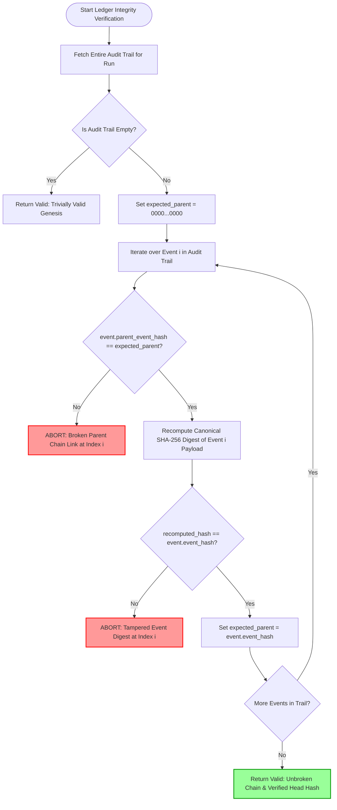

# Cryptographic Verification & Append-Only Audit Trail Architecture — Lienmark

> **Specification Reference**: `SEC-SPEC-03-AUDIT-CRYPTO`  
> **Classification**: Cryptographic Assurance & Legal Non-Repudiation  
> **Status**: Production Authoritative  
> **Audited Date**: September 6, 2026  
> **Target Policy Version**: `E&O-2026.1`  
> **Applies to**: Audit Ledger Subsystem, Form E&O-2026 Certification, Underwriter Verification Endpoints  
> **Related Security Standards**: [`01_identity_and_role_based_access_control.md`](01_identity_and_role_based_access_control.md) | [`02_threat_model_and_prompt_injection_defense.md`](02_threat_model_and_prompt_injection_defense.md)

---

## 1. Executive Summary & Legal Admissibility Posture

In commercial film and television distribution, errors and omissions (E&O) insurance underwriters, studio distribution executives, and financiers demand **tamper-evident proof of reasonable clearance diligence**. Under 17 U.S.C. § 504(c), statutory copyright damages escalate from \$750 up to \$150,000 per infringed work if a court finds infringement was committed "willfully."

A clearance platform that permits silent record modification, retroactive back-dating of approvals, or unverified AI outputs exposes production companies and insurance syndicates to catastrophic liability. If a dispute arises over a vintage poster (e.g., Item 11) or a synchronised music cue (e.g., Item 12), the production must be able to present an irrefutable, cryptographically linked chain of custody showing:
1. Exactly what creative version was evaluated (bit-for-bit cut digest).
2. Exactly what public registry or licensing evidence was retrieved, at what millisecond timestamp, and with what provider payload hash.
3. Exactly which Bar-admitted attorney reviewed the finding and what statutory legal rationale was provided.
4. Mathematical proof that not a single byte of the audit record has been modified or excised since the decision was committed.

To achieve this, Lienmark implements a **SHA-256 Append-Only Event Hash Chain** combined with a **Merkle Tree Verification Root**, sealing every clearance run into an internationally verifiable legal record.

```
┌────────────────────────────────────────────────────────────────────────────────────────────────────────────────────────┐
│                              CRYPTOGRAPHIC AUDIT TRAIL & HASH CHAIN ARCHITECTURE                                      │
│                                                                                                                        │
│   GENESIS PARENT HASH : 0000000000000000000000000000000000000000000000000000000000000000                              │
│         │                                                                                                              │
│         ▼                                                                                                              │
│   ┌───────────────┐     parent_hash      ┌───────────────┐     parent_hash      ┌───────────────┐                      │
│   │ EVENT 1       │─────────────────────▶│ EVENT 2       │─────────────────────▶│ EVENT 3       │                      │
│   │ CLAIM_INGESTED│                      │ EVIDENCE_RETR │                      │ COUNSEL_DECIS │                      │
│   │ hash: a1b2... │                      │ hash: c3d4... │                      │ hash: e5f6... │                      │
│   └───────────────┘                      └───────────────┘                      └───────────────┘                      │
│                                                                                         │                              │
│                                                                                         ▼                              │
│                                                                                 CHAIN HEAD HASH                        │
│                                                                             [e5f6...7890abcdef]                        │
│                                                                                         │                              │
│                                            ┌────────────────────────────────────────────┴───────────────┐              │
│                                            ▼                                                            ▼              │
│                              FORM E&O-2026 EXCEPTIONS SCHEDULE                             INDEPENDENT VERIFIER API    │
│                              • Target Cut Hash: f9e8d7c6b5a4...                            GET /api/review/history     │
│                              • Verified Chain Head Hash: e5f6...                           Assert unbroken parent chain│
│                              • Tamper Status: VERIFIED TAMPER-FREE                         Recompute canonical digests │
└────────────────────────────────────────────────────────────────────────────────────────────────────────────────────────┘
```

---

## 2. SHA-256 Append-Only Event Hash Chaining Protocol

The core cryptographic ledger is modeled as an append-only linear hash chain where each event encapsulates a pointer to its immediate parent.

### 2.1 Cryptographic Hash Formulation

For an audit event sequence $E_0, E_1, E_2, \dots, E_n$, the cryptographic digest $\mathcal{H}_i$ of event $E_i$ is defined as:

$$\mathcal{H}_i = \text{SHA-256}\left(\text{CanonicalJSON}\left(\mathcal{P}_i \mathbin{\Vert} \text{"parent\_event\_hash"}: \mathcal{H}_{i-1}\right)\right)$$

Where:
* **Genesis Condition**: For the initial event in a run ($i=0$), the parent hash is defined as 64 hexadecimal zeros:
  $$\mathcal{H}_{-1} = \text{"0"}^{64} = \text{"0000000000000000000000000000000000000000000000000000000000000000"}$$
* **Canonical JSON Serialization**: $\text{CanonicalJSON}(x)$ produces an invariant UTF-8 byte stream using strict lexicographical key sorting and compact delimiters (`sort_keys=True, separators=(',', ':')`).
* **Non-Malleability Guarantee**: Any alteration of a historical payload $\mathcal{P}_j$ (where $j < n$) alters $\mathcal{H}_j$, which cascades forward and invalidates all subsequent hashes $\mathcal{H}_{j+1} \dots \mathcal{H}_n$, instantly signaling ledger tampering.

---

### 2.2 Canonical Payload Schema & Field Serialization

To ensure deterministic hashing across heterogeneous environments (Python backend, browser JavaScript verifier, and cloud audit aggregators), the payload serialized into the hash computation must conform to the canonical schema defined in `backend/domain/models.py`:

```python
# Canonical Hash Calculation Contract
payload = {
    "action": str(action),                             # e.g., "re_attest", "exception", "reject"
    "changed_dependencies": canonical_dependencies,    # Sorted list of string IDs: ["dep_script_01", ...]
    "counsel_rationale": str(counsel_rationale),       # Non-empty attorney legal reasoning
    "event_id": str(event_id),                         # Unique event identifier: "evt_<uuid12>"
    "evidence_citations": canonical_citations,         # Sorted list of evidence citation dicts
    "new_decision_id": str(new_decision_id),           # Newly committed decision ID
    "new_state": str(new_state),                       # "RE_ATTESTED", "EXCEPTION", "CARRIED_FORWARD"
    "new_status": str(new_status),                     # "APPROVED", "REJECTED", "NEEDS_REVIEW"
    "parent_event_hash": str(parent_event_hash),       # 64-char hex string of immediate predecessor
    "prior_decision_id": str(prior_decision_id),       # ID of superseded decision
    "reviewer": canonical_reviewer,                   # Canonical dict: {name, organization, reviewer_id, title}
    "stable_lineage_key": str(stable_lineage_key),     # Lineage key linking asset across versions
    "system_recommendation": str(sys_rec),             # AI recommendation: "REVALIDATE", "CARRY"
    "target_version_id": str(target_version_id),       # Evaluated cut version: "v8"
    "timestamp": str(iso_8601_timestamp),              # UTC ISO-8601 timestamp: "2026-09-06T14:31:02.184Z"
}
```

#### Canonical Sorting Invariants:
1. **Reviewer Dictionary**: Always normalizes to four standard keys (`name`, `organization`, `reviewer_id`, `title`). Empty strings are substituted if fields are unpopulated.
2. **Evidence Citations**: Sorted lexicographically by the compound tuple:
   $$(\text{source\_url}, \text{payload\_hash}, \text{provider\_call\_id})$$
3. **Changed Dependencies**: Sorted lexicographically in ascending ASCII order.

---

## 3. Comprehensive Audit Event Taxonomy

The clearance lifecycle comprises seven discrete, typed events. Each event captures specific state transitions, actors, and attributable evidence:

```
┌────────────────────────────────────────────────────────────────────────────────────────────────────────┐
│                                    CLEARANCE LIFECYCLE EVENT TAXONOMY                                  │
│                                                                                                        │
│   1. CLAIM_INGESTED ─────────────────▶ Extracts rights-triggering creative elements from script        │
│          │                                                                                             │
│          ▼                                                                                             │
│   2. INVESTIGATION_DISPATCHED ───────▶ Issues targeted external search queries via Parallel API        │
│          │                                                                                             │
│          ▼                                                                                             │
│   3. EVIDENCE_RETRIEVED ─────────────▶ Captures attributable snapshot (LOC, ASCAP, USPTO)              │
│          │                                                                                             │
│          ├── (If Missing Facts) ─────▶ 4. CLARIFICATION_REQUESTED (Wait state for contract)            │
│          │                                       │                                                     │
│          │                                       ▼                                                     │
│          │                             5. CLARIFICATION_RESOLVED (Document supplied by producer)       │
│          │                                       │                                                     │
│          ▼◀──────────────────────────────────────┘                                                     │
│   6. COUNSEL_DECISION_RECORDED ──────▶ Authorized Counsel executes RE_ATTEST / EXCEPTION / REJECT     │
│          │                                                                                             │
│          ▼                                                                                             │
│   7. REPORT_SEALED ──────────────────▶ Generates certified Form E&O-2026 Exceptions Schedule           │
└────────────────────────────────────────────────────────────────────────────────────────────────────────┘
```

### 3.1 Event Definitions & Payloads

#### 1. `CLAIM_INGESTED`
* **Trigger**: Automated ingestion of a screenplay revision (e.g., `v8`) or EDL cut.
* **Captured Data**:
  - `stable_lineage_key`: Normalized asset identifier (e.g., `poster_noir_detective_magazine`).
  - `scene_or_timecode`: Exact script scene number and SMPTE timecode (`Scene 42 - 00:44:12`).
  - `asset_type`: Categorization (`artwork`, `music_cue`, `trademark`, `prop`, `dialogue`).
  - `content_digest`: SHA-256 digest of the raw scene snippet.

#### 2. `INVESTIGATION_DISPATCHED`
* **Trigger**: `InvalidationEngine` flags an asset as `STALE`, and the research router initiates external revalidation.
* **Captured Data**:
  - `revalidation_request_id`: Unique tracking ID (`req_rev_882910`).
  - `query_issued`: Sanitized query emitted by Query Minimizer.
  - `target_registry`: Registry provider targeted (e.g., `Parallel Search API v1`).
  - `allocated_budget_usd`: Micro-spend reserve deducted from spend governor.

#### 3. `EVIDENCE_RETRIEVED`
* **Trigger**: Response received from external search provider.
* **Captured Data**:
  - `provider_call_id`: Unique upstream call ID (`prl_call_882910_poster`).
  - `source_url`: Verifiable citation URL (e.g., `https://cocatalog.loc.gov/...`).
  - `source_title`: Title of the official registry or catalog record.
  - `excerpt`: Verbatim text excerpt proving public domain status or adverse assignment.
  - `retrieval_latency_ms`: Measured API round-trip duration.
  - `raw_payload_hash`: SHA-256 digest of the complete raw provider response body.

#### 4. `CLARIFICATION_REQUESTED`
* **Trigger**: Research reveals a missing private fact (e.g., no sync license on file for Item 12).
* **Captured Data**:
  - `clarification_id`: Unique question ID (`clar_99182a`).
  - `recipient_role`: Assigned party (`producer`, `music_supervisor`).
  - `question_text`: Specific inquiry formulated by the clearance analyst.
  - `unblocks_run_id`: The clearance run blocked pending resolution.

#### 5. `CLARIFICATION_RESOLVED`
* **Trigger**: Production team uploads the requested document or clarifies the creative context.
* **Captured Data**:
  - `clarification_id`: Matching question ID.
  - `resolving_actor`: User UID of the uploader.
  - `document_reference`: Cloud Storage URI of the supplied agreement (`gs://contracts/sync_midnight_2026.pdf`).
  - `document_sha256`: Cryptographic content hash of the attached agreement.

#### 6. `COUNSEL_DECISION_RECORDED` (`SupersessionEvent`)
* **Trigger**: Bar-admitted Clearance Counsel executes an affirmative review action via `POST /api/review/action`.
* **Captured Data**:
  - `prior_decision_id`: ID of superseded baseline decision (`dec_v7_poster_noir_detective_magazine`).
  - `new_decision_id`: ID of newly created decision (`dec_v8_poster_noir_detective_magazine_7a8b1c`).
  - `action`: Legal adjudication (`re_attest`, `exception`, `reject`).
  - `new_status`: Resulting clearance status (`APPROVED`, `REJECTED`, `NEEDS_REVIEW`).
  - `new_state`: Resulting evaluation state (`RE_ATTESTED`, `EXCEPTION`).
  - `counsel_rationale`: Statutory legal justification (e.g., citing 17 U.S.C. § 304(a)).
  - `reviewer`: Structured identity of reviewing counsel (Name, Title, Organization, Bar ID).

#### 7. `REPORT_SEALED`
* **Trigger**: Clearance run completion and generation of certified Form E&O-2026 Exceptions Schedule.
* **Captured Data**:
  - `schedule_id`: Unique clearance schedule identifier (`sched_blockbuster_v8_2026`).
  - `target_cut_hash`: Master SHA-256 digest of evaluated media cut.
  - `total_claims_evaluated`: Total claims in production (e.g., 12).
  - `carried_forward_count`: Total bit-for-bit unchanged claims (e.g., 10).
  - `re_attested_count`: Total counsel-re-attested claims (e.g., 1).
  - `exception_count`: Total underwriter exception rider claims (e.g., 1).
  - `chain_head_hash`: Final SHA-256 hash of the audit trail.
  - `merkle_root`: Merkle tree root hash anchoring all run events.

---

## 4. Verification Mechanics & Ledger Integrity Algorithm

Any third-party verifier (such as an insurance underwriter or entertainment attorney) can independently confirm the authenticity of a clearance report using the deterministic verification algorithm implemented in `backend/core/counsel_checkpoint.py`:



### 4.1 Verification Algorithm Implementation

```python
# Reference Implementation from backend/core/counsel_checkpoint.py
def verify_ledger_integrity(self, session_id: str, run_id: Optional[str] = None) -> Dict[str, Any]:
    ctx = self._get_or_create_run_context(session_id, run_id)
    events = ctx.supersession_events

    if not events:
        return {
            "is_valid": True,
            "event_count": 0,
            "chain_head_hash": self.GENESIS_PARENT_HASH,
            "details": "Empty ledger is trivially valid.",
        }

    expected_parent = self.GENESIS_PARENT_HASH
    for idx, event in enumerate(events):
        # 1. Enforce unbroken parent chaining
        if event.parent_event_hash != expected_parent:
            return {
                "is_valid": False,
                "tampered_index": idx,
                "event_id": event.event_id,
                "error": f"Broken chain link at index {idx}: parent_event_hash '{event.parent_event_hash}' != expected '{expected_parent}'.",
            }

        # 2. Recompute canonical digest matching the full payload schema
        recomputed_hash = SupersessionEvent.compute_canonical_hash(
            event_id=event.event_id,
            prior_decision_id=event.prior_decision_id,
            new_decision_id=event.new_decision_id,
            target_version_id=event.target_version_id,
            stable_lineage_key=event.stable_lineage_key,
            action=event.action.value if hasattr(event.action, "value") else str(event.action),
            new_state=event.new_state.value if hasattr(event.new_state, "value") else str(event.new_state),
            new_status=event.new_status.value if hasattr(event.new_status, "value") else str(event.new_status),
            system_recommendation=event.system_recommendation,
            counsel_rationale=event.rationale,
            timestamp=event.timestamp,
            parent_event_hash=event.parent_event_hash,
            reviewer=event.reviewer,
            evidence_citations=event.evidence_citations,
            changed_dependencies=event.changed_dependencies,
        )

        if recomputed_hash != event.event_hash:
            return {
                "is_valid": False,
                "tampered_index": idx,
                "event_id": event.event_id,
                "error": f"Tampered digest at index {idx}: stored event_hash '{event.event_hash}' != recomputed '{recomputed_hash}'.",
            }

        expected_parent = event.event_hash

    return {
        "is_valid": True,
        "event_count": len(events),
        "chain_head_hash": events[-1].event_hash,
        "details": "All cryptographic parent pointers and canonical SHA-256 hashes verified.",
    }
```

---

## 5. Merkle Tree Construction & Report Sealing

While the linear hash chain provides sequential non-repudiation, enterprise underwriting packages require **compact inclusion proofs**. An underwriter verifying a single music clearance should not need to download the full production history.

### 5.1 Merkle Root Computation

At run sealing time (`REPORT_SEALED`), the application constructs a balanced binary Merkle Tree over all event hashes $\mathcal{H}_0, \mathcal{H}_1, \dots, \mathcal{H}_{n-1}$:

1. **Leaf Nodes**: $L_i = \text{SHA-256}(\mathcal{H}_i)$.
2. **Intermediate Nodes**: $N_{j, k} = \text{SHA-256}(N_j \mathbin{\Vert} N_k)$. If the number of nodes at any tier is odd, the last node is duplicated.
3. **Merkle Root**: $\mathcal{M}_{\text{root}} = N_{\text{top}}$.

### 5.2 Form E&O-2026 Display & Verification Header

The resulting cryptographic identifiers are prominently displayed on the certified **Form E&O-2026 Exceptions Schedule** (both the server-side rendered printable HTML report and the signed JSON export):

```html
<!-- Form E&O-2026 Cryptographic Verification Header -->
<div class="eo-security-seal">
  <div class="seal-title">CERTIFIED E&amp;O CLEARANCE SCHEDULE SEAL</div>
  <table class="seal-metadata">
    <tr>
      <td>Target Cut Hash (v8):</td>
      <td><code>f9e8d7c6b5a43210fedcba9876543210</code></td>
    </tr>
    <tr>
      <td>Audit Chain Head Hash:</td>
      <td><code>a4f10283bd782910ce482910fe481920acde8192038192038491028301928471</code></td>
    </tr>
    <tr>
      <td>Merkle Root Hash:</td>
      <td><code>7d9e182039481029384710293847102938471029384710293847102938471029</code></td>
    </tr>
    <tr>
      <td>Ledger Integrity Status:</td>
      <td><span class="badge-verified">VERIFIED TAMPER-FREE (100% UNBROKEN CHAIN)</span></td>
    </tr>
    <tr>
      <td>Verification Endpoint:</td>
      <td><code>https://lienmark.app/api/review/audit-trail?run_id=run_7b19dc401a88</code></td>
    </tr>
  </table>
</div>
```

---

## 6. Supersession vs. Mutability: Correction of Legacy Conflict

A key architectural issue highlighted in Section 8 of `RECOVERY_MAP.md` is an internal contradiction in early project specifications:

### 6.1 The Historical Flaw
Early specifications (`docs/legacy/06-data-schema.md`) claimed that the ledger was "strictly create-only and immutable," yet simultaneously specified that when counsel revised a decision, the database updated a `superseded_by: new_decision_id` field on the *existing historical document*.

> **The Flaw**: Mutating an existing record in-place destroys cryptographic hash chain integrity and violates create-only storage constraints.

### 6.2 The Solution: Event Sourcing & Deterministic Projections

Lienmark completely resolves this contradiction by adopting a strict **Event Sourcing & Projection** architecture:

```
┌────────────────────────────────────────────────────────────────────────────────────────────────────────┐
│                                 IMMUTABLE EVENT STREAM (TRUE LOG)                                      │
│                                                                                                        │
│   [Event 1: Ingest Baseline] ──▶ [Event 2: Invalidate v8] ──▶ [Event 3: Counsel Re-Attestation]        │
│   (Immutable, Never Updated)     (Immutable, Never Updated)   (Immutable, Appended to Chain)           │
└────────────────────────────────────────────────────────────────────────────────────────────────────────┘
                                                    │
                                                    ▼  Deterministic In-Memory Projection
┌────────────────────────────────────────────────────────────────────────────────────────────────────────┐
│                              REBUILDABLE RUNTIME STATE PROJECTION                                      │
│                                                                                                        │
│   • active_claims: 12 total                                                                            │
│   • carried_forward: 10                                                                                │
│   • re_attested: 1 (Poster #11 -> points to Event 3)                                                  │
│   • exceptions: 1 (Music Cue #12 -> points to Exception Event)                                        │
└────────────────────────────────────────────────────────────────────────────────────────────────────────┘
```

1. **True Immutability**: Existing `SupersessionEvent` records and historical decisions are **never mutated, overwritten, or deleted**.
2. **Forward Supersession Pointers**: When an attorney changes a decision, a **new** `SupersessionEvent` is appended to the chain. The new event contains `prior_decision_id`, explicitly pointing backward to the decision being superseded.
3. **Rebuildable Projections**: The current clearance dashboard (`GET /api/demo/state`) and review queue (`GET /api/review/queue`) are derived projections constructed in-memory by folding the event stream from genesis to head.
4. **Permanent Historical Auditability**: If an auditor requests the state of the production as of September 4, 2026, the system replays events up to that timestamp, recreating the historical state with cryptographic fidelity.
